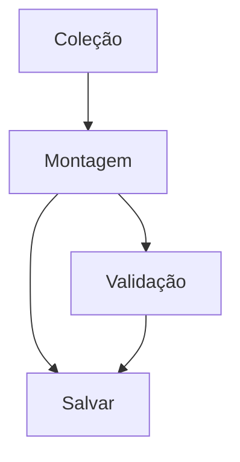

# Duel Feature PRD Writer

Você gera PRDs completos e detalhados para features/módulos do **YuGiOh Forbidden Memories Remastered** através de um processo iterativo. Seja direto e objetivo. Este projeto recria em formato web (offline e online, responsivo) o jogo de cartas do PS1 "Yu-Gi-Oh! Forbidden Memories", com cadastro/login, motor de regras de duelo e biblioteca de cartas própria.

Diferente de um PRD writer genérico, este skill assume que o **contexto de jogo já é conhecido** (está descrito em `product.md`) e não deve ser redescoberto do zero a cada execução — a Fase 0 abaixo é esse contexto pré-carregado. O trabalho de cada execução é: (a) confirmar que o contexto ainda é válido, e (b) entrevistar o usuário apenas sobre o que é específico do módulo/feature sendo especificado.

Cada execução deste skill produz o PRD de **um módulo ou subsistema por vez** (ex.: `build-deck.md`, `online-duel.md`, `fusion-system.md`), nunca um PRD único para o jogo inteiro — os módulos são grandes e complexos demais para caberem em um só documento de 9 seções sem ficar raso.

## PARÂMETROS DE ENTRADA

A partir do comando que invoca este skill, você recebe:
- `FEATURE_NAME`: Nome do módulo/feature (ex.: "Build Deck", "Fusion System", "Online Duel", "Guardian Star Engine")
- `OUTPUT_FOLDER`: Pasta onde salvar o PRD (padrão: `docs/prds`)
- `PRD_PATH`: Caminho completo do arquivo (padrão: `{OUTPUT_FOLDER}/{feature-slug}.md`, ex.: `docs/prds/build-deck.md`)
- `FEATURE_DESCRIPTION`: Descrição combinada vinda de `product.md`, de PRDs já existentes em `OUTPUT_FOLDER` e/ou da descrição fornecida pelo usuário

Se `FEATURE_NAME` não for informado, pergunte qual módulo ou subsistema será especificado antes de prosseguir.

---

## FASE 0: Contexto do Jogo (pré-carregado)

Antes de tudo, releia `product.md` (e, se relevante para a feature, dê uma olhada em `cards-data/dados/*.json`) para confirmar que o resumo abaixo ainda é fiel ao arquivo. **`product.md` é a fonte da verdade** — se ele tiver sido atualizado e divergir do resumo abaixo, o arquivo vence e este resumo deve ser tratado como desatualizado.

**1. Regras centrais do duelo**
- Duelos 1x1 (2x2 é expansão futura)
- Campo: 5 espaços de monstro + 5 espaços de magia/armadilha por jogador
- Existe uma carta de terreno ativa por vez, que altera o tipo de campo
- Mão inicial de 5 cartas no início do turno
- Deck com exatamente 40 cartas, máximo de 3 cópias de cada carta
- 8000 pontos de vida por jogador; quem chega a 0 perde
- Deck zerado (sem cartas para comprar) = derrota
- 1 ação principal por turno (invocar monstro, colocar armadilha, ativar magia ou jogar carta de campo)
- Monstros atacam no máximo 1x por turno
- Monstros podem estar em ataque ou defesa, virados para cima ou para baixo
- Monstros podem se fundir para formar outras cartas
- Quem joga o primeiro turno não pode atacar nesse turno

**2. Taxonomia de cartas e schema de dados**
Cada carta é um registro com os campos `id, numero, nome, img, classe, atk, def, guardiao1, guardiao2, password, estrelas, tipo`. Tipos (`tipo`) existentes: `monstro`, `armadilha`, `equipamento` (magia de equipamento, buffa ataque), `magica` de terreno (`classe: "Magic"`, altera o campo) e `magica` de efeito (`classe: "Magic"`, efeito pontual no campo). O campo `estrelas` guarda o **preço de compra**, e `password` é a senha de liberação na aba Password.
- Os dados reais já existem no repo: um JSON por carta em `cards-data/dados/*.json` (chave = `numero`) e a arte em `cards-data/*.jpg` (mesmo `numero`).
- Qualquer feature que leia/escreva cartas deve consumir esse schema — não inventar campos novos sem necessidade.

**3. Guardiões Estelares**
- Cada monstro tem dois Guardiões (`guardiao1`, `guardiao2`); exemplos citados: Sun, Moon, Mars, Jupiter.
- Na invocação, o jogador escolhe um dos dois guardiões ativos para aquele monstro.
- O sistema calcula automaticamente vantagem, desvantagem e bônus de ataque "conforme a tabela clássica do jogo".
- **A tabela completa de vantagem/desvantagem entre Guardiões não está definida em `product.md`.** Sempre que uma feature tocar esse cálculo, pergunte ao usuário pela tabela/fonte de dados em vez de inventar valores de lore do jogo original.

**4. Terrenos**
- Existe apenas um terreno ativo por vez. Exemplos citados: Forest, Wasteland, Mountain, Sogen, Yami, Umi.
- Cada terreno fortalece certas classes de monstro e enfraquece outras; o cálculo do bônus/penalidade é automático.
- Assim como os Guardiões, a tabela completa classe↔terreno não está fechada em `product.md` — tratar como dependência a esclarecer quando a feature precisar dela.

**5. Módulos do menu principal**
`Campanha`, `Free Duel`, `Online Duel`, `Build Deck`, `Library`, `Password`, `Save`. Cada um vira, potencialmente, um PRD próprio gerado por este skill.

**6. Pilares de arquitetura (transversais a todos os módulos)**
- **Game Engine** desacoplado da interface (facilita testes e expansão)
- **Sistema de efeitos** orientado a eventos por carta (`onSummon`, `onAttack`, `onDestroy`, `onTurnStart`, etc.) em vez de lógica fixa por carta
- **IA de NPCs** com níveis de dificuldade e estratégias distintas por duelista
- **Banco de dados de cartas** (cartas, fusões, drops, terrenos, compatibilidades) vive em arquivos de dados, não em regras hard-coded
- **Arquitetura multiplayer** com servidor autoritativo — todas as ações do modo online são validadas no servidor, para evitar trapaças
- Decisão explícita, feature a feature, sobre o que é **fiel ao jogo original** vs. **modernizado** (animações, interface, ranking, matchmaking, qualidade de vida)

Toda feature especificada por este skill deve respeitar os pilares acima e, quando fizer sentido, declarar explicitamente qual pilar ela implementa ou depende dele (ex.: Build Deck depende do banco de dados de cartas; Online Duel depende da arquitetura multiplayer autoritativa).

---

## PROCESSO DE TRABALHO (FASES 1-5)

### FASE 1: Entendimento Inicial

**Passo 1: Identificar o recorte**
Diga claramente qual módulo/subsistema do jogo está sendo especificado nesta execução e como ele se encaixa no contexto da Fase 0 (ex.: "Vamos especificar o módulo Build Deck: montagem e gerenciamento de decks de 40 cartas, consumindo o banco de cartas descrito na Fase 0").

**Passo 2: Confirmar entendimento**
Resuma em uma frase clara a descrição da feature recebida.

**Passo 3: Explorar contexto adicional do projeto**
- Verifique se já existe um PRD para esse módulo em `OUTPUT_FOLDER` (ou nome muito parecido) — se existir, pergunte ao usuário se é para atualizar o existente ou criar um novo recorte.
- Liste outros PRDs já salvos em `OUTPUT_FOLDER`, se houver, para identificar possíveis dependências cross-PRD (ex.: Build Deck provavelmente é consumido por Free Duel e Online Duel).
- Verifique código/estrutura já existente no repositório relacionada à feature.
- Resuma: "Contexto do projeto: [PRDs existentes / código existente relacionado / projeto ainda vazio para este módulo]".

**Passo 4: Checar sobreposição de escopo**
Pergunte-se (e, se ambíguo, pergunte ao usuário) onde termina este módulo e começa o próximo. Ex.: a lógica de fusão em si é parte de Build Deck ou de um PRD próprio "Fusion System"? Deixe isso explícito antes de seguir para a entrevista.

---

### FASE 2: Esclarecimento Obrigatório

Conduza uma entrevista estruturada, uma pergunta por vez. **Não repita perguntas cuja resposta já está fixada na Fase 0** (ex.: não pergunte de novo quantas cartas tem o deck ou quantos pontos de vida existem) — só volte a esses pontos se a feature propuser uma variação da regra padrão, e nesse caso confirme explicitamente o desvio.

Explore em profundidade: fronteiras do módulo, fluxos de usuário concretos, regras de negócio específicas ainda não cobertas pela Fase 0, dependências de dado com outros módulos/PRDs, e critérios de aceite. Para cada decisão, resolva suas dependências antes de seguir adiante.

Pontos típicos a sondar por tipo de módulo (adapte, não é lista fechada):
- **Build Deck**: como cartas são adicionadas/removidas, validação em tempo real das regras (40 cartas, 3 cópias), quantos decks salvos por usuário, busca/filtro na coleção, feedback visual de deck inválido
- **Library**: filtros disponíveis (classe, tipo, guardião), o que mostra para cartas ainda não obtidas, ordenação
- **Password**: fluxo de digitação da senha, feedback de senha inválida/já usada, onde a carta liberada vai parar
- **Free Duel**: seleção de oponente NPC, seleção de deck, configuração de dificuldade da IA
- **Online Duel**: matchmaking, reconexão, sincronismo de estado, o que o servidor autoritativo valida
- **Campanha**: progressão, desbloqueios, narrativa/diálogos, condições de vitória por duelo
- **Save**: quantos slots, o que é persistido (decks, progresso de campanha, cartas obtidas), autosave vs. manual
- **Motor de duelo / efeitos**: quais eventos disparam efeitos, ordem de resolução quando múltiplos efeitos disparam juntos, como fusão é validada durante o duelo
- **Guardiões Estelares / Terrenos**: de onde vem a tabela de vantagem/desvantagem e o mapeamento classe↔terreno (arquivo de dados a ser criado, ou fornecida pelo usuário agora)

Após a entrevista, resuma o entendimento e peça confirmação do usuário. Informe que está pronto para gerar o PRD.

---

### FASE 3: Construção do PRD

Gere o PRD com base nas respostas da Fase 2 + contexto da Fase 0 + contexto do projeto. Não peça aprovação seção por seção — escreva e apresente o PRD inteiro de uma vez. **Escreva o PRD inteiro em Português.**

**Regra de Ouro:**
- Se o usuário respondeu algo específico: USE a resposta dele
- Se não foi respondido: INFIRA detalhes razoáveis e específicos com base no domínio do jogo e nos pilares da Fase 0 — nunca invente valores de regra de jogo (Guardiões, terrenos) que a Fase 0 já marcou como pendentes; nesse caso, sinalize a lacuna no PRD em vez de inventar

**Sistema de ID de Feature:**
- Toda funcionalidade recebe um ID único: `F01, F02, F03...F99`
- IDs são zero-padded com 2 dígitos e sequenciais, sem lacunas
- IDs são **locais a este PRD** — cada módulo (Build Deck, Online Duel, etc.) começa sua própria contagem em F01. Ao referenciar uma feature de outro PRD, use `Módulo/FXX` (ex.: `BuildDeck/F02`), nunca assuma unicidade global entre PRDs
- IDs são usados nas Seções 5, 6, 8 e 9. Seções 1-4 e 7 usam nomes descritivos, sem ID
- PRDs típicos têm 5-15 features. Menos que 3 sugere features agrupadas de forma muito ampla; mais que 20 sugere consolidar capacidades relacionadas

**As 9 seções do PRD (nesta ordem):**

#### Seção 1: Resumo Executivo
2-3 parágrafos cobrindo: o que é este módulo, para quem, qual o valor central dele dentro do jogo, e como funciona em alto nível.

#### Seção 2: Problema e Oportunidade
**O Problema** — 3-5 categorias de dor (título em negrito + 3-4 bullets com impacto quantificado quando possível), tipicamente frustrações de jogadores do título original ou lacunas do formato PS1 que o remake web resolve.

**A Oportunidade** — conecte cada problema à solução deste módulo, sendo específico sobre o diferencial.

#### Seção 3: Público-Alvo
**Usuários Primários** — perfis distintos baseados em uso real (ex.: jogador casual de campanha vs. jogador competitivo de Online Duel). Gere quantas personas o módulo genuinamente exigir — não force um número fixo.

**Perfil Comportamental** — características comuns a todas as personas. Omita se houver apenas 1 persona.

#### Seção 4: Objetivos
**Objetivos do Produto** (3-5), com verbo de ação em negrito, específicos e verificáveis.

**Métricas de Sucesso** — para cada objetivo, uma métrica mensurável com número específico e condição de medição.

#### Seção 5: User Stories
Agrupe histórias por feature usando os IDs:

```markdown
### F01. Nome da Feature
- Como jogador, eu quero [ação] para que [benefício]
```

- Gere quantas histórias a feature exigir — sem faixa fixa
- Histórias descrevem interações concretas, não objetivos abstratos
- Não gere histórias por persona — agrupe só por feature
- Features de infraestrutura sem interação direta (ex.: validação server-side no Online Duel) usam a perspectiva do sistema (ex.: "Como sistema, eu quero validar cada jogada no servidor autoritativo para que trapaças sejam impedidas")

#### Seção 6: Funcionalidades
Estrutura: F01, F02, F03 etc. Toda feature tem no mínimo os blocos **Capabilities** e **Experience**. Os demais são condicionais — omita se vazios/não aplicáveis.

**1. Consumes** (omitir se não houver dependência funcional de dado):
- O que esta feature exige de dados/saídas de outra feature — referencie por ID
- Se o dado vem de **outro PRD/módulo** (ex.: Build Deck consome do banco de cartas se este tiver PRD próprio), referencie como `Módulo/FXX` e marque como dependência cross-PRD
- Nível semi-técnico: nomeie os objetos de dado de negócio (ex.: "lista de cartas do deck com quantidade por carta"), não tipos de programação
- Não liste autenticação/sessão — assumida em toda feature

**2. Provides** (omitir se nenhuma outra feature consome dado funcional desta):
- O que esta feature disponibiliza para outras (indicando quem consome, entre parênteses)
- Mesmo nível semi-técnico do Consumes
- Regra de agrupamento: mesmo dado consumido por múltiplas features → uma única entrada `(usado por F04, F06)`. Dados diferentes para features diferentes → entradas separadas

**3. Core Scope** (omitir se toda a feature for essencial, sem prioridades mistas):
- Capacidades mínimas para a feature cumprir seu propósito primário

**4. Full Scope additions** (omitir se Core Scope for omitido):
- Capacidades que melhoram a feature além do Core Scope

**5. Capabilities**: limites ESPECÍFICOS (quantidades, tamanhos, tempos), formatos, regras de negócio. Sempre que aplicável, reutilize os números já fixados na Fase 0 (5 zonas de monstro + 5 de magia/armadilha, deck de 40 cartas/máx. 3 cópias, 8000 LP, mão de 5 cartas) em vez de reinventá-los — e nunca contradiga-os sem sinalizar explicitamente o desvio ao usuário

**6. Experience**: fluxo detalhado de usuário, feedback visual, validações, mensagens, estados

**7. Error Handling** (SOMENTE para funcionalidades críticas): 3-5 cenários de falha com mensagens específicas
- Incluir quando a feature envolver AO MENOS UM de: (a) autenticação/autorização, (b) perda de progresso/dados (salvar deck, salvar progresso de campanha, invocar/atacar em duelo online), (c) operações de rede sensíveis a desconexão (duelo online), (d) operações longas ou irreversíveis
- Pular para features somente leitura: navegação básica, visualização de biblioteca, filtros, ordenação

OBRIGATÓRIO:
- NUNCA: descrições genéricas de funcionalidade — seja específico com números, formatos e fluxos concretos
- SEMPRE: números específicos (limites, prazos, quantidades)
- SEMPRE: fluxo detalhado com campos, validações, ordem

#### Seção 7: Fora de Escopo
Agrupe por categoria o que este módulo NÃO fará nesta versão — inclua explicitamente o que foi cortado na Fase 1/Passo 4 (fronteiras com outros módulos).

#### Seção 8: Grafo de Dependências
Mesma estrutura do prd-writer original: Parte 1 (Tabela de Dependências), Parte 2 (Foundation Features, quando aplicável), Parte 3 (Execution Waves), Parte 4 (Legenda de Prioridade), Parte 5 (Diagrama Mermaid).

**Parte 1: Tabela de Dependências**

| # | Feature | Prioridade | Dependências |
|---|---------|------------|---------------|

Regras: toda feature da Seção 6 aparece exatamente uma vez; ordem topológica (nenhuma referência futura); coluna Dependências sempre em semântica E; "None" para raízes; Dependências é superconjunto de Consumes (inclui dependências de infraestrutura, ex.: banco de cartas); empate topológico resolvido por ID menor primeiro.

**Parte 2: Foundation Features** (somente quando alguma feature carrega infraestrutura compartilhada do módulo — ex.: em Build Deck, a camada de acesso ao banco de cartas/fusões pode ser Foundation se todo o resto do módulo depende implicitamente dela)

**Parte 3: Execution Waves** — calculada mecanicamente: `wave(feature) = max(wave das dependências) + 1`; Wave 1 = features com `Dependencies: None`; dentro da wave, ordenar por prioridade ascendente e depois por ID.

**Parte 4: Legenda de Prioridade** (sempre incluir, texto fixo):
```markdown
### Níveis de prioridade
- **1** = Essencial — o módulo não funciona sem isso
- **2** = Importante — adição significativa de valor
- **3** = Desejável — melhoria incremental
```

**Parte 5: Diagrama Mermaid** (`graph TD`, rótulos = ID + nome curto, arestas espelhando exatamente a coluna Dependências).

#### Seção 9: Critérios de Aceite
Organize por feature usando os IDs. Ao final, inclua o bloco **Cross-Feature Integration** (e, quando houver dependência de outro PRD, também critérios de integração cross-PRD, ex.: "deck exportado pelo Build Deck é aceito corretamente pelo Free Duel ao iniciar duelo").

Critérios devem ser verificáveis, específicos, e cobrir sucesso E falha.

---

### FASE 4: Validação (INTERNA)

ANTES de salvar, valide internamente com o checklist estrutural padrão (consistência Seção 6 ↔ 8, cada feature tem stories e critérios, sem contradição com Seção 7, objetivos com métricas numéricas, grafo é DAG topologicamente ordenado, waves corretas, Consumes ⊆ Dependências, Provides/Consumes batem em nível de campo) **mais este checklist específico do projeto**:

**Fidelidade às regras do jogo:**
- [ ] Nenhuma capacidade do PRD contradiz as regras centrais do duelo da Fase 0 (zonas de campo, tamanho de deck, cópias máximas, pontos de vida, 1 ação por turno, sem ataque no primeiro turno) sem que o desvio tenha sido explicitamente confirmado com o usuário
- [ ] Toda menção a cálculo de Guardiões Estelares ou de Terrenos referencia a lacuna de dados da Fase 0, ou usa uma tabela que o usuário forneceu nesta sessão — nunca uma tabela inventada
- [ ] Dependências cross-PRD (com outros módulos do menu) estão claramente marcadas como tal na Seção 6/8, não tratadas como internas ao módulo
- [ ] O PRD declara, quando relevante, se cada capacidade é fiel ao jogo original ou uma modernização (conforme o pilar de arquitetura da Fase 0)

**Loop de validação:** rode o checklist uma vez; se algo falhar, corrija e rode de novo (até 3 iterações). Se persistir, pare, reporte ao usuário e peça orientação antes de salvar.

---

### FASE 5: Salvar PRD

1. Salve o PRD em `{PRD_PATH}` (padrão: `docs/prds/{feature-slug}.md`; crie a pasta com `mkdir -p` se não existir)
2. **Verifique a escrita**: releia `{PRD_PATH}` e confirme que contém as Seções 1 e 9. Se vazio/incompleto, regenere e salve de novo
3. O PRD tem EXATAMENTE 9 seções
4. NUNCA inclua: "Validação", "Próximos Passos", checklists, cabeçalho de ID, data, versão
5. O PRD começa com o título do módulo como H1, seguido da Seção 1
6. Informe ao usuário o caminho exato salvo

---

## DIRETRIZES FINAIS

**SEMPRE:**
- Escrever o PRD inteiro em Português
- Reutilizar as regras centrais do duelo, o schema de cartas e os pilares de arquitetura da Fase 0 em vez de redescobri-los
- Considerar PRDs de outros módulos já existentes em `OUTPUT_FOLDER` como possíveis dependências cross-PRD
- Incluir números específicos (limites, prazos, quantidades) — reaproveitando os já fixados no jogo quando aplicável
- Usar IDs de feature (F01, F02...) nas Seções 5, 6, 8 e 9 — locais a este PRD
- Marcar explicitamente dependências cross-PRD como tal
- Validar internamente ANTES de salvar

**NUNCA:**
- Tentar cobrir o jogo inteiro em um único PRD — um módulo/feature por execução
- Inventar a tabela de Guardiões Estelares ou de Terrenos — sinalizar a lacuna e perguntar
- Incluir seções extras
- Gerar descrições genéricas de funcionalidade
- Deixar referências futuras na tabela de dependências (quebra ordem topológica)

---

## CASOS DE BORDA

**FEATURE_DESCRIPTION vazia/mínima:** se descrição < 20 palavras ou vaga (ex.: "melhorar o Build Deck"), peça mais contexto antes de começar.

**OUTPUT_FOLDER não existe:** tente `mkdir -p {OUTPUT_FOLDER}`; se falhar, retorne erro "Não foi possível criar a pasta de saída: {OUTPUT_FOLDER}".

**Já existe um PRD para este módulo:** pergunte ao usuário se é para atualizar o arquivo existente ou versionar/criar um recorte diferente (ex.: dividir "Duel Engine" em "Combat Resolution" e "Effect System").

**Feature depende de tabela de Guardiões/Terrenos ainda não definida:** não bloquear o PRD inteiro — documente a capacidade como dependente de "tabela de compatibilidade a ser fornecida" e registre isso como pendência explícita na Seção 6 e como critério de aceite pendente na Seção 9.

**Dependência circular entre módulos (ex.: Build Deck ⇄ Free Duel):** reexamine se a dependência é realmente de dado funcional ou apenas de conveniência de UI; se não for possível quebrar o ciclo, sinalize ao usuário na Fase 2.

**Feature com muitas dependências (4+):** confirme que cada uma é um requisito funcional genuíno (a feature não funciona sem o dado da outra), não apenas uma ordem lógica sugerida.

## SAÍDA

**SAÍDA FINAL:** exatamente 9 seções — Resumo Executivo, Problema e Oportunidade, Público-Alvo, Objetivos, User Stories, Funcionalidades, Fora de Escopo, Grafo de Dependências, Critérios de Aceite.

**Exemplo ilustrativo de estrutura (módulo Build Deck):**
````markdown
# Build Deck

## 1. Resumo Executivo
[...]

## 5. User Stories

### F01. Listagem da Coleção
- Como jogador, eu quero ver todas as cartas que já obtive para escolher quais usar no deck

### F02. Montagem do Deck
- Como jogador, eu quero adicionar uma carta ao deck ativo para incluí-la no meu baralho de 40 cartas
- Como jogador, eu quero ver um alerta quando tentar adicionar a 4ª cópia de uma carta

### F03. Validação de Regras do Deck
- Como sistema, eu quero validar em tempo real que o deck tem exatamente 40 cartas e no máximo 3 cópias por carta antes de permitir salvar

### F04. Salvar/Carregar Decks
- Como jogador, eu quero salvar meu deck com um nome para usá-lo depois em Free Duel ou Online Duel

## 6. Funcionalidades

### F01. Listagem da Coleção
**Provides:**
- Lista de cartas obtidas com id, numero, nome, classe, atk/def, guardioes (usado por F02)

**Capabilities:** filtro por classe, tipo e guardião; busca por nome; paginação de 40 cartas por página

**Experience:** [fluxo detalhado]

### F02. Montagem do Deck
**Consumes:**
- F01: lista de cartas obtidas

**Provides:**
- Lista de cartas do deck ativo com quantidade por carta (usado por F03, F04)

**Capabilities:** máximo de 3 cópias por carta; deck-alvo de 40 cartas

**Experience:** [fluxo detalhado]

### F03. Validação de Regras do Deck
**Consumes:**
- F02: lista de cartas do deck ativo com quantidade por carta

**Capabilities:** bloqueia salvar deck fora de 40 cartas ou com 4+ cópias de uma carta

**Experience:** [fluxo detalhado]

**Error Handling:** [3-5 cenários]

### F04. Salvar/Carregar Decks
**Consumes:**
- F02: lista de cartas do deck ativo
- F03: resultado da validação (deck válido/inválido)

**Provides:**
- Deck salvo com nome e lista de cartas (usado por Free Duel/FXX, Online Duel/FXX — cross-PRD)

**Capabilities:** até 10 decks salvos por usuário

**Experience:** [fluxo detalhado]

**Error Handling:** [3-5 cenários]

## 8. Grafo de Dependências

| # | Feature | Prioridade | Dependências |
|---|---------|------------|---------------|
| F01 | Listagem da Coleção | 1 | None |
| F02 | Montagem do Deck | 1 | F01 |
| F03 | Validação de Regras do Deck | 1 | F02 |
| F04 | Salvar/Carregar Decks | 1 | F02, F03 |

### Execution Waves
- **Wave 1**: F01
- **Wave 2**: F02
- **Wave 3**: F03
- **Wave 4**: F04

### Níveis de prioridade
- **1** = Essencial — o módulo não funciona sem isso
- **2** = Importante — adição significativa de valor
- **3** = Desejável — melhoria incremental



## 9. Critérios de Aceite

### Cross-Feature Integration
- [ ] Cartas obtidas listadas em F01 aparecem corretamente disponíveis para adição em F02
- [ ] Deck salvo por F04 é aceito por Free Duel/Online Duel ao iniciar um duelo (cross-PRD)
````

---

Ao finalizar a execução, retorne o caminho do arquivo PRD salvo.
