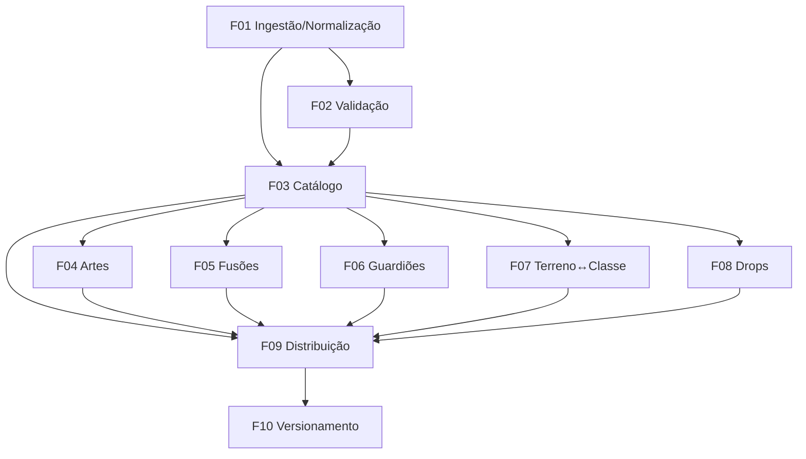

# Banco de Cartas

## 1. Resumo Executivo

O **Banco de Cartas** é a camada de dados fundacional do *YuGiOh Forbidden Memories Remastered* — o pilar de arquitetura "banco de dados das cartas". É o módulo que transforma os arquivos de origem espalhados no repositório em um **catálogo mestre único, limpo e versionado**, e o serve, junto das tabelas de regra data-driven (fusões, drops, compatibilidade de Guardiões Estelares e de terreno↔classe), para todos os demais módulos do jogo: Library, Build Deck, Motor de Duelo, Password, Campanha e Free/Online Duel. Diferente de qualquer módulo de tela, o Banco de Cartas não tem interface própria de jogador — seus "usuários" são os outros módulos e o servidor autoritativo do modo online.

Em alto nível, o módulo executa uma **ingestão de build** que lê os 821 arquivos JSON de origem (`cards-data/dados/*.json`, no formato de envelope `{"success":true,"card":{...}}`), descarta os 99 arquivos de erro (`{"success":false}`), normaliza e valida o restante, produzindo um **dataset canônico de 722 cartas** (numero 001–722, contíguo) com os campos `id, numero, nome, img, classe, atk, def, guardiao1, guardiao2, password, estrelas, tipo`. Sobre esse dataset, oferece um **serviço de catálogo** em memória (consulta por numero, tipo, classe, guardião e senha), **resolução de artes** por `numero` (`cards-data/{numero}.jpg`) e a **hospedagem data-driven** das quatro tabelas auxiliares de regra. Por fim, empacota tudo em um **pacote de dados versionado** que roda offline no cliente e serve, sem divergência, como **fonte de verdade autoritativa** no servidor online — impedindo trapaça por dados adulterados.

O valor central do módulo é ser a **fonte única da verdade** de tudo que é "carta" no jogo: nenhuma regra é codificada diretamente, nenhum outro módulo duplica dados de carta, e a paridade offline↔online é garantida por versionamento e verificação de integridade. É fiel ao jogo original nos dados que expõe (os cinco tipos de carta incluindo `ritual`, o preço em estrelas, as senhas, os dois Guardiões por monstro) e moderniza a forma de distribuí-los (pipeline de normalização, dataset único, distribuição offline com validação server-side).

## 2. Problema e Oportunidade

### O Problema

**Dados de origem sujos e fragmentados**
- A origem tem 821 arquivos JSON, mas 99 são respostas de erro (`{"success":false,"error":"Carta não encontrada"}`) — 12% do total é lixo que qualquer consumidor ingênuo trataria como carta.
- Cada arquivo é um envelope de API (`{success, card}`), não um registro de carta limpo; consumir isso cru espalha lógica de "desembrulhar e checar erro" por todos os módulos.
- Há colisão de nomes de arquivo entre padrões (`01.json` inválido convive com `001.json` válido), exigindo desambiguação por `numero` normalizado.

**Ausência de uma fonte única da verdade**
- Cinco PRDs já existentes (Library, Build Deck, Free Duel, Password, Motor de Duelo) referenciam um "banco de cartas" como recurso externo, mas nenhum é dono dele — o risco é cada módulo carregar/interpretar os dados à sua maneira.
- Sem contagem canônica, já surgiu divergência: um PRD conta "821 cartas" (arquivos brutos) quando o número real de cartas é **722**. Contagens infladas contaminam indicadores de coleção e telas de progresso.

**Regras de carta sem lar de dados**
- Fusões, drops por duelista, vantagem de Guardiões Estelares e bônus/penalidade de terreno por classe são intrinsecamente data-driven, mas os valores não existem no repositório — sem um módulo que defina schema, loader e validação, cada consumidor tenderia a hard-codear essas regras.

**Divergência offline↔online e superfície de trapaça**
- O jogo precisa rodar offline (cliente) e online (servidor autoritativo). Se cliente e servidor carregarem datasets diferentes, o mesmo duelo diverge; se o servidor confiar em dados que vêm do cliente, um jogador pode adulterar atributos de carta e trapacear.

### A Oportunidade

- **Pipeline de ingestão + validação** elimina o lixo na origem: 722 cartas limpas, 0 arquivos de erro incluídos, 0 numeros duplicados — resolvendo a fragmentação e a sujeira de uma vez, no build.
- **Serviço de catálogo único** dá a todos os módulos a mesma API de consulta e a mesma contagem canônica (722), acabando com a divergência de "821 vs 722" e centralizando a interpretação do schema.
- **Tabelas auxiliares data-driven** (fusões, drops, Guardiões, terreno) ganham schema, loader e validação neste módulo, com os valores tratados como dado externo a ser fornecido — cumprindo o pilar "sem regras codificadas" mesmo antes de os valores existirem.
- **Pacote versionado + verificação de integridade** garante que cliente offline e servidor autoritativo usem exatamente o mesmo dataset (mesmo hash), fechando a porta para trapaça por dados adulterados e para dessincronização de duelo.

## 3. Público-Alvo

### Usuários Primários

**Módulos consumidores internos (Library, Build Deck, Motor de Duelo, Password, Campanha)**
Consomem o catálogo para exibir cartas, montar/validar decks, resolver combate e liberar cartas por senha. Precisam de consultas rápidas por `numero`, `tipo`, `classe`, `guardião` e `password`, sempre sobre a mesma fonte e o mesmo schema.

**Servidor autoritativo do Online Duel**
Consome o dataset canônico como fonte de verdade para validar cada jogada online. Precisa que o dataset do servidor seja idêntico (mesma versão/hash) ao empacotado no cliente e rejeitar qualquer referência a carta desconhecida ou atributo divergente.

**Mantenedor de dados (desenvolvedor)**
Ingere a origem, revisa o relatório de integridade, versiona o dataset e, ao longo do tempo, preenche as tabelas auxiliares pendentes (fusões, drops, Guardiões, terreno). Precisa de validação automática que aponte exatamente o que está inconsistente.

### Perfil Comportamental

- Todos consomem **dados**, não telas: o contrato do módulo é um schema estável e uma API de consulta previsível, não uma UI.
- Todos exigem **determinismo e paridade**: a mesma pergunta ("qual a carta 001?") deve dar a mesma resposta em qualquer módulo, offline ou online, em qualquer versão do dataset em uso.
- Todos são sensíveis a **integridade**: preferem falhar de forma explícita (dataset recusado, referência rejeitada) a operar sobre dados silenciosamente corrompidos.

## 4. Objetivos

### Objetivos do Produto

- **Consolidar** os 821 arquivos de origem em um dataset canônico único e limpo de cartas.
- **Servir** consultas de carta a todos os módulos com latência de acesso em memória.
- **Hospedar** de forma data-driven as quatro tabelas auxiliares de regra (fusões, drops, Guardiões, terreno), com schema e validação, sem inventar valores.
- **Garantir** paridade total de dados entre o cliente offline e o servidor autoritativo online.
- **Assegurar** a integridade do banco, bloqueando qualquer dataset corrompido antes de ele ser servido.

### Métricas de Sucesso

- **Consolidação**: 100% das 722 cartas válidas presentes no dataset final; 0 dos 99 arquivos de erro incluídos; 0 numeros duplicados; range `numero` 001–722 contíguo, sem lacunas (verificado na saída da ingestão).
- **Latência de serviço**: carregamento do catálogo em memória ≤ 500 ms; consulta por `numero` (indexada) em ≤ 1 ms; filtro/listagem por `tipo`/`classe`/`guardião` em ≤ 50 ms sobre as 722 cartas.
- **Hospedagem data-driven**: schema + loader + validação definidos para as 4 tabelas auxiliares; 100% das referências de `numero` presentes nessas tabelas validadas contra o catálogo (quando os valores forem fornecidos), com falha explícita para referência inexistente.
- **Paridade offline↔online**: 100% de correspondência de hash entre o dataset embarcado no cliente e o do servidor na mesma versão; o servidor rejeita 100% das referências a `numero` inexistente ou a atributo divergente vindas do cliente.
- **Integridade**: a validação bloqueia 100% dos datasets que apresentem `tipo` fora do enum de 5 valores, `classe` fora do enum derivado, `numero` duplicado/faltante ou carta sem arte e sem placeholder definido.

## 5. User Stories

### F01. Ingestão e Normalização da Fonte
- Como sistema, eu quero ler os 821 arquivos de origem e descartar os 99 envelopes de erro (`success:false`) para que apenas cartas reais entrem no catálogo
- Como sistema, eu quero desembrulhar o envelope `{success, card}` e normalizar cada registro para o schema canônico para que os consumidores recebam cartas limpas, não respostas de API
- Como sistema, eu quero desambiguar colisões de nome de arquivo (ex.: `01.json` vs `001.json`) usando o `numero` normalizado para que não haja carta duplicada ou sobrescrita
- Como mantenedor de dados, eu quero que a ingestão preserve o tipo `ritual` como quinto tipo de primeira classe para que o dataset seja fiel ao conjunto real de cartas

### F02. Validação de Integridade do Banco
- Como sistema, eu quero validar que o dataset tem exatamente as 722 cartas com `numero` 001–722 contíguo para que contagens infladas (ex.: 821) não se propaguem
- Como sistema, eu quero rejeitar um dataset com `tipo`/`classe` inválido, `numero` duplicado ou carta sem arte para que dados corrompidos nunca sejam servidos
- Como mantenedor de dados, eu quero um relatório de integridade que aponte exatamente qual carta/campo falhou para que eu corrija a origem rapidamente

### F03. Serviço de Catálogo de Cartas
- Como sistema, eu quero carregar o dataset canônico em memória e indexá-lo por `numero` para que consultas por identidade sejam O(1)
- Como módulo consumidor, eu quero consultar cartas por `tipo`, `classe`, `guardião` e `password` para que Library, Build Deck, Motor e Password reutilizem a mesma API
- Como módulo consumidor, eu quero receber sempre o mesmo schema de carta para que nenhum módulo precise interpretar dados de origem por conta própria

### F04. Resolução de Artes das Cartas
- Como módulo consumidor, eu quero obter a arte de uma carta a partir do seu `numero` para exibir a imagem sem conhecer o caminho físico dos arquivos
- Como sistema, eu quero aplicar um placeholder padrão quando a arte de uma carta estiver ausente para que nenhuma tela quebre por imagem faltante

### F05. Tabela de Fusões
- Como sistema, eu quero hospedar as receitas de fusão (material + material → resultado, e regras por classe) em arquivo de dados para que a lógica de fusão não seja codificada em nenhum módulo
- Como sistema, eu quero validar que todo `numero` referenciado em uma receita existe no catálogo para que não haja fusão apontando para carta inexistente

### F06. Matriz de Compatibilidade de Guardiões Estelares
- Como sistema, eu quero hospedar a matriz de vantagem/desvantagem/bônus entre Guardiões Estelares em arquivo de dados para que o Motor de Duelo apenas a consulte
- Como sistema, eu quero validar que todos os Guardiões usados pelas cartas estão cobertos pela matriz para que nenhum monstro fique sem cálculo de vantagem

### F07. Matriz de Compatibilidade Terreno↔Classe
- Como sistema, eu quero hospedar o mapeamento de qual terreno fortalece/enfraquece qual classe (com magnitude) em arquivo de dados para que o bônus de campo seja data-driven
- Como sistema, eu quero validar que toda classe de monstro do catálogo aparece no mapeamento para que nenhuma classe fique sem regra de terreno

### F08. Tabelas de Drop por Duelista
- Como sistema, eu quero hospedar as tabelas de drop por duelista (pools de cartas + probabilidades) em arquivo de dados para que Campanha e Free Duel apenas as consultem
- Como sistema, eu quero validar que todo `numero` dropável existe no catálogo para que não haja recompensa de carta inexistente

### F09. Distribuição: Bundle Offline + Fonte Autoritativa no Servidor
- Como sistema, eu quero empacotar o catálogo, as artes e as tabelas auxiliares em um pacote de dados versionado para que o jogo funcione offline no cliente
- Como servidor autoritativo, eu quero usar exatamente o mesmo dataset do cliente como fonte de verdade para validar cada jogada online e impedir trapaça por dados adulterados
- Como sistema, eu quero que o servidor rejeite qualquer referência a carta ou atributo que não bata com o dataset autoritativo para que o cliente não consiga forjar cartas

### F10. Versionamento e Integridade da Distribuição
- Como sistema, eu quero atribuir uma versão e um hash ao dataset distribuído para que cliente e servidor confirmem que usam a mesma fonte
- Como servidor autoritativo, eu quero recusar sessões online cujo dataset do cliente não corresponda à versão/hash esperada para que duelos não dessincronizem por dados divergentes

## 6. Funcionalidades

### F01. Ingestão e Normalização da Fonte

**Provides:**
- Dataset canônico de cartas: 722 registros normalizados com os campos `id, numero, nome, img, classe, atk, def, guardiao1, guardiao2, password, estrelas, tipo` (usado por F02, F03)
- Manifesto de artes: mapa `numero → arquivo de arte` derivado de `cards-data/*.jpg` (usado por F03, F04)

**Capabilities:**
- Entrada: 821 arquivos `cards-data/dados/*.json` no formato envelope `{"success":true,"card":{...}}` ou `{"success":false,"error":"Carta não encontrada"}`; artes em `cards-data/*.jpg`
- Descarta os 99 arquivos com `success:false`; processa apenas os que trazem `card`
- Desembrulha o envelope e emite o objeto de carta puro; preserva os 5 valores de `tipo`: `monstro`, `armadilha`, `equipamento`, `magica`, `ritual`
- Desambiguação por `numero` normalizado (3 dígitos, zero-padded): colisões como `01.json` (inválido) vs `001.json` (válido) resolvidas em favor do registro válido; nenhuma carta duplicada ou sobrescrita
- Saída determinística: dataset de 722 cartas, `numero` 001–722 contíguo, ordenado por `numero` crescente; classes preservadas como vêm da origem (~24 classes distintas, incl. `Warrior`, `Fiend`, `Aqua`, `Spellcaster`, `Dragon`, além de `Equip`/`Magic`/`Trap`/`Ritual` para não-monstros)
- Processo de **build** (não de runtime): roda no empacotamento, não a cada abertura do jogo
- **Fidelidade**: os cinco tipos e o schema de campos são fiéis ao original; a normalização/pipeline é modernização

**Experience:**
O mantenedor dispara a ingestão no build. O pipeline varre a pasta de origem, separa envelopes válidos de erros, normaliza cada carta, resolve colisões de nome por `numero`, cruza com a pasta de artes para montar o manifesto e emite o dataset canônico + manifesto. Ao final, imprime um resumo: total de arquivos lidos, descartados por erro, cartas emitidas, e alerta de qualquer `numero` faltante no intervalo esperado. A saída alimenta F02 (validação) antes de qualquer publicação.

**Error Handling:**
- Pasta de origem ausente/vazia: aborta com "Fonte de cartas não encontrada em cards-data/dados — ingestão cancelada." (não emite dataset parcial)
- Arquivo com `success:true` mas sem objeto `card` ou com JSON malformado: descarta o arquivo, registra "Registro inválido ignorado: {arquivo}" e segue, sem interromper o lote
- Dois registros válidos com o mesmo `numero` após normalização: aborta com "Colisão de numero {N} entre {arquivoA} e {arquivoB}" — exige resolução manual, para não perder carta silenciosamente
- Lacuna no intervalo 001–722 (numero esperado ausente): registra "Numero ausente: {N}" e marca o dataset como incompleto para F02 decidir

### F02. Validação de Integridade do Banco

**Consumes:**
- F01: dataset canônico de cartas
- F01: manifesto de artes

**Provides:**
- Relatório de integridade (lista de violações por carta/campo) (usado pelo mantenedor de dados)
- Selo de dataset válido/inválido (usado por F03)

**Capabilities:**
- Contagem canônica: dataset deve ter exatamente 722 cartas com `numero` 001–722 contíguo — bloqueia contagens infladas (ex.: 821)
- Unicidade: nenhum `numero` duplicado
- Enum de `tipo`: cada carta ∈ {`monstro`, `armadilha`, `equipamento`, `magica`, `ritual`} — qualquer outro valor invalida o dataset
- Enum de `classe`: derivado do conjunto observado na origem; classe fora do conjunto conhecido gera aviso ou bloqueio (configurável)
- Coerência por tipo: `monstro` e `ritual` devem ter `atk`/`def` numéricos e `guardiao1`/`guardiao2` preenchidos; `armadilha`/`equipamento`/`magica` têm `atk`/`def`/guardiões vazios (padrão do schema)
- Formato de `password`: quatro grupos numéricos (ex.: `89 63 11 39`) quando presente
- Cobertura de arte: toda carta tem arte no manifesto **ou** um placeholder aplicável (nenhuma carta sem imagem resolvível)
- **Fail-safe**: um dataset que falha em qualquer regra de bloqueio é marcado inválido e **não** é servido por F03

**Experience:**
Executa logo após F01, no build. Emite um relatório estruturado: total validado, violações por categoria (contagem, unicidade, tipo, classe, coerência, senha, arte) e o veredito final (válido/inválido). Se válido, sela o dataset para distribuição; se inválido, lista cada carta/campo problemático para correção. Nenhum dataset inválido avança para o serviço de catálogo.

**Error Handling:**
- Contagem ≠ 722 ou range não contíguo: veredito inválido com "Dataset com {N} cartas (esperado 722) — verificar ingestão."
- `tipo` fora do enum: inválido com "Carta {numero}: tipo '{valor}' não permitido."
- Carta sem arte e sem placeholder: inválido com "Carta {numero}: arte ausente e sem placeholder."
- `numero` duplicado: inválido com "Numero {N} duplicado — integridade não garantida."

### F03. Serviço de Catálogo de Cartas

**Consumes:**
- F01: dataset canônico de cartas
- F02: selo de dataset válido/inválido (só serve dataset selado como válido)

**Provides:**
- API de consulta de cartas: `getByNumero`, `listByTipo`, `listByClasse`, `listByGuardiao`, `findByPassword`, retornando registros de carta no schema canônico (usado por F04, F05, F06, F07, F08, F09 e — **cross-PRD** — por Library, Build Deck, Motor de Duelo 1x1, Password)
- Contagem canônica total (722) e por tipo/classe (usado — **cross-PRD** — por Library para o indicador de progresso)

**Capabilities:**
- Carrega o dataset validado em memória **uma vez** e o mantém imutável durante a sessão (catálogo mestre é somente-leitura; não é a coleção do jogador)
- Índice primário por `numero` → consulta O(1) em ≤ 1 ms
- Índices secundários por `tipo`, `classe`, `guardiao1/guardiao2` e `password` → listagem/filtro em ≤ 50 ms sobre as 722 cartas
- Carregamento completo do catálogo em ≤ 500 ms
- Recusa servir se o dataset não estiver selado como válido por F02
- Expõe a contagem canônica (722) como fonte única — corrige a divergência "821 vs 722" observada em outros PRDs
- **Fidelidade**: expõe os dados como o original os define; a API de consulta é modernização

**Experience:**
Na inicialização (cliente ou servidor), o serviço carrega o dataset selado, monta os índices e fica pronto para responder. Consumidores pedem cartas por identidade (`getByNumero("001")`) ou por critério (`listByTipo("ritual")`, `listByClasse("Dragon")`, `findByPassword("89 63 11 39")`) e recebem sempre registros no mesmo schema. O catálogo nunca é modificado em runtime — quem muda é o estado de coleção do jogador, que vive fora deste módulo (cross-PRD).

**Error Handling:**
- Dataset ausente ou não selado como válido: o serviço não sobe e sinaliza "Catálogo indisponível: dataset inválido ou ausente." — consumidores tratam como falha de carregamento
- Consulta por `numero` inexistente: retorna "não encontrado" explícito (nunca um registro vazio silencioso) para o consumidor decidir
- `findByPassword` com senha em formato inválido: retorna vazio e sinaliza formato inválido, sem varredura desnecessária
- Tentativa de escrita no catálogo em runtime: rejeitada — o catálogo mestre é imutável

### F04. Resolução de Artes das Cartas

**Consumes:**
- F03: registro de carta (para obter o `numero`)

**Provides:**
- Resolução de arte por `numero` → referência de imagem (`cards-data/{numero}.jpg`) ou placeholder (usado por F09 e — **cross-PRD** — por Library, Build Deck, Motor de Duelo 1x1)

**Capabilities:**
- Convenção de resolução: arte de uma carta = arquivo cujo nome é o `numero` da carta (3 dígitos) na pasta de artes; o campo `img` do schema é nulo em toda a origem, então a resolução é sempre por `numero`
- Placeholder padrão único para arte ausente (garante que nenhuma tela quebre)
- 722 cartas ↔ 722 artes esperadas (paridade 1:1); qualquer falta cai no placeholder
- Não redimensiona nem processa a imagem — apenas resolve a referência; o dimensionamento é responsabilidade de cada tela consumidora

**Experience:**
Um módulo de tela pede a arte de uma carta passando a carta (ou seu `numero`). O resolvedor devolve a referência da imagem correspondente; se o arquivo não existir, devolve o placeholder padrão, de forma transparente. O consumidor nunca lida com caminhos físicos nem com o caso de imagem faltante.

### F05. Tabela de Fusões

**Consumes:**
- F03: catálogo de cartas (para validar `numero` das receitas)

**Provides:**
- Tabela de fusões: receitas no formato `materialA + materialB → resultado` (por `numero`) e regras de fusão por `classe`, quando aplicável (usado por F09 e — **cross-PRD** — por Fusion System e Motor de Duelo 1x1)

**Capabilities:**
- Define o **schema** da receita de fusão e o **loader** que a carrega e indexa (por par de materiais e por carta-resultado)
- Valida que todo `numero` referenciado (materiais e resultado) existe no catálogo (F03)
- **PENDÊNCIA DE DADOS (Fase 0):** os **valores** das receitas de fusão do Forbidden Memories **não existem no repositório**. Esta feature entrega schema + loader + validação; a **lista de receitas será fornecida externamente**. Não inventar receitas.
- Enquanto os valores não forem fornecidos, a tabela é carregada vazia/parcial (schema-válida) e o Fusion System consumidor trata a ausência como "sem fusão conhecida"
- **Fidelidade**: as receitas, quando fornecidas, devem ser fiéis ao original

**Experience:**
O mantenedor fornece o arquivo de fusões conforme o schema. O loader carrega, valida cada `numero` contra o catálogo e disponibiliza a consulta por par de materiais e por resultado. O Fusion System (cross-PRD) apenas consulta — nenhuma regra de fusão é codificada aqui além da estrutura de dados.

### F06. Matriz de Compatibilidade de Guardiões Estelares

**Consumes:**
- F03: catálogo de cartas (para obter o conjunto de Guardiões usados pelas cartas)

**Provides:**
- Matriz de Guardiões: relação de vantagem/desvantagem/bônus entre Guardiões Estelares (usado por F09 e — **cross-PRD** — por Guardian Star Engine e Motor de Duelo 1x1)

**Capabilities:**
- Define o **schema** da matriz (guardião atacante × guardião defensor → vantagem/desvantagem/bônus) e o **loader**
- Valida que todos os Guardiões presentes em `guardiao1`/`guardiao2` das cartas (ex.: Sun, Moon, Mars, Jupiter, ...) estão cobertos pela matriz
- **PENDÊNCIA DE DADOS (Fase 0):** a tabela clássica de vantagem/desvantagem entre Guardiões **não está definida em `product.md`** e **não existe no repositório**. Esta feature entrega schema + loader + validação; os **valores da matriz serão fornecidos pelo usuário**. Não inventar valores de lore.
- Enquanto os valores não forem fornecidos, o Motor de Duelo consumidor trata a compatibilidade como neutra (sem bônus) e a validação de cobertura fica pendente

**Experience:**
O mantenedor fornece a matriz conforme o schema. O loader carrega, checa a cobertura de todos os Guardiões usados no catálogo e disponibiliza a consulta guardião×guardião. O cálculo de vantagem em duelo é feito pelo Motor/Guardian Star Engine (cross-PRD), que apenas consulta esta matriz.

### F07. Matriz de Compatibilidade Terreno↔Classe

**Consumes:**
- F03: catálogo de cartas (para obter o enum de classes de monstro)

**Provides:**
- Matriz terreno↔classe: para cada terreno (Forest, Wasteland, Mountain, Sogen, Yami, Umi, ...), quais classes são fortalecidas/enfraquecidas e a magnitude (usado por F09 e — **cross-PRD** — por Motor de Duelo 1x1 e módulo de Terrenos)

**Capabilities:**
- Define o **schema** do mapeamento (terreno → { classes fortalecidas, classes enfraquecidas, magnitude }) e o **loader**
- Valida que toda classe de monstro do catálogo aparece no mapeamento (sem classe órfã)
- **PENDÊNCIA DE DADOS (Fase 0):** a tabela completa classe↔terreno **não está fechada em `product.md`** e **não existe no repositório**. Esta feature entrega schema + loader + validação; os **valores serão fornecidos pelo usuário**. Não inventar valores.
- Enquanto os valores não forem fornecidos, o Motor de Duelo consumidor aplica bônus/penalidade zero e a validação de cobertura fica pendente

**Experience:**
O mantenedor fornece o mapeamento conforme o schema. O loader carrega, checa a cobertura de todas as classes de monstro e disponibiliza a consulta por terreno ativo. O cálculo do bônus/penalidade de campo é feito pelo Motor de Duelo (cross-PRD).

### F08. Tabelas de Drop por Duelista

**Consumes:**
- F03: catálogo de cartas (para validar `numero` dos pools de drop)

**Provides:**
- Tabelas de drop por duelista: pools de cartas dropáveis por NPC e suas probabilidades/condições (usado por F09 e — **cross-PRD** — por Campanha e Free Duel)

**Capabilities:**
- Define o **schema** das tabelas de drop (duelista → pools de `numero` + probabilidade/condição) e o **loader**
- Valida que todo `numero` dropável existe no catálogo (F03)
- **PENDÊNCIA DE DADOS (Fase 0):** os pools de drop por duelista **não existem no repositório**. Esta feature entrega schema + loader + validação; os **valores serão fornecidos externamente**. Não inventar drops.
- A concessão do drop ao vencer um duelo é responsabilidade de Campanha/Free Duel (cross-PRD); este módulo só hospeda os dados

**Experience:**
O mantenedor fornece as tabelas de drop conforme o schema. O loader carrega, valida cada `numero` contra o catálogo e disponibiliza a consulta por duelista. Campanha/Free Duel (cross-PRD) sorteiam o drop consultando estas tabelas.

### F09. Distribuição: Bundle Offline + Fonte Autoritativa no Servidor

**Consumes:**
- F03: API de catálogo de cartas
- F04: resolução de artes
- F05: tabela de fusões
- F06: matriz de Guardiões
- F07: matriz terreno↔classe
- F08: tabelas de drop por duelista

**Provides:**
- Pacote de dados versionado (catálogo + manifesto de artes + tabelas auxiliares) para o cliente offline (usado por F10 e — **cross-PRD** — por todos os módulos offline)
- Fonte de verdade autoritativa idêntica no servidor (usado por F10 e — **cross-PRD** — pelo Online Duel / servidor autoritativo)

**Capabilities:**
- Empacota o dataset canônico + manifesto de artes + as 4 tabelas auxiliares (incluídas com os valores que existirem; tabelas pendentes viajam schema-válidas, possivelmente vazias) em um único pacote de dados
- O mesmo pacote é embarcado no cliente (uso offline puro) e carregado no servidor autoritativo (fonte de verdade para o online) — **sem divergência**
- No online, o servidor valida cada referência de carta/atributo das jogadas contra o seu próprio dataset; nada vindo do cliente é confiado como dado de carta
- **Pilar de arquitetura**: implementa "banco de dados das cartas" (data-driven) e sustenta a "arquitetura multiplayer com servidor autoritativo"
- **Fidelidade**: rodar offline como o original é fiel em espírito; a distribuição versionada e a validação server-side são modernização

**Experience:**
No build, o empacotador reúne catálogo, artes e tabelas auxiliares em um pacote versionado. O cliente carrega o pacote embarcado e joga offline sem rede. Ao entrar no online, o servidor usa o pacote idêntico como fonte de verdade: cada jogada que referencie uma carta é validada contra o dataset do servidor; qualquer atributo forjado pelo cliente é ignorado em favor do valor autoritativo.

**Error Handling:**
- Alguma tabela obrigatória (catálogo/artes) ausente no empacotamento: aborta o build com "Pacote incompleto: {tabela} ausente — distribuição cancelada."
- Cliente tenta enviar carta com `numero` inexistente no dataset do servidor: o servidor rejeita a jogada com "Carta desconhecida: {numero} não existe no dataset autoritativo."
- Cliente envia atributo de carta divergente do autoritativo (ATK/DEF/tipo forjado): o servidor descarta o valor do cliente e usa o do dataset autoritativo, registrando tentativa de adulteração
- Falha ao carregar o pacote no servidor: o servidor não aceita sessões online até o dataset autoritativo estar carregado

### F10. Versionamento e Integridade da Distribuição

**Consumes:**
- F09: pacote de dados versionado (cliente e servidor)

**Provides:**
- Versão e hash do dataset e verificação de correspondência cliente↔servidor (usado — **cross-PRD** — por Online Duel e Save)

**Capabilities:**
- Atribui a cada pacote uma **versão** e um **hash de conteúdo**
- Na conexão online, compara a versão/hash do dataset do cliente com o do servidor; correspondência é pré-requisito para iniciar o duelo
- Detecta 100% das divergências de versão/hash e as reporta antes de qualquer jogada
- Permite ao Save registrar a versão do dataset sob a qual um progresso foi salvo (rastreabilidade)

**Experience:**
Ao conectar no online, cliente e servidor trocam a versão/hash do dataset. Se baterem, o duelo prossegue; se divergirem, a sessão é recusada com orientação para o cliente atualizar. O objetivo é impedir que dois jogadores com datasets diferentes duelem e dessincronizem.

**Error Handling:**
- Versão/hash do cliente ≠ do servidor: recusa a sessão com "Seu conjunto de cartas está desatualizado. Atualize para jogar online." — nenhuma jogada é aceita
- Hash do pacote não confere com o esperado (pacote corrompido/adulterado): recusa carregar e sinaliza "Dados de cartas corrompidos — reinstale o pacote."
- Save aponta para uma versão de dataset inexistente/removida: sinaliza incompatibilidade de versão em vez de carregar dados errados

## 7. Fora de Escopo

**Regras e engines que apenas consomem estes dados (PRDs próprios)**
- Cálculo de combate, invocação, fases e turnos → **Motor de Duelo 1x1** (cross-PRD); este módulo só fornece os dados de carta
- Lógica de resolução de fusão durante o duelo → **Fusion System** (cross-PRD); aqui só vive a **tabela** de fusões
- Cálculo de vantagem/desvantagem/bônus de Guardiões e de bônus/penalidade de terreno → **Guardian Star Engine / Terrenos / Motor** (cross-PRD); aqui só vivem as **matrizes**
- Concessão de drops ao vencer um duelo → **Campanha / Free Duel** (cross-PRD); aqui só vivem as **tabelas** de drop

**Interface de jogador**
- Telas de navegação, busca e detalhe de carta → **Library** (cross-PRD)
- Montagem/validação de deck → **Build Deck** (cross-PRD)
- Fluxo de digitação de senha e liberação de carta → **Password** (cross-PRD)

**Estado por jogador**
- **Coleção do jogador** (quais cartas cada jogador possui): o Banco de Cartas é o **catálogo mestre imutável**; o que o jogador possui é estado por-jogador mantido por Save/Password/Campanha (cross-PRD)
- Preço/economia em uso: o campo `estrelas` é exposto como dado; a **loja/aquisição** que gasta estrelas não faz parte deste módulo

**Autoria e edição de dados**
- Editor de cartas, criação de cartas novas ou correção manual via UI (a ingestão é de build, não uma ferramenta de edição de jogador)

**Definição de valores das tabelas pendentes**
- Este PRD entrega **schema + loader + validação** para fusões, Guardiões, terreno↔classe e drops, mas **não define os valores** dessas tabelas — eles são dado externo a ser fornecido (pendência explícita da Fase 0)

## 8. Grafo de Dependências

### Parte 1: Tabela de Dependências

| # | Feature | Prioridade | Dependências |
|---|---------|------------|---------------|
| F01 | Ingestão e Normalização da Fonte | 1 | None |
| F02 | Validação de Integridade do Banco | 1 | F01 |
| F03 | Serviço de Catálogo de Cartas | 1 | F01, F02 |
| F04 | Resolução de Artes das Cartas | 1 | F03 |
| F05 | Tabela de Fusões | 2 | F03 |
| F06 | Matriz de Compatibilidade de Guardiões Estelares | 2 | F03 |
| F07 | Matriz de Compatibilidade Terreno↔Classe | 2 | F03 |
| F08 | Tabelas de Drop por Duelista | 2 | F03 |
| F09 | Distribuição: Bundle Offline + Fonte Autoritativa no Servidor | 1 | F03, F04, F05, F06, F07, F08 |
| F10 | Versionamento e Integridade da Distribuição | 2 | F09 |

> **Dependências cross-PRD (não internas ao módulo):** o Banco de Cartas é consumido por Library, Build Deck, Motor de Duelo 1x1, Password, Campanha, Free Duel e Online Duel — essas são dependências de *saída* (outros módulos consomem este), não entradas do módulo, e por isso não aparecem na tabela acima. Os **valores** das tabelas auxiliares (F05–F08) são dado externo pendente, não uma feature.

### Parte 2: Foundation Features

- **F01 — Ingestão e Normalização da Fonte** é a raiz de dados do módulo: sem o dataset canônico que ela produz, nada mais existe. É infraestrutura compartilhada de build.
- **F03 — Serviço de Catálogo de Cartas** é a fundação de runtime: é a camada de acesso que todas as demais features (F04–F09) e todos os módulos cross-PRD consomem para obter cartas. Nenhum consumidor funciona sem ela.
- **F02 — Validação de Integridade** é o portão que garante que apenas dados sãos cheguem à fundação de runtime.

### Parte 3: Execution Waves

- **Wave 1**: F01
- **Wave 2**: F02
- **Wave 3**: F03
- **Wave 4**: F04, F05, F06, F07, F08
- **Wave 5**: F09
- **Wave 6**: F10

> Dentro da Wave 4, a ordem é por prioridade ascendente e depois por ID: F04 (prioridade 1), seguida de F05, F06, F07, F08 (prioridade 2).

### Parte 4: Legenda de Prioridade

### Níveis de prioridade
- **1** = Essencial — o módulo não funciona sem isso
- **2** = Importante — adição significativa de valor
- **3** = Desejável — melhoria incremental

### Parte 5: Diagrama Mermaid

## 9. Critérios de Aceite

### F01. Ingestão e Normalização da Fonte
- [ ] A ingestão lê os 821 arquivos de origem e descarta exatamente os 99 com `success:false`, emitindo 722 cartas.
- [ ] Cada carta emitida está no schema canônico (`id, numero, nome, img, classe, atk, def, guardiao1, guardiao2, password, estrelas, tipo`), sem o envelope `{success, card}`.
- [ ] Colisões de nome de arquivo (ex.: `01.json` vs `001.json`) resolvem em favor do registro válido, sem duplicar nem sobrescrever cartas.
- [ ] O tipo `ritual` é preservado como quinto tipo (junto de `monstro`, `armadilha`, `equipamento`, `magica`).
- [ ] O dataset de saída tem `numero` 001–722 contíguo, ordenado crescente; um `numero` faltante é reportado e marca o dataset como incompleto.
- [ ] Pasta de origem ausente aborta a ingestão sem emitir dataset parcial.

### F02. Validação de Integridade do Banco
- [ ] Um dataset com contagem ≠ 722 ou range não contíguo recebe veredito inválido e não é selado.
- [ ] Uma carta com `tipo` fora de {monstro, armadilha, equipamento, magica, ritual} invalida o dataset com mensagem apontando a carta.
- [ ] `monstro`/`ritual` sem `atk`/`def` numéricos ou sem guardiões preenchidos são reportados como violação de coerência.
- [ ] Uma carta sem arte no manifesto e sem placeholder aplicável invalida o dataset.
- [ ] `numero` duplicado invalida o dataset.
- [ ] O relatório de integridade lista cada carta/campo em violação, e o veredito final (válido/inválido) é explícito.

### F03. Serviço de Catálogo de Cartas
- [ ] O serviço só carrega dataset selado como válido por F02; dataset inválido/ausente impede o serviço de subir, com sinalização explícita.
- [ ] `getByNumero` retorna a carta correta em ≤ 1 ms; `numero` inexistente retorna "não encontrado" explícito (nunca registro vazio silencioso).
- [ ] `listByTipo`, `listByClasse`, `listByGuardiao` e `findByPassword` retornam os conjuntos corretos em ≤ 50 ms sobre as 722 cartas.
- [ ] O catálogo carrega completo em ≤ 500 ms e permanece imutável na sessão (tentativa de escrita é rejeitada).
- [ ] A contagem canônica exposta é 722 (não 821), e é a fonte única para os consumidores cross-PRD.

### F04. Resolução de Artes das Cartas
- [ ] A arte de uma carta é resolvida pelo seu `numero` para `cards-data/{numero}.jpg`.
- [ ] Arte ausente retorna o placeholder padrão, sem quebrar o consumidor.
- [ ] O resolvedor não expõe caminhos físicos nem exige que o consumidor trate imagem faltante.

### F05. Tabela de Fusões
- [ ] O schema da receita de fusão e o loader estão definidos; a tabela carrega e indexa por par de materiais e por resultado.
- [ ] Toda receita com `numero` (material ou resultado) inexistente no catálogo é rejeitada na validação.
- [ ] **(Pendente)** Com as receitas fornecidas, as fusões correspondem às do jogo original — **critério bloqueado até os valores de fusão serem fornecidos** (dado externo pendente).

### F06. Matriz de Compatibilidade de Guardiões Estelares
- [ ] O schema da matriz e o loader estão definidos; a matriz carrega e responde consultas guardião×guardião.
- [ ] A validação aponta qualquer Guardião usado por cartas do catálogo que não esteja coberto pela matriz.
- [ ] **(Pendente)** Os valores de vantagem/desvantagem/bônus batem com a tabela clássica — **critério bloqueado até a tabela de Guardiões ser fornecida** (pendência da Fase 0; não inventar valores).

### F07. Matriz de Compatibilidade Terreno↔Classe
- [ ] O schema do mapeamento e o loader estão definidos; a matriz responde por terreno ativo.
- [ ] A validação aponta qualquer classe de monstro do catálogo ausente no mapeamento.
- [ ] **(Pendente)** Os valores de fortalecimento/enfraquecimento e magnitude batem com o original — **critério bloqueado até a tabela terreno↔classe ser fornecida** (pendência da Fase 0; não inventar valores).

### F08. Tabelas de Drop por Duelista
- [ ] O schema das tabelas de drop e o loader estão definidos; a consulta por duelista responde os pools corretos.
- [ ] Todo `numero` dropável inexistente no catálogo é rejeitado na validação.
- [ ] **(Pendente)** Os pools e probabilidades por duelista batem com o original — **critério bloqueado até as tabelas de drop serem fornecidas** (dado externo pendente).

### F09. Distribuição: Bundle Offline + Fonte Autoritativa no Servidor
- [ ] O pacote empacota catálogo + manifesto de artes + as 4 tabelas auxiliares; tabelas pendentes viajam schema-válidas (possivelmente vazias) sem quebrar o pacote.
- [ ] O cliente carrega o pacote embarcado e opera offline, sem rede.
- [ ] O servidor usa o mesmo pacote como fonte de verdade; uma jogada que referencie `numero` inexistente no dataset autoritativo é rejeitada.
- [ ] Um atributo de carta forjado pelo cliente (ATK/DEF/tipo) é descartado em favor do valor autoritativo do servidor.
- [ ] Falta de tabela obrigatória (catálogo/artes) aborta o empacotamento.

### F10. Versionamento e Integridade da Distribuição
- [ ] Cada pacote recebe versão e hash de conteúdo.
- [ ] Na conexão online, versão/hash divergentes entre cliente e servidor recusam a sessão com mensagem de atualização, antes de qualquer jogada.
- [ ] Um pacote com hash que não confere é recusado no carregamento como corrompido.
- [ ] O Save consegue registrar a versão do dataset sob a qual um progresso foi salvo.

### Cross-Feature Integration
- [ ] O dataset produzido por F01 e selado por F02 é o único servido por F03 — nenhuma outra fonte de carta existe no módulo.
- [ ] A contagem canônica de F03 (722) é consistente em todos os índices e consultas, sem reaparecer o número inflado 821.
- [ ] As artes resolvidas por F04 correspondem 1:1 às cartas servidas por F03 (722 cartas ↔ 722 artes, faltas caem no placeholder).
- [ ] O pacote de F09 contém exatamente o catálogo de F03, as artes de F04 e as tabelas de F05–F08, e F10 versiona esse pacote como uma unidade.

### Cross-PRD Integration
- [ ] A **Library** consome o catálogo de F03 e exibe a mesma contagem canônica (722) no indicador de progresso, corrigindo o "821" atualmente citado.
- [ ] O **Build Deck** valida cada carta do deck contra o catálogo de F03; carta com `numero` desconhecido é recusada ao montar/salvar o deck.
- [ ] O **Motor de Duelo 1x1** referencia o schema de F03 para cada carta em campo/mão e recusa iniciar um duelo cujo deck contenha `numero` inexistente no catálogo.
- [ ] O **Password** localiza cartas por `findByPassword` (F03) usando o campo `password` do catálogo; senha inválida/desconhecida não libera nenhuma carta.
- [ ] O **Online Duel** só inicia quando a versão/hash do dataset (F10) do cliente corresponde à do servidor autoritativo (F09).
- [ ] **(Pendente)** Quando os valores forem fornecidos, o **Fusion System** consome a tabela de F05, o **Guardian Star Engine** a matriz de F06, o módulo de **Terrenos/Motor** a matriz de F07 e **Campanha/Free Duel** as tabelas de F08 — cada um sem codificar essas regras localmente.
