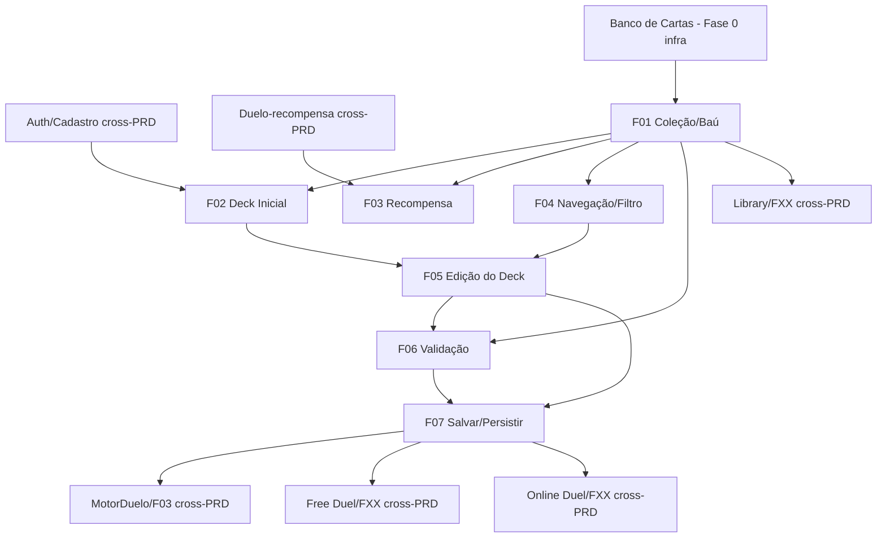

# Build Deck

## 1. Resumo Executivo

O **Build Deck** é o módulo em que o jogador monta e mantém o seu único baralho de duelo — exatamente **40 cartas**, com no máximo **3 cópias** de cada carta — a partir da sua **coleção pessoal de cartas** (o "baú"). É o ponto onde a economia de cartas do jogo (o que ele possui) encontra a preparação estratégica para o duelo (o que ele leva para o campo). Todo jogador tem, desde o cadastro, um deck ativo pronto para jogar; a partir daí, o Build Deck é o lugar onde ele ajusta, troca cartas e evolui o baralho conforme sua coleção cresce.

Neste projeto, a coleção do jogador é **finita**: no momento do cadastro, o sistema gera automaticamente um **deck aleatório válido de 40 cartas**, que passa a ser tanto a coleção inicial quanto o deck ativo. A cada **vitória em duelo**, o jogador ganha **uma carta nova**, expandindo a coleção e abrindo espaço para decisões de montagem — trocar uma carta do deck por outra recém-conquistada. Como a coleção é finita, o limite prático de cópias de uma carta no deck é `min(cópias possuídas, 3)`. Nesta versão o jogador tem **um único deck ativo** (slot único), editado no próprio lugar.

O valor central do módulo é **garantir que exista sempre um deck válido e pronto**, e que o jogador entenda com clareza o estado do seu baralho em tempo real (quantas cartas faltam para 40, quais violações impedem salvar). O deck é **persistido na conta do jogador (servidor) com cache local**, o que o torna a fonte consumida pelos módulos de duelo: o **Motor de Duelo 1x1** (`MotorDuelo/F03`), o **Free Duel** e o **Online Duel** recebem daqui o deck validado de 40 cartas. O módulo implementa o pilar de arquitetura "banco de dados das cartas em arquivos de dados" — consome o schema de cartas da Fase 0 sem inventar campos — e prepara o terreno para o pilar do servidor autoritativo, já que o deck vive na conta e não apenas no dispositivo.

## 2. Problema e Oportunidade

### O Problema

**Preparar um baralho no Forbidden Memories original era opaco e trabalhoso**
- No PS1, montar o deck significava navegar por listas longas com filtros mínimos, sem busca por nome nem ordenação útil, dificultando encontrar uma carta específica entre centenas.
- Não havia feedback claro do quão perto o deck estava de ser jogável; o jogador descobria problemas tarde, na hora de duelar.
- O baú finito e a regra de cópias criavam confusão: era difícil saber quantas cópias de uma carta o jogador realmente possuía e podia usar.

**Sem um deck sempre válido, o jogador trava logo na entrada**
- Um novo jogador sem deck pronto não consegue nem iniciar seu primeiro duelo, gerando abandono imediato.
- Decks inválidos (≠ 40 cartas, cópias em excesso) que "escapam" para o duelo quebram as regras e corrompem partidas.
- Sem validação em tempo real, o jogador perde tempo montando algo que o motor de duelo depois recusa (`MotorDuelo/F03` rejeita deck ≠ 40).

**Persistência frágil impede jogar em qualquer lugar e online**
- Um deck salvo só localmente não acompanha a conta entre dispositivos e não serve à validação server-side do modo online.
- Sem persistência confiável, uma falha de rede ou troca de aparelho faz o jogador perder horas de montagem.

**Coleção desconectada do progresso desmotiva**
- Se ganhar duelos não refletir de forma tangível na coleção e nas opções de montagem, o loop de progressão perde sentido.
- Sem enxergar as cartas recém-conquistadas disponíveis no editor, a recompensa por vencer fica invisível.

### A Oportunidade

O Build Deck web resolve cada dor: gera **automaticamente um deck válido no cadastro**, garantindo que ninguém fique travado na entrada; oferece **busca, filtros e ordenação** sobre a coleção, tornando a montagem rápida e clara; exibe **validação em tempo real** (contador 40, cópias, cartas possuídas) que impede salvar um deck inválido antes que ele chegue ao duelo; **persiste o deck na conta com cache local**, habilitando jogar em qualquer dispositivo e alimentando o servidor autoritativo do Online Duel; e **conecta a vitória à coleção** — cada duelo ganho adiciona uma carta visível e utilizável no editor, fechando o loop de progressão. O módulo se torna a ponte confiável entre "o que eu conquistei" e "o que eu levo para o duelo".

## 3. Público-Alvo

### Usuários Primários

**Jogador iniciante (recém-cadastrado)**
Acabou de criar a conta e possui apenas o deck inicial de 40 cartas gerado automaticamente. Ainda não conhece o pool de cartas nem as sinergias. Espera poder duelar imediatamente com o deck que recebeu e, aos poucos, entender como ajustá-lo. Precisa de um editor simples, com feedback claro do que é um deck válido e mensagens que expliquem o que está impedindo uma ação.

**Jogador engajado (coleção em crescimento)**
Já venceu vários duelos e acumulou cartas além das 40 iniciais. Quer otimizar o baralho: encontrar rapidamente uma carta pela busca, filtrar por classe/tipo/guardião, comparar ATK/DEF e trocar cartas fracas pelas recém-conquistadas. Valoriza agilidade na edição e a certeza de que o deck salvo é exatamente o que vai para o duelo, inclusive online.

### Perfil Comportamental

- Ambos operam sobre **um único deck ativo** e esperam que ele esteja sempre pronto para jogar.
- Ambos são sensíveis a feedback imediato: querem ver na hora quantas cartas faltam e por que não podem salvar.
- Ambos esperam que o deck **persista** e que a coleção reflita fielmente o que conquistaram jogando.

## 4. Objetivos

### Objetivos do Produto

- **Garantir** que todo jogador tenha, desde o cadastro, um deck ativo válido de 40 cartas pronto para duelar.
- **Impedir** que qualquer deck inválido (≠ 40 cartas, 4+ cópias de uma carta, ou carta não possuída) seja salvo ou usado em duelo.
- **Tornar a edição ágil e transparente**, com validação e feedback de estado do deck em tempo real durante a montagem.
- **Persistir o deck de forma confiável na conta do jogador** (servidor + cache local), tolerando falhas de rede sem perda de dados.
- **Refletir o progresso na coleção**, disponibilizando no editor cada carta conquistada ao vencer duelos.

### Métricas de Sucesso

- **Deck inicial garantido:** 100% das contas criadas recebem um deck inicial válido (exatamente 40 cartas, ≤ 3 cópias) em até 2 segundos após o cadastro; 0 contas sem deck ativo.
- **Bloqueio de deck inválido:** 100% das tentativas de salvar um deck fora de 40 cartas, com 4+ cópias de uma carta, ou com carta não possuída são bloqueadas; 0 decks inválidos persistidos ou entregues aos módulos de duelo.
- **Responsividade do editor:** contador `X/40` e lista de violações atualizados em até 100 ms por ação de adicionar/remover carta; resultados de busca/filtro sobre a coleção em até 200 ms.
- **Persistência confiável:** 100% dos saves válidos refletidos no servidor e no cache local; em falha de rede, 100% dos saves preservados localmente e sincronizados na reconexão; 0 perdas de deck salvo.
- **Coleção conectada ao progresso:** 100% das cartas de recompensa recebidas após vitória adicionadas à coleção e disponíveis no editor no próximo acesso ao Build Deck.

## 5. User Stories

### F01. Coleção do Jogador (Baú)
- Como sistema, eu quero manter a coleção do jogador como o conjunto de cartas possuídas com a quantidade de cada uma para que o editor de deck e o Library saibam exatamente o que está disponível.
- Como jogador, eu quero ver quantas cópias de cada carta eu possuo para que eu saiba quantas posso colocar no deck.

### F02. Geração do Deck Inicial no Cadastro
- Como jogador recém-cadastrado, eu quero receber automaticamente um deck válido de 40 cartas para que eu possa duelar imediatamente sem precisar montar nada.
- Como sistema, eu quero que o deck inicial gerado respeite as regras (exatamente 40 cartas, no máximo 3 cópias) para que ele já seja aceito pelos módulos de duelo.

### F03. Recompensa: Adicionar Carta à Coleção
- Como jogador, eu quero que a carta conquistada ao vencer um duelo apareça na minha coleção para que eu possa usá-la no meu deck.
- Como sistema, eu quero registrar a carta de recompensa recebida do módulo de duelo somando à quantidade possuída para que a coleção reflita o progresso do jogador.

### F04. Navegação e Filtro da Coleção
- Como jogador, eu quero buscar uma carta pelo nome dentro da minha coleção para que eu a encontre rapidamente ao montar o deck.
- Como jogador, eu quero filtrar minha coleção por classe, tipo e guardião e ordenar por atributos para que eu compare opções com agilidade.

### F05. Edição do Deck Ativo
- Como jogador, eu quero adicionar uma carta da minha coleção ao meu deck para incluí-la no baralho de 40 cartas.
- Como jogador, eu quero remover uma carta do deck de volta para a coleção para trocá-la por outra.
- Como jogador, eu quero ser impedido de adicionar uma 4ª cópia de uma carta ou uma carta que não possuo para que meu deck respeite as regras.

### F06. Validação em Tempo Real do Deck
- Como jogador, eu quero ver a todo momento quantas cartas o deck tem e o que falta para ele ficar válido para que eu saiba quando posso salvar.
- Como sistema, eu quero calcular continuamente se o deck é válido (exatamente 40, ≤ 3 cópias, apenas cartas possuídas) para que o botão de salvar só seja liberado quando for seguro.

### F07. Salvar e Persistir o Deck Ativo
- Como jogador, eu quero salvar meu deck ativo para que ele seja usado nos próximos duelos e não se perca.
- Como sistema, eu quero persistir o deck na conta (servidor) com cache local para que ele acompanhe o jogador entre dispositivos e alimente o modo online.
- Como jogador, eu quero que meus ajustes não se percam se a rede cair para que eu não retrabalhe a montagem.

## 6. Funcionalidades

### F01. Coleção do Jogador (Baú)

**Provides:**
- Coleção do jogador — mapa de `numero da carta → quantidade possuída`, enriquecido com os dados do schema (`id, numero, nome, img, classe, atk, def, guardiao1, guardiao2, estrelas, tipo`) de cada carta possuída (usado por F02, F03, F04, F05, F06; e por **Library/FXX — cross-PRD**, para exibir cartas obtidas × não obtidas)

**Capabilities:**
- A coleção é o conjunto de cartas **possuídas** com quantidade `≥ 1` por carta; cartas não possuídas não aparecem (a lista completa de 821 cartas, obtidas e não obtidas, é responsabilidade do **Library**, cross-PRD)
- Cada entrada referencia exclusivamente campos do **schema da Fase 0**, sem inventar campos novos; os dados vêm do banco de cartas em `cards-data/dados/*.json`
- Quantidade possuída por carta é um inteiro `≥ 0`; quando chega a 0 (todas as cópias fora e nenhuma possuída), a carta deixa a coleção
- A coleção é a **fonte da verdade** sobre o que pode entrar no deck; o limite efetivo de cópias de uma carta no deck é `min(quantidade possuída, 3)`
- Persistida na conta do jogador junto ao deck (servidor + cache local, ver F07)

**Experience:** Estrutura de dados consumida pelo editor e pelo Library. No editor de deck, cada carta da coleção mostra a arte (`cards-data/{numero}.jpg`), nome, classe, tipo, ATK/DEF e um indicador "possui N / no deck M". Não há tela isolada só para a coleção neste módulo — ela é o painel-fonte do editor (F04/F05).

**Nota de fidelidade:** fiel ao FM (baú finito de cartas possuídas). A exposição da coleção ao Library é uma modernização de organização de dados.

**Error Handling:**
- Coleção não carregada por falha de leitura → usa o cache local mais recente e sinaliza "Coleção carregada do cache; algumas cartas podem estar desatualizadas."
- Carta na coleção sem correspondência no banco de cartas (numero inexistente) → oculta a carta do editor e registra inconsistência: "Carta desconhecida ignorada (numero X)."

### F02. Geração do Deck Inicial no Cadastro

**Consumes:**
- F01: coleção do jogador (para semear com as 40 cartas geradas)
- **Auth/Cadastro (cross-PRD):** gatilho de criação de conta (evento "conta criada")

**Provides:**
- Coleção inicial de 40 cartas + **deck ativo inicial** de 40 cartas (usado por F05 como deck a editar; e persistido por F07)

**Capabilities:**
- Disparada **uma única vez**, no momento do cadastro/criação de conta (cross-PRD)
- Gera um deck de **exatamente 40 cartas** respeitando o **máximo de 3 cópias** por carta (Fase 0)
- As 40 cartas geradas **são também a coleção inicial**: para cada carta sorteada, a quantidade possuída é igual à quantidade colocada no deck (coleção == deck no dia 0)
- Sorteio a partir de um **pool inicial configurável** (por padrão, o catálogo de cartas jogáveis); a composição exata do pool inicial é um dado de balanceamento tunável (ver Fora de Escopo / Seção 9) e **não** contradiz nenhuma regra da Fase 0
- O deck gerado é marcado como o **deck ativo único** do jogador e persistido (F07)

**Experience:** Ao concluir o cadastro, o jogador já entra no jogo com um deck jogável. Se ele abrir o Build Deck pela primeira vez, encontra 40 cartas montadas (coleção == deck) e pode começar a jogar de imediato; só terá cartas "sobrando" na coleção para trocar depois de vencer duelos (F03).

**Nota de fidelidade:** adaptação/modernização — o FM entregava um deck inicial roteirizado; aqui o deck inicial é **aleatório e válido**, garantindo variedade e jogabilidade imediata.

**Error Handling:**
- Falha ao gerar/persistir o deck inicial no cadastro → repete a geração (idempotente) até obter um deck válido persistido; enquanto isso, bloqueia a entrada em duelos com "Preparando seu deck inicial…".
- Pool inicial insuficiente para montar 40 cartas com ≤ 3 cópias → erro de configuração registrado: "Pool inicial insuficiente para gerar deck válido." (impede contas sem deck).

### F03. Recompensa: Adicionar Carta à Coleção

**Consumes:**
- **Free Duel/FXX, Online Duel/FXX, Campanha/FXX (cross-PRD):** carta de recompensa concedida ao vencer um duelo (o `numero` da carta e a decisão de *qual* carta são do resultado do duelo — cross-PRD)
- F01: coleção do jogador (para incrementar)

**Provides:**
- Coleção atualizada (quantidade da carta recebida `+1`) (refletido em F01; visível em F04/F05 e no **Library/FXX — cross-PRD**)

**Capabilities:**
- Recebe **1 carta por vitória** e soma `+1` à quantidade possuída daquela carta na coleção; se o jogador ainda não possuía, a carta passa a existir na coleção com quantidade 1
- Não há limite superior de quantas cópias podem ser **possuídas** (o limite de 3 é regra de **deck**, não de coleção)
- A operação é **idempotente por recompensa**: cada evento de recompensa é aplicado exatamente uma vez (identificador do duelo/recompensa), evitando duplicar cartas em reprocessamento
- **Não** decide qual carta é premiada nem calcula tabela de drop — isso é responsabilidade do módulo de duelo (cross-PRD); este PRD apenas registra o recebimento

**Experience:** Após vencer um duelo, o jogador vê a carta conquistada refletida na coleção na próxima vez que abrir o Build Deck (ou imediatamente, se estiver no editor). A carta nova fica disponível para entrar no deck (F05), abrindo espaço para trocas.

**Nota de fidelidade:** simplificação — o FM tinha economia de drops baseada em rank/probabilidade por oponente; aqui a regra é "1 carta por vitória", com a seleção da carta delegada ao módulo de duelo (cross-PRD).

**Error Handling:**
- Falha ao persistir o incremento da coleção → aplica no cache local e enfileira sincronização; sinaliza "Carta conquistada salva localmente; sincronizando…".
- Evento de recompensa duplicado (mesmo identificador) → ignora sem somar de novo, registrando "Recompensa já aplicada."
- Carta de recompensa com `numero` inexistente no banco de cartas → não aplica e registra inconsistência: "Recompensa inválida (numero X)."

### F04. Navegação e Filtro da Coleção

**Consumes:**
- F01: coleção do jogador (cartas possuídas + quantidades + dados do schema)

**Provides:**
- Lista filtrada/ordenada da coleção e a **carta atualmente selecionada** no painel (usado por F05 para a ação de adicionar)

**Core Scope:**
- Listagem da coleção com arte, nome, classe, tipo, ATK/DEF, quantidade possuída e quantidade já no deck
- Busca textual por **nome** da carta

**Full Scope additions:**
- Filtros por **classe** (ex.: Dragon, Warrior…), **tipo** (`monstro`, `armadilha`, `equipamento`, `magica`) e **guardião** (`guardiao1`/`guardiao2`)
- Ordenação por `numero`, nome, `atk`, `def`, `estrelas` e quantidade possuída
- Alternância de exibição "somente cartas fora do deck" × "toda a coleção"

**Capabilities:**
- Busca por nome é **case-insensitive** e por substring; retorna resultados em até **200 ms** sobre a coleção
- Filtros são **combináveis** (semântica E entre categorias diferentes) e refletem apenas cartas **possuídas**
- Lista **virtualizada/paginada** (padrão: 40 itens por página ou rolagem virtual equivalente) para suportar coleções grandes sem perda de fluidez
- Somente leitura sobre a coleção — não altera quantidades nem o deck

**Experience:** O painel da coleção fica ao lado do painel do deck. O jogador digita parte do nome e a lista filtra ao vivo; aplica filtros de classe/tipo/guardião e ordena por atributo. Cada carta mostra "possui N · no deck M"; cartas com `M == min(N,3)` aparecem com marca de "limite atingido". Selecionar uma carta a destaca e habilita a ação de adicionar ao deck (F05).

**Nota de fidelidade:** modernização (qualidade de vida) — busca, filtros e ordenação vão além do que o FM oferecia.

### F05. Edição do Deck Ativo

**Consumes:**
- F02: deck ativo atual do jogador (o deck único a ser editado)
- F04: carta selecionada na coleção (para adicionar) e referência da carta no deck (para remover)

**Provides:**
- Deck em edição (rascunho) — lista de `numero → quantidade no deck` e o **total atual** de cartas (usado por F06 e F07)

**Capabilities:**
- Opera sobre **um único deck ativo** (slot único); não há "salvar como" nem múltiplos decks nesta versão
- **Adicionar** uma carta move `+1` cópia da coleção para o deck; **remover** devolve `+1` cópia ao pool disponível da coleção
- Limite de cópias de uma carta no deck = `min(quantidade possuída, 3)`: bloqueia a 4ª cópia **e** bloqueia adicionar mais do que o jogador possui
- Só permite adicionar cartas **presentes na coleção** (possuídas); cartas não possuídas nunca entram
- O total do deck durante a edição pode ficar temporariamente **abaixo ou acima de 40** enquanto o jogador ajusta; a **validade** (exatamente 40) é avaliada por F06 e só afeta o salvar (F07)
- Mantém um **rascunho local** dos ajustes para não perder progresso; o deck ativo oficial só muda ao salvar um rascunho válido (F07)

**Experience:** O jogador clica em "＋" numa carta da coleção para adicioná-la ao deck, ou "－" numa carta do deck para removê-la. O contador do deck (F06) atualiza na hora, assim como o marcador "no deck M / possui N" da carta. Tentar adicionar além do permitido não faz nada além de exibir a mensagem de bloqueio correspondente. Ao sair sem salvar um rascunho válido, o deck ativo anterior permanece intacto.

**Nota de fidelidade:** fiel ao FM (troca de cartas entre baú e deck, deck único), com feedback em tempo real como modernização.

**Error Handling:**
- Tentar adicionar a 4ª cópia de uma carta → recusa: "Máximo de 3 cópias por carta."
- Tentar adicionar mais cópias do que possui → recusa: "Você possui apenas N cópia(s) desta carta."
- Tentar adicionar carta não possuída → recusa: "Carta não está na sua coleção."
- Sair do editor com rascunho **não salvo** e diferente do deck ativo → confirma: "Você tem alterações não salvas. Sair sem salvar?" (mantém o rascunho local para retomar depois).

### F06. Validação em Tempo Real do Deck

**Consumes:**
- F05: deck em edição (rascunho) com quantidade por carta e total atual
- F01: quantidade possuída por carta (para validar "apenas cartas possuídas" e o teto por carta)

**Provides:**
- Estado de validação do deck — booleano `válido/inválido` + lista de violações com detalhe (usado por F07 para liberar/bloquear o salvar)

**Capabilities:**
- Avalia continuamente as três regras da Fase 0: **exatamente 40 cartas**, **no máximo 3 cópias** por carta, e (regra deste módulo) **todas as cartas possuídas** em quantidade suficiente
- Recalcula em até **100 ms** a cada ação de adicionar/remover (F05)
- Produz violações específicas e legíveis: `faltam K cartas para 40`, `excedem K cartas acima de 40`, `carta X com 4+ cópias`, `carta X além do que possui`
- É um cálculo **puro/somente leitura**: não altera o deck nem a coleção; apenas reporta o estado
- O deck só é considerado **válido para salvar/duelar** quando **todas** as regras passam simultaneamente

**Experience:** No topo do editor, um contador `X/40` fica verde quando `X == 40` e as regras passam, e vermelho caso contrário, acompanhado de uma lista curta de pendências ("Faltam 3 cartas", "Dark Magician: 4 cópias (máx. 3)"). O botão "Salvar deck" permanece desabilitado enquanto houver qualquer violação. Não há tratamento de erro dedicado: é um validador de leitura, sem escrita nem rede.

**Nota de fidelidade:** fiel às regras de deck da Fase 0; o feedback em tempo real é modernização.

### F07. Salvar e Persistir o Deck Ativo

**Consumes:**
- F05: deck em edição (rascunho) a ser salvo
- F06: estado de validação (deck válido/inválido)

**Provides:**
- **Deck ativo validado de 40 cartas** — lista de cartas com quantidade por carta, persistida na conta (usado por **MotorDuelo/F03 — cross-PRD** para iniciar o duelo, **Free Duel/FXX — cross-PRD** e **Online Duel/FXX — cross-PRD**)

**Core Scope:**
- Salvar o deck ativo apenas quando **100% válido** (F06), gravando no servidor (conta) e no cache local
- Carregar o deck ativo persistido ao abrir o Build Deck

**Full Scope additions:**
- Resolução de conflito quando o mesmo deck foi alterado em outro dispositivo (última gravação válida vence, com aviso)
- Sincronização em segundo plano de saves feitos offline assim que a conexão volta

**Capabilities:**
- O botão de salvar só é habilitado com deck **válido** (F06); um deck **inválido nunca é persistido** (decisão da Fase 2)
- Grava primeiro no **cache local** (imediato) e replica ao **servidor** em até **2 s** em condições normais de rede
- Em **falha de rede**, mantém o save no cache local e **enfileira sincronização**; ao reconectar, sobe automaticamente sem intervenção do jogador
- O deck persistido é a **fonte única** entregue aos módulos de duelo; nenhum módulo de duelo recebe rascunhos não salvos
- Como há **1 deck único**, salvar **sobrescreve** o deck ativo anterior (não cria novo slot)

**Experience:** Com o deck em 40/40 válido, o jogador clica em "Salvar deck". Um indicador confirma "Deck salvo" (localmente na hora; "sincronizado" quando o servidor confirma). A partir daí, iniciar um Free Duel ou Online Duel usa exatamente esse deck. Se a rede estiver fora, o jogador vê "Salvo offline — será sincronizado" e pode jogar offline normalmente.

**Nota de fidelidade:** modernização — persistência em conta (servidor) com cache local não existia no FM de PS1; habilita multi-dispositivo e o servidor autoritativo do Online Duel.

**Error Handling:**
- Tentar salvar deck inválido (contorno de UI) → recusa no back-end: "Deck inválido: exatamente 40 cartas, máx. 3 cópias, apenas cartas possuídas."
- Falha de rede ao salvar → grava no cache local e sinaliza "Salvo offline — sincronizando quando a conexão voltar."
- Conflito de versão (deck alterado em outro dispositivo) → mantém a última gravação **válida** e avisa "Seu deck foi atualizado em outro dispositivo; a versão mais recente foi mantida."
- Sessão expirada/sem autorização ao sincronizar → mantém o cache local e solicita reautenticação: "Faça login novamente para sincronizar seu deck."

## 7. Fora de Escopo

**Subsistemas que são (ou serão) PRDs próprios:**
- **Fusion System** — a lógica de quais cartas se fundem em quê acontece **durante o duelo**, não na montagem; o Build Deck não pré-monta fusões (cross-PRD).
- **Seleção da carta de recompensa / tabela de drops** — *qual* carta o jogador ganha ao vencer é decisão do módulo de duelo (Free/Online/Campanha); este PRD só **recebe e registra** a carta (cross-PRD).
- **Library** — a navegação pelo catálogo completo das 821 cartas, incluindo as **não obtidas** e seus estados; o Build Deck só lista a coleção **possuída** (cross-PRD; o Library consome a coleção deste PRD).

**Economia de aquisição não coberta nesta versão:**
- **Compra de cartas por `estrelas`** (loja/shop) e **desbloqueio via Password** — fontes adicionais de crescimento da coleção; o "sink" de adicionar carta (F03) já as atenderá no futuro, mas as telas e regras dessas fontes ficam fora desta versão.

**Escopo de deck limitado nesta versão:**
- **Múltiplos decks / troca de deck ativo** — nesta versão há **1 deck único** (slot único); suporte a vários decks salvos e a um "ativo entre muitos" é expansão futura.
- **Importar/exportar deck por código, decks pré-fabricados e sugestões automáticas** — fora de escopo.

**Regras de jogo e outros módulos:**
- **Regras de duelo, invocação, combate e uso das cartas em campo** — pertencem ao **Motor de Duelo 1x1** (cross-PRD); este módulo só entrega o deck válido.
- **Duelos 2x2** e qualquer deck secundário associado — expansão futura (Fase 0).

**Interface e apresentação:**
- Renderização, animações, layout responsivo concreto e sons — camada de UI; este PRD descreve validações, fluxos e mensagens em nível lógico, não sua aparência.

**Dado de balanceamento (pendência, não regra da Fase 0):**
- A **composição exata do pool inicial** usado por F02 (quais cartas podem cair no deck aleatório de cadastro) é um dado tunável de balanceamento a ser definido; não é uma tabela de regra protegida da Fase 0.

## 8. Grafo de Dependências

### Parte 1: Tabela de Dependências

| # | Feature | Prioridade | Dependências |
|---|---------|------------|---------------|
| F01 | Coleção do Jogador (Baú) | 1 | None (infra: banco de cartas — Fase 0) |
| F02 | Geração do Deck Inicial no Cadastro | 1 | F01, Auth/Cadastro (cross-PRD) |
| F03 | Recompensa: Adicionar Carta à Coleção | 2 | F01, Duelo-recompensa (Free/Online/Campanha, cross-PRD) |
| F04 | Navegação e Filtro da Coleção | 2 | F01 |
| F05 | Edição do Deck Ativo | 1 | F02, F04 |
| F06 | Validação em Tempo Real do Deck | 1 | F05, F01 |
| F07 | Salvar e Persistir o Deck Ativo | 1 | F05, F06 |

### Parte 2: Foundation Features

- **F01 — Coleção do Jogador (Baú):** a fonte única da verdade sobre o que o jogador possui. Todo o restante do módulo depende dela, direta ou indiretamente: a geração inicial a semeia (F02), a recompensa a incrementa (F03), a navegação a exibe (F04), a edição a consome (F05) e a validação lê suas quantidades (F06). Recomenda-se implementá-la antes de qualquer outra feature.

### Parte 3: Execution Waves

- **Wave 1:** F01
- **Wave 2:** F02, F03, F04
- **Wave 3:** F05
- **Wave 4:** F06
- **Wave 5:** F07

*(Dependências cross-PRD — Auth, módulos de duelo, banco de cartas — são tratadas como externas/disponíveis e não deslocam as waves internas. Dentro de cada wave, a ordem segue prioridade ascendente e depois o ID.)*

### Parte 4: Legenda de Prioridade

### Níveis de prioridade
- **1** = Essencial — o módulo não funciona sem isso
- **2** = Importante — adição significativa de valor
- **3** = Desejável — melhoria incremental

### Parte 5: Diagrama Mermaid

## 9. Critérios de Aceite

### F01. Coleção do Jogador (Baú)
- [ ] A coleção expõe, por carta possuída, a quantidade (`≥ 1`) e os dados do schema da Fase 0, sem campos inventados.
- [ ] Cartas com quantidade 0 não aparecem na coleção; o limite efetivo de cópias no deck é `min(possuídas, 3)`.
- [ ] Cartas não possuídas não são listadas no editor (a lista completa é do Library, cross-PRD).
- [ ] Falha de leitura recorre ao cache local com aviso, sem quebrar o editor.

### F02. Geração do Deck Inicial no Cadastro
- [ ] Ao criar a conta, um deck de exatamente 40 cartas com ≤ 3 cópias é gerado e marcado como deck ativo em até 2 s.
- [ ] As 40 cartas geradas são também a coleção inicial (coleção == deck no dia 0).
- [ ] 100% das contas criadas terminam com um deck ativo válido; falha na geração é reprocessada até persistir um deck válido.
- [ ] **(Pendente — dado de balanceamento)** Quando o pool inicial for definido, o sorteio respeita esse pool; critério a validar após a definição da composição do pool.

### F03. Recompensa: Adicionar Carta à Coleção
- [ ] Vencer um duelo adiciona exatamente `+1` à quantidade da carta recebida; carta antes não possuída passa a existir com quantidade 1.
- [ ] Cada evento de recompensa é aplicado uma única vez (idempotência por identificador); reprocessar não duplica cartas.
- [ ] Recompensa com `numero` inexistente é rejeitada sem alterar a coleção, com registro de inconsistência.
- [ ] A carta conquistada aparece disponível no editor no acesso seguinte ao Build Deck.

### F04. Navegação e Filtro da Coleção
- [ ] Busca por nome (case-insensitive, substring) retorna resultados sobre a coleção em até 200 ms.
- [ ] Filtros por classe, tipo e guardião são combináveis (semântica E) e exibem apenas cartas possuídas; ordenação por `numero`, nome, `atk`, `def`, `estrelas` e quantidade funciona.
- [ ] Cada carta mostra "possui N · no deck M" e marca "limite atingido" quando `M == min(N, 3)`.
- [ ] A navegação é somente leitura: não altera quantidades nem o deck.

### F05. Edição do Deck Ativo
- [ ] Adicionar move `+1` da coleção para o deck; remover devolve `+1` à coleção; ambos refletem no contador na hora.
- [ ] Recusa a 4ª cópia de uma carta, adicionar além do que possui, e adicionar carta não possuída — cada caso com a mensagem específica.
- [ ] O total pode ficar temporariamente ≠ 40 durante a edição; a validade é avaliada por F06 e só afeta o salvar.
- [ ] Sair com rascunho não salvo pede confirmação e preserva o rascunho local; o deck ativo anterior permanece intacto até um save válido.

### F06. Validação em Tempo Real do Deck
- [ ] O estado válido/inválido reflete simultaneamente: exatamente 40 cartas, ≤ 3 cópias por carta e apenas cartas possuídas em quantidade suficiente.
- [ ] Cada ação de adicionar/remover recalcula o estado em até 100 ms e atualiza a lista de violações específicas.
- [ ] O botão de salvar permanece desabilitado enquanto houver qualquer violação.
- [ ] A validação não altera deck nem coleção (é somente leitura).

### F07. Salvar e Persistir o Deck Ativo
- [ ] Salvar só é permitido com deck 100% válido (F06); um deck inválido nunca é persistido, mesmo por contorno de UI (recusa no back-end).
- [ ] Um save válido grava no cache local imediatamente e replica ao servidor em até 2 s em rede normal.
- [ ] Em falha de rede, o save é mantido localmente e sincronizado automaticamente na reconexão, sem perda.
- [ ] Salvar sobrescreve o deck ativo único (não cria novo slot); ao reabrir o Build Deck, o deck ativo persistido é carregado.
- [ ] Conflito entre dispositivos mantém a última gravação válida e avisa o jogador.

### Cross-Feature Integration
- [ ] Fluxo completo: F02 gera deck+coleção no cadastro → F04 navega a coleção → F05 edita → F06 valida em tempo real → F07 salva o deck válido, sem estado inconsistente entre coleção e deck.
- [ ] Somar/subtrair cartas em F05 nunca deixa a soma "no deck + disponível na coleção" maior que a quantidade possuída registrada em F01.
- [ ] Uma carta conquistada por F03 fica imediatamente utilizável em F04/F05 para troca no deck.

### Cross-PRD Integration
- [ ] **Motor de Duelo 1x1:** o deck válido de 40 cartas persistido por F07 é aceito por `MotorDuelo/F03` ao iniciar o duelo, sem rejeição por tamanho/cópias (cross-PRD).
- [ ] **Free Duel / Online Duel:** ao iniciar um duelo offline ou online, o deck ativo salvo é o usado; nenhum rascunho não salvo chega ao duelo (cross-PRD).
- [ ] **Library:** as cartas e quantidades da coleção (F01) são refletidas corretamente pelo Library para distinguir obtidas × não obtidas (cross-PRD).
- [ ] **Auth/Cadastro:** o evento de criação de conta dispara F02 exatamente uma vez por conta (cross-PRD).
- [ ] **(Pendente)** Quando as fontes de compra por `estrelas`/Password existirem, elas usarão o mesmo "sink" de F03 para crescer a coleção — critério a validar após a definição desses módulos (cross-PRD).
