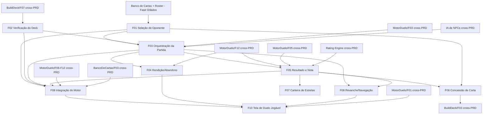

# Free Duel

## 1. Resumo Executivo

O **Free Duel** é o modo de partida avulsa offline do YuGiOh Forbidden Memories Remastered: o lugar onde o jogador escolhe um duelista NPC, entra em um duelo 1x1 contra a CPU usando seu deck ativo e recebe recompensas proporcionais à qualidade do duelo. Ele funciona como a **casca de orquestração entre o menu principal e o Motor de Duelo 1x1** — não reimplementa nenhuma regra de combate; em vez disso, monta a partida, conecta o lado da CPU à IA de NPCs e traduz o resultado devolvido pelo motor em um fim de partida com nota, recompensas e navegação.

O módulo é o principal **loop de progressão offline** do jogo. A cada vitória, o desempenho do jogador é avaliado por uma **nota de duelo** (calculada por um Rating Engine compartilhado, cross-PRD): notas mais altas rendem **mais estrelas** (creditadas em uma carteira persistente na conta) e **maior chance de dropar cartas raras** do pool do oponente derrotado — a carta conquistada é somada à coleção do Build Deck. Derrota e empate encerram a partida sem recompensa e sem penalidade. Assim, o Free Duel fecha o ciclo "jogar → ganhar estrelas e cartas → melhorar o deck → jogar de novo" sem exigir conexão.

O valor central do Free Duel é oferecer **duelos justos, imediatos e recompensadores contra a CPU**, reaproveitando integralmente o Motor de Duelo 1x1 como fonte única de regras e o Build Deck como fonte do deck. Ele implementa os pilares de arquitetura "Game Engine desacoplado" (consome o motor, não o duplica), "IA de NPCs com dificuldades e estratégias por duelista" (cada NPC do roster tem seu perfil) e "banco de dados das cartas em arquivos de dados" (roster, decks de NPC e pools de drop vivem em dados, não em regras hard-coded).

## 2. Problema e Oportunidade

### O Problema

**Não há um caminho rápido para "só duelar" offline**
- Sem um modo avulso, todo teste de deck ou partida casual dependeria da campanha (com progressão amarrada) ou do online (com rede e fila), criando fricção para quem só quer jogar uma partida.
- Jogadores que querem treinar um deck novo antes de arriscá-lo no ranqueado online não têm sandbox offline.
- O modo avulso do FM original tinha seleção de oponente enxuta e pouca clareza sobre o que estava em jogo em cada duelo.

**Jogar bem não é recompensado, então o duelo vira "só reduzir LP a 0"**
- No FM original, a qualidade do duelo (rapidez, eficiência, uso de fusões) definia o rank e o pool de drops, mas isso era opaco e mal explicado ao jogador.
- Sem uma nota visível e uma recompensa escalonada, não há incentivo para vencer com estilo — todo duelo rende o mesmo, e o farm de cartas raras fica frustrante e aleatório demais.
- Sem estrelas e drops conectados ao desempenho, o loop de progressão perde tração e o jogador abandona antes de completar a coleção.

**Deck inválido ou ausente pode travar (ou corromper) a partida**
- Se o Free Duel tentasse iniciar sem garantir um deck válido, o Motor de Duelo rejeitaria a inicialização (`MotorDuelo/F03` recusa deck ≠ 40), gerando um beco sem saída na entrada do duelo.
- Um jogador recém-cadastrado, ou que esvaziou o deck no editor, precisa ser direcionado com clareza em vez de receber um erro cru.

**Reimplementar regras por modo gera divergência**
- Se o Free Duel tivesse sua própria cópia das regras de combate, o comportamento divergiria do Online Duel e da Campanha, quebrando a promessa de "mesma jogada, mesmo resultado".
- Cada divergência vira um bug de "por que perdi vida aqui e não ali" difícil de reproduzir.

### A Oportunidade

O Free Duel resolve cada dor sem reinventar nada: entrega **partidas offline imediatas** contra um roster de duelistas selecionável, cada um com deck e dificuldade próprios; introduz uma **nota de duelo visível** que converte desempenho em **estrelas + chance de drop raro**, dando finalmente sentido a vencer bem e sustentando o farm de coleção; **valida o deck ativo antes de iniciar**, redirecionando ao Build Deck quando necessário em vez de falhar; e **consome o Motor de Duelo 1x1 como fonte única de regras**, garantindo comportamento idêntico ao dos demais modos. É o modo que transforma o motor e o editor em um ciclo de jogo completo e recompensador, mesmo sem internet.

## 3. Público-Alvo

### Usuários Primários

**Jogador casual / de treino**
Quer entrar, escolher um oponente e duelar em poucos cliques, sem se preocupar com fila, rede ou progressão obrigatória. Usa o Free Duel para relaxar, testar um deck novo ou reaprender as regras. Espera início rápido, oponentes de dificuldade previsível e a certeza de que pode sair e voltar a qualquer momento.

**Jogador otimizador de recompensa (farmador)**
Joga o Free Duel com objetivo claro: acumular **estrelas** e **cartas raras** para completar a coleção e financiar o deck. Estuda quais oponentes têm os melhores pools de drop e busca a nota máxima em cada duelo para maximizar a recompensa. Valoriza transparência da nota, consistência do escalonamento (nota melhor = recompensa melhor) e ausência de recompensas perdidas por bug.

**Jogador competitivo em preparação (ponte para o Online)**
Usa o Free Duel como campo de treino offline antes do ranqueado online: testa combinações do deck contra IAs de estilos diferentes, sem risco de rating. Espera que as regras aqui sejam exatamente as do Online (mesmo motor), para que o treino seja válido.

### Perfil Comportamental

- Todos esperam **início e saída sem fricção**: entrar, duelar, receber o resultado e voltar ao menu ou revanche em poucos passos.
- Todos são sensíveis a **justiça e consistência**: o duelo precisa seguir as mesmas regras dos demais modos e a recompensa precisa refletir o desempenho de forma previsível.
- Todos esperam que o **progresso (estrelas e cartas) seja preservado** de forma confiável na conta, mesmo offline.

## 4. Objetivos

### Objetivos do Produto

- **Oferecer** duelos 1x1 avulsos offline contra a CPU, com escolha de oponente em um roster de duelistas, sem depender de rede.
- **Reaproveitar** o Motor de Duelo 1x1 como fonte única das regras, sem reimplementar combate no Free Duel (todo resultado vem de `MotorDuelo/F12`).
- **Recompensar a qualidade do duelo** convertendo a nota de vitória em estrelas e em cartas com raridade escalonada, com derrota/empate sem recompensa e sem penalidade.
- **Fechar o loop de progressão offline**, creditando estrelas em uma carteira persistente na conta e somando a carta conquistada à coleção do Build Deck.
- **Garantir** que apenas decks válidos entrem em duelo, bloqueando o início e redirecionando o jogador quando o deck ativo for inválido ou ausente.

### Métricas de Sucesso

- **Entrada segura em partida:** 100% dos duelos iniciados usam dois decks de exatamente 40 cartas aceitos por `MotorDuelo/F03`; 0 partidas iniciadas com deck do jogador inválido/ausente.
- **Recompensa por vitória:** 100% das vitórias creditam exatamente 1 carta na coleção e as estrelas correspondentes à nota; 0 recompensas duplicadas (idempotência por identificador de duelo).
- **Escalonamento monotônico:** para 100% das faixas de nota, uma nota mais alta concede estrelas ≥ e chance de drop raro ≥ às de uma nota mais baixa (sem inversões).
- **Carteira confiável:** 100% dos créditos de estrelas refletidos no saldo persistido (servidor + cache local); em falha de rede, 100% enfileirados e sincronizados na reconexão, com 0 perdas.
- **Desacoplamento de regras:** 0 regras de combate reimplementadas no Free Duel (todo desfecho provém de `MotorDuelo/F12`), verificável por análise estática/revisão.
- **Integridade do roster:** 100% dos oponentes carregados do arquivo de roster referenciam decks válidos (40 cartas, ≤ 3 cópias) e apenas cartas existentes no banco (`cards-data/dados/*.json`).

## 5. User Stories

### F01. Seleção de Oponente (Roster de Duelistas)
- Como jogador, eu quero ver a lista de duelistas NPC disponíveis, com nome e dificuldade, para escolher contra quem duelar.
- Como jogador, eu quero saber a dificuldade de cada oponente antes de escolher para calibrar o desafio que quero.
- Como sistema, eu quero carregar o roster (nome, retrato, deck, dificuldade, pool de drops) de um arquivo de dados para que novos duelistas sejam adicionados sem alterar código.

### F02. Verificação do Deck Ativo
- Como jogador, eu quero que o jogo use automaticamente meu deck ativo salvo ao iniciar um Free Duel para não precisar montar nada de novo.
- Como jogador, eu quero ser avisado e levado ao Build Deck se meu deck estiver inválido ou ausente para que eu não fique travado na entrada do duelo.

### F03. Orquestração da Partida
- Como jogador, eu quero iniciar o duelo contra o oponente escolhido e ver a partida começar com meu deck contra o deck dele para que eu jogue de imediato.
- Como sistema, eu quero entregar os dois decks e um seed ao Motor de Duelo e conduzir o lado da CPU pela IA de NPCs conforme a dificuldade do oponente para que o duelo role sem que o Free Duel conheça as regras internas.

### F04. Rendição e Abandono
- Como jogador, eu quero me render durante um duelo perdido para encerrá-lo e voltar ao menu sem esperar o fim natural.
- Como jogador, eu quero ser avisado de que sair no meio da partida conta como derrota antes de confirmar para que eu não perca o duelo por engano.

### F05. Resultado do Duelo e Nota
- Como jogador, eu quero ver ao final se venci, perdi ou empatei, por qual motivo, e qual nota o meu duelo recebeu para entender minha recompensa.
- Como sistema, eu quero consolidar o resultado do motor com a nota calculada pelo Rating Engine para que as features de recompensa saibam exatamente o que conceder.

### F06. Concessão de Carta (Drop por Vitória)
- Como jogador, eu quero receber uma carta ao vencer, com chance maior de ser rara quando minha nota é alta, para completar minha coleção.
- Como sistema, eu quero sortear a carta do pool de drops do oponente derrotado ponderado pela faixa de raridade da nota e somá-la à coleção do Build Deck exatamente uma vez.

### F07. Carteira de Estrelas
- Como jogador, eu quero acumular as estrelas ganhas por nota em um saldo que fica salvo na minha conta para usá-las no futuro.
- Como sistema, eu quero creditar as estrelas da recompensa na carteira de forma persistente e idempotente para que o saldo nunca duplique nem se perca.

### F08. Revanche e Navegação Pós-Duelo
- Como jogador, eu quero, ao fim do duelo, poder pedir revanche contra o mesmo oponente, escolher outro oponente ou voltar ao menu para continuar jogando sem fricção.

### F09. Integração do Motor no Duelo Offline
- Como jogador, eu quero que o duelo que eu inicio seja de verdade — cartas compradas, jogadas aplicadas e vitória apurada pelo motor — e não uma tela de demonstração.
- Como jogador, eu quero que uma jogada ilegal apenas me avise o motivo, sem encerrar a partida, para eu poder tentar outra coisa.
- Como sistema, eu quero um único ponto de composição que instancie o motor real com o catálogo, o deck do jogador e o deck do NPC, para que a fronteira "app não conhece regra" continue verificável.

### F10. Tela de Duelo Jogável
- Como jogador, eu quero ver o campo dos dois lados, minha mão e os pontos de vida em uma tela que se pareça com o console original, para me sentir jogando Forbidden Memories.
- Como jogador, eu quero invocar um monstro escolhendo a zona e a posição (ataque ou defesa, virado para cima ou para baixo) para jogar com intenção.
- Como jogador, eu quero declarar ataque escolhendo o atacante e o alvo, ou atacar diretamente quando o campo do oponente estiver vazio.
- Como jogador, eu quero ver o que aconteceu — a carta comprada, a carta entrando no campo, o ataque e o dano — por meio de animações curtas que não me atrapalhem.

## 6. Funcionalidades

### F01. Seleção de Oponente (Roster de Duelistas)

**Provides:**
- Deck fixo do oponente selecionado (lista de 40 cartas por `numero`) + perfil de dificuldade/estratégia da IA daquele duelista (usado por F03)
- Pool de drops do oponente — cartas candidatas organizadas por faixa de raridade (usado por F06)

**Capabilities:**
- Roster **fixo, carregado de um arquivo de dados** (não hard-coded): cada duelista tem `id`, nome, retrato (asset), **deck próprio de exatamente 40 cartas** (≤ 3 cópias, Fase 0), **dificuldade/estratégia fixa** e um **pool de drops** próprio
- Cada carta do deck do NPC e de seu pool de drops referencia apenas o schema da Fase 0 (`id, numero, nome, img, classe, atk, def, guardiao1, guardiao2, password, estrelas, tipo`) e existe no banco (`cards-data/dados/*.json`) — sem campos novos
- A **dificuldade é fixa por NPC** (decisão da Fase 2): escolher o oponente já define o nível/estratégia da IA; não há seletor de dificuldade separado nesta versão
- A **composição do roster** (quais duelistas, seus decks, dificuldades e pools de drop) é **dado de balanceamento a definir** — pendência explícita (ver Seção 9); não é regra protegida da Fase 0
- Somente leitura: a seleção não altera dados do jogador

**Experience:** Ao entrar no Free Duel, o jogador vê uma tela com os duelistas do roster — retrato, nome e um indicador de dificuldade (ex.: Fácil / Médio / Difícil). Seleciona um oponente e confirma para prosseguir à preparação da partida (F02/F03). A lista é populada a partir do arquivo de roster; adicionar um novo duelista é uma edição de dados.

**Nota de fidelidade:** fiel ao FM (duelistas com decks e “personalidades” próprios), com dificuldade explícita ao jogador como modernização de qualidade de vida.

**Error Handling:**
- Arquivo de roster ausente/corrompido → usa o último roster em cache e sinaliza: "Lista de duelistas carregada do cache; pode estar desatualizada."
- Duelista com deck inválido (≠ 40 cartas ou 4+ cópias) ou carta inexistente → oculta o duelista da lista e registra inconsistência: "Duelista X indisponível (deck inválido)."

### F02. Verificação do Deck Ativo

**Consumes:**
- **BuildDeck/F07 (cross-PRD):** deck ativo validado de exatamente 40 cartas do jogador

**Provides:**
- Deck do jogador pronto para o duelo + flag "jogador tem deck válido" (usado por F03)

**Capabilities:**
- Carrega o **deck ativo único** do jogador do Build Deck (servidor + cache local, cross-PRD); não há seleção de deck nesta versão (o jogador tem 1 deck ativo, Fase 0/Build Deck)
- Reconfirma que o deck tem **exatamente 40 cartas** e **≤ 3 cópias** (Fase 0) antes de liberar o início; se o Build Deck já garante isso, esta é uma verificação de defesa
- Se o deck estiver **ausente, incompleto ou inválido**, **bloqueia** o início do duelo e oferece navegação direta ao **Build Deck** (cross-PRD)
- Não edita o deck — apenas lê e valida

**Experience:** Após escolher o oponente, o jogo carrega o deck ativo do jogador silenciosamente. Se estiver tudo certo, segue direto para a partida (F03). Se o deck não estiver pronto (ex.: jogador esvaziou o deck no editor), aparece um aviso claro com o botão "Ir para Build Deck".

**Nota de fidelidade:** modernização — a verificação e o redirecionamento não existiam no FM; garantem que o jogador nunca fique preso na entrada do duelo.

**Error Handling:**
- Deck ativo ausente → bloqueia e orienta: "Você ainda não tem um deck pronto. Monte seu deck no Build Deck."
- Deck ativo inválido (≠ 40 / 4+ cópias) → bloqueia e orienta: "Seu deck está inválido (precisa de 40 cartas, máx. 3 cópias). Ajuste no Build Deck."
- Falha ao carregar o deck (rede/cache) → tenta o cache local; se indisponível, sinaliza: "Não foi possível carregar seu deck agora. Tente novamente."

### F03. Orquestração da Partida

**Consumes:**
- F01: deck fixo do oponente + perfil de dificuldade/estratégia da IA
- F02: deck do jogador válido + flag "jogador tem deck válido"
- **MotorDuelo/F03 (cross-PRD):** inicialização do duelo com os dois decks + seed
- **IA de NPCs/FXX (cross-PRD):** ações do lado CPU conforme o perfil de dificuldade do NPC

**Provides:**
- Sessão de duelo ativa — referência à partida em andamento no motor, com **lado do jogador = P1** e **lado da CPU = P2** (usado por F04, F05, F08)

**Capabilities:**
- Monta a partida entregando ao motor (`MotorDuelo/F03`) o **deck do jogador (F02)** e o **deck do NPC (F01)**, mais um **seed** (para reprodutibilidade/registro); o motor sorteia quem começa e distribui as mãos de 5 cartas e os 8000 LP (Fase 0)
- Vincula o **lado da CPU (P2)** ao agente da **IA de NPCs (cross-PRD)** usando o perfil de dificuldade do oponente (F01); a cada turno da CPU, o Free Duel repassa o estado do motor ao agente e submete as ações retornadas ao motor
- **Não decide jogadas nem valida regras**: a decisão da CPU é da IA de NPCs (cross-PRD) e a validação/resolução é do motor (cross-PRD); o Free Duel apenas conecta as pontas e transporta ações
- Encaminha as ações do **jogador humano (P1)** vindas da UI ao motor sem interpretá-las como regra
- A partida roda **100% offline**; sem servidor autoritativo (isso é do Online Duel, cross-PRD)

**Experience:** Após a verificação do deck, a tela de duelo abre com o campo montado (5 zonas de monstro + 5 de magia/armadilha por lado, Fase 0), as mãos iniciais e o oponente do outro lado. O jogador joga seus turnos; nos turnos da CPU, a IA age conforme a dificuldade do NPC. O duelo segue até o motor declarar um resultado (`MotorDuelo/F12`).

**Nota de fidelidade:** fiel ao FM (duelo 1x1 contra CPU com deck e estilo próprios); a arquitetura de conectar IA e motor por contrato é modernização transparente ao jogador.

**Error Handling:**
- Motor recusa iniciar (deck ≠ 40 / carta desconhecida) apesar da verificação de F02 → aborta o início e reporta: "Não foi possível iniciar o duelo (deck inválido). Verifique seu deck."
- Agente de IA indisponível/sem ação válida em um turno → registra o incidente e encerra a partida com segurança (sem travar o jogador), oferecendo voltar ao menu: "Falha na IA do oponente; duelo encerrado."
- Interrupção do app durante a partida (offline) → a sessão não persiste como duelo em andamento nesta versão (ver Fora de Escopo); ao reabrir, o jogador retorna ao menu do Free Duel.

### F04. Rendição e Abandono

**Consumes:**
- F03: sessão de duelo ativa
- **MotorDuelo/F12 (cross-PRD):** encerramento por rendição (motivo `rendicao`)

**Capabilities:**
- Permite **render-se a qualquer momento** durante a partida; a rendição é encaminhada ao motor (`MotorDuelo/F12`), que declara derrota do jogador com motivo `rendicao`
- **Sair da tela de duelo** (abandono) equivale a render-se: conta como **derrota**, sem recompensa (F06/F07 não disparam) e sem penalidade extra
- Exige **confirmação explícita** antes de render/abandonar, deixando claro que conta como derrota
- Como o resultado (derrota) flui pelo motor, a tela de resultado (F05) trata o desfecho normalmente

**Experience:** O jogador aciona "Render-se" (ou tenta sair da partida). Um diálogo confirma: "Render-se conta como derrota. Confirmar?". Ao confirmar, o motor encerra o duelo como derrota e a tela de resultado (F05) aparece indicando o motivo, sem recompensa.

**Error Handling:**
- Tentativa de render após o duelo já ter terminado → ignora silenciosamente (o motor já declarou resultado): sem efeito.
- Fechamento abrupto da aba/app no meio do duelo → tratado como abandono/derrota da sessão corrente; nenhum estado de duelo em andamento é retomado (ver Fora de Escopo).

### F05. Resultado do Duelo e Nota

**Consumes:**
- F03: sessão de duelo ativa (encerrada)
- **MotorDuelo/F12 (cross-PRD):** resultado do duelo — vencedor, perdedor e motivo (`lp_zerado`, `deck_out`, `rendicao`, `empate`)
- **MotorDuelo/F05 (cross-PRD):** snapshot/estatísticas do duelo (turnos, LP restante, fusões, cartas usadas etc.) como insumo para a nota
- **Rating Engine/FXX (cross-PRD):** nota de duelo calculada + tabela de recompensa aplicável (estrelas + faixa de raridade) para a nota

**Provides:**
- Resultado consolidado do duelo — { desfecho (vitória/derrota/empate), motivo, **nota** (grade), **estrelas a conceder**, **faixa de raridade do drop** } (usado por F06, F07, F08)

**Capabilities:**
- Recebe o desfecho do motor (`MotorDuelo/F12`) e, **apenas quando o jogador é o vencedor**, obtém do **Rating Engine (cross-PRD)** a nota do duelo a partir do snapshot/estatísticas (`MotorDuelo/F05`) e a tabela nota→recompensa
- A **escala de notas e a fórmula de cálculo** (ex.: S+, S, A, B, C, D — ilustrativo) e a **tabela nota→recompensa** (quantas estrelas e qual faixa de raridade por nota) são do **Rating Engine (cross-PRD)** e são **pendência a definir**; o Free Duel **não inventa** esses valores (ver Seção 9)
- Em **derrota/empate**, exibe o desfecho e o motivo, **sem nota de recompensa e sem drop/estrelas** (decisão da Fase 2)
- Exibe o resultado de forma legível: desfecho, motivo, e (na vitória) a nota, as estrelas ganhas e a carta conquistada (esta última vinda de F06)
- É o **ponto único** que traduz o desfecho técnico do motor em recompensa; F06 e F07 consomem daqui, não do motor diretamente

**Experience:** Ao fim do duelo, abre a tela de resultado. Na vitória: "Vitória! Nota S — +N estrelas" e, logo abaixo, a carta conquistada (F06). Na derrota/empate: "Derrota" / "Empate" com o motivo (ex.: "Seus LP chegaram a 0"), sem recompensa. Botões de revanche/navegação (F08) ficam disponíveis.

**Nota de fidelidade:** fiel ao espírito do FM (rank de duelo determinando drops) e modernizado ao tornar a nota e a recompensa **explícitas** ao jogador.

**Error Handling:**
- Rating Engine indisponível na vitória → concede a **faixa de recompensa mínima** garantida (nota-base) para não punir o jogador por falha de sistema, e registra o incidente: "Não foi possível avaliar a nota; recompensa mínima aplicada."
- Resultado do motor ausente/inconsistente → não concede recompensa e reporta: "Não foi possível apurar o resultado do duelo."

### F06. Concessão de Carta (Drop por Vitória)

**Consumes:**
- F05: resultado consolidado (desfecho = vitória + faixa de raridade da nota)
- F01: pool de drops do oponente derrotado (cartas por faixa de raridade)

**Provides:**
- Carta de recompensa escolhida — o `numero` da carta a somar à coleção (usado por **BuildDeck/F03 — cross-PRD**, que incrementa a coleção)

**Capabilities:**
- Dispara **somente na vitória**; concede **exatamente 1 carta por vitória** (consistente com `BuildDeck/F03`)
- Sorteia a carta do **pool de drops do oponente (F01)**, ponderando pela **faixa de raridade da nota (F05)**: notas mais altas aumentam a probabilidade de cair uma carta de faixa rara; notas baixas caem majoritariamente em cartas comuns — o jogador **sempre recebe uma carta** na vitória, variando a **raridade**, não a presença
- Entrega o `numero` da carta ao **sink de recompensa do Build Deck (`BuildDeck/F03`, cross-PRD)**, que soma `+1` à coleção
- **Idempotente por duelo**: cada vitória concede a carta exatamente uma vez (identificador do duelo/recompensa), sem duplicar em reprocessamento/reabertura da tela
- A **composição dos pools e os pesos de raridade por nota** são **dado de balanceamento a definir** — pendência explícita (Seção 9); o Free Duel não inventa esses valores

**Experience:** Na vitória, a tela de resultado (F05) revela a carta conquistada — arte (`cards-data/{numero}.jpg`), nome e raridade — e informa que ela foi adicionada à coleção. Ao abrir o Build Deck em seguida, a carta está disponível para montar o deck (via `BuildDeck/F03`).

**Nota de fidelidade:** fiel ao FM (drop de carta por vitória, com raridade ligada ao desempenho), com a seleção da carta explicitamente delegada a este módulo (o Build Deck só registra o recebimento).

**Error Handling:**
- Falha ao entregar a carta ao Build Deck (rede) → registra a recompensa localmente e enfileira o envio; sinaliza: "Carta conquistada salva localmente; sincronizando…".
- Pool de drops vazio/indefinido para o oponente → concede uma carta da faixa comum padrão do catálogo e registra a pendência de configuração do pool.
- Recompensa já aplicada para o mesmo duelo (reprocessamento) → não concede de novo: "Recompensa já recebida."

### F07. Carteira de Estrelas

**Consumes:**
- F05: resultado consolidado (estrelas a conceder pela nota)

**Provides:**
- Saldo de estrelas atualizado — **carteira persistente na conta do jogador** (fonte para a futura loja/gasto por `estrelas` — cross-PRD/futuro)

**Capabilities:**
- **Define e mantém a carteira de estrelas** do jogador: um saldo inteiro `≥ 0` persistido na conta (**servidor + cache local**), creditado ao vencer
- Credita, **somente na vitória**, a quantidade de estrelas indicada pela tabela nota→recompensa (via F05); derrota/empate não creditam
- **Idempotente por duelo**: cada vitória credita as estrelas exatamente uma vez (mesmo identificador de duelo de F06), sem duplicar
- Em **falha de rede**, credita no cache local e **enfileira** a sincronização; ao reconectar, sobe automaticamente sem intervenção
- **Não implementa gasto/loja**: apenas a **fonte** (crédito). O consumo de estrelas (comprar cartas) é módulo futuro (cross-PRD); esta carteira poderá migrar para um módulo de economia/Save no futuro (ver Fora de Escopo)

**Experience:** Na vitória, a tela de resultado mostra "+N estrelas" e o saldo total atualizado. O saldo acompanha a conta entre sessões e dispositivos. Offline, o crédito aparece na hora e sincroniza depois.

**Nota de fidelidade:** modernização — a carteira de estrelas persistente na conta não existia no FM de PS1; habilita a futura economia de compra de cartas.

**Error Handling:**
- Falha ao persistir o crédito no servidor → grava no cache local e enfileira: "Estrelas creditadas localmente; sincronizando…".
- Crédito duplicado (mesmo duelo) → ignora sem somar de novo: "Estrelas já creditadas."
- Sessão expirada ao sincronizar → mantém o cache local e solicita reautenticação: "Faça login novamente para sincronizar suas estrelas."

### F08. Revanche e Navegação Pós-Duelo

**Consumes:**
- F03: capacidade de iniciar uma nova sessão de duelo
- F05: resultado consolidado (partida encerrada)

**Capabilities:**
- Ao fim do duelo, oferece três ações: **Revanche** (novo duelo contra o **mesmo oponente**, nova sessão com **novo seed**), **Trocar oponente** (volta à seleção de roster, F01) e **Voltar ao menu** principal
- A revanche reexecuta o fluxo F02→F03 (revalida o deck ativo, que pode ter mudado) antes de iniciar
- Não concede nem revoga recompensas — é navegação; as recompensas já foram tratadas por F06/F07
- Estado de fim de partida não se acumula entre revanches (cada duelo é independente; sem histórico persistido nesta versão — ver Fora de Escopo)

**Experience:** Na tela de resultado, o jogador escolhe "Revanche" para reencarar o mesmo duelista, "Outro oponente" para voltar ao roster, ou "Menu" para sair. Revanche inicia uma nova partida do zero, com o deck ativo mais recente.

**Nota de fidelidade:** modernização de qualidade de vida (revanche imediata e navegação rápida).

### F09. Integração do Motor no Duelo Offline

**Consumes:**
- F01: duelista escolhido (deck do NPC, perfil de dificuldade, pool de drops)
- F02: deck ativo do jogador já validado
- F03: contratos de sessão (`DuelSession`, `MatchOrchestrationInput`) e o laço de decisão da CPU
- F05: apuração do resultado a partir do desfecho do motor
- MotorDuelo/F03, F06–F12 (cross-PRD): inicialização, `apply`, janela de reação e desfecho
- Banco de Cartas/F03 (cross-PRD): catálogo completo, necessário para resolver os 80 números de carta em cartas reais

**Provides:**
- Uma sessão de duelo conduzida pelo motor real, do primeiro turno ao desfecho, para F10 renderizar

**Capabilities:**
- Um único módulo de composição instancia o motor (inicialização, `apply`, fechamento de janela de reação, snapshot) e é o **único ponto do app autorizado a importar o motor**; a fronteira é verificada por um portão de lint dedicado
- Uma ação recusada pelo motor é um **valor**, não uma falha de sessão: o estado não muda, a sessão continua em andamento e o motivo (`DomainError.code`) fica disponível para a UI traduzir. Só falha de agente encerra a partida
- A **janela de reação** aberta por invocação, magia/armadilha e declaração de ataque é liquidada pelo orquestrador no mesmo despacho, porque o Effect System ainda não existe e ninguém pode reagir; a declaração de ataque encadeia sua resolução, de forma que uma intenção do jogador é sempre um despacho
- O lado da CPU é conduzido por um **agente passivo**: ao receber a vez, apenas avança as fases até devolvê-la. Cada ação da CPU é publicada individualmente, com ritmo perceptível, para que o turno do oponente seja legível
- O roster passa a conter um **duelista de teste** com deck de 40 cartas válido, cumprindo a pendência de dado de balanceamento de F01 no nível mínimo necessário para jogar

**Experience:** O jogador escolhe o duelista de teste, confirma o deck e cai em uma partida real: compra cartas, faz jogadas, vê o oponente passar o turno e chega a um desfecho. Uma jogada impossível responde com uma linha explicando o porquê, e a partida segue.

**Error Handling:**
- Catálogo indisponível na rota do duelo → aviso próprio com opção de recarregar, sem tentar iniciar a partida
- Motor recusa a inicialização (deck inválido) → falha de orquestração de F03, mensagem específica
- Motor recusa uma ação do jogador → mensagem, estado intacto, partida em andamento
- Agente da CPU indisponível ou sem progresso → encerra a sessão com segurança (`ai_unavailable` / `no_progress_loop`), conforme F03

**Nota de fidelidade:** infraestrutura; sem contraparte no jogo original. A IA passiva é um andaime declarado, não o comportamento final do NPC (a estratégia pertence à IA de NPCs, cross-PRD).

### F10. Tela de Duelo Jogável

**Consumes:**
- F09: a sessão conduzida pelo motor real e o fluxo de eventos de cada jogada
- F04: rendição e confirmação de abandono
- F05/F08: resultado consolidado e navegação pós-duelo
- MotorDuelo/F01 (cross-PRD): projeção pública do estado, que esconde do jogador as cartas viradas do oponente

**Capabilities:**
- Renderiza o duelo no visual do console: barra superior (terreno, fase, turno e saída), campo do oponente e do jogador com 5 zonas de monstro e 5 de magia/armadilha cada, indicadores de pontos de vida e a barra da mão
- O que o jogador vê do oponente é a **projeção pública** do estado: monstros e armadilhas virados para baixo aparecem como carta oculta, a mão como contagem
- **Invocação**: seleciona a carta, escolhe a zona livre e escolhe a posição entre ataque/defesa × virada para cima/para baixo; um atalho põe direto em defesa virada para baixo
- **Magia/armadilha**: pode ser colocada em uma zona livre da fileira de trás (sem efeito nesta versão), consumindo a jogada da mão do turno
- **Ataque**: seleciona o atacante, depois o alvo; com o campo do oponente vazio, ataca diretamente
- **Mudança de posição** de um monstro já em campo, na fase de batalha
- Cada afordância é habilitada pela fase, pela vez e pela legalidade da jogada, de modo que a recusa do motor seja exceção e não o caminho comum
- **Animações curtas** derivadas dos eventos do motor — compra, entrada no campo, ataque, dano e destruição — que respeitam a preferência de movimento reduzido do sistema

**Experience:** O jogador vê o tabuleiro inteiro sem rolar a página. Toca uma carta da mão para ampliá-la, escolhe onde e como jogá-la, passa a fase, assiste o oponente jogar e ataca quando é hora. Ao fim, o resultado cobre a tela com as opções de revanche.

**Error Handling:**
- Jogada recusada pelo motor → linha de aviso em região assertiva, tabuleiro inalterado
- Enquanto uma animação corre ou é a vez do oponente, os controles do jogador ficam desabilitados
- Preferência por movimento reduzido → nenhuma animação, o estado aparece imediatamente

**Nota de fidelidade:** alta — o layout, a paleta e o chrome seguem o protótipo derivado do PS1. Divergências deliberadas: sem fase separada de "posição inicial" e sem cemitério visível (o motor não modela um).

## 7. Fora de Escopo

**Regras de duelo e subsistemas de regra (outros PRDs):**
- **Regras de combate, turnos, invocação, fusão, guardiões e terrenos** — pertencem ao **Motor de Duelo 1x1** e aos engines cross-PRD (**Guardian Star**, **Terrain**, **Fusion**, **Effect System**); o Free Duel apenas consome o motor e nunca calcula tabelas de guardião/terreno.
- **Lógica de decisão da IA** — a estratégia e as jogadas da CPU são da **IA de NPCs (cross-PRD)**; o Free Duel só seleciona o perfil (por oponente) e transporta as ações.
- **Cálculo da nota de duelo e a tabela nota→recompensa** — são do **Rating Engine (cross-PRD)** compartilhado; o Free Duel consome a nota e a tabela, não as calcula.

**Montagem e origem do deck:**
- **Construção/edição/salvamento do deck** — no **Build Deck (cross-PRD)**; o Free Duel recebe o deck ativo já validado e não oferece seleção entre múltiplos decks (há 1 deck ativo, Fase 0).

**Modo online e persistência de partida:**
- **Matchmaking, servidor autoritativo, sincronismo, reconexão e timeout** — no **Online Duel (cross-PRD)**; o Free Duel é 100% offline.
- **Retomar um duelo em andamento** após fechar o app — nesta versão, uma partida interrompida não é persistida como "em andamento"; o jogador retorna ao menu do Free Duel. (Expansão futura.)

**Economia e progressão além deste módulo:**
- **Gasto de estrelas / loja de cartas** — a carteira aqui é apenas a **fonte** (crédito); a compra por `estrelas` é módulo futuro (cross-PRD). A carteira poderá migrar para um módulo de economia/Save.
- **Histórico de partidas, estatísticas agregadas e conquistas** — fora desta versão (candidatos ao módulo Save).
- **Tabela de drops detalhada / rank estilo Pow-Tec do FM original** — o Free Duel usa faixa de raridade por nota; a fórmula de rank fina é do Rating Engine (cross-PRD).

**Modos e variações:**
- **Duelos 2x2** (expansão futura, Fase 0), **campanha/narrativa e diálogos de duelistas** (módulo **Campanha**, cross-PRD), **torneios/ladder offline** — fora de escopo.
- **Seleção de dificuldade independente do oponente** e **handicaps/condições iniciais customizadas** (terreno pré-definido, LP alterado) — fora desta versão; a dificuldade é fixa por NPC e as condições iniciais são as padrão do motor.

**Dados de balanceamento (pendências, não regras da Fase 0):**
- **Composição do roster** (quais duelistas, decks, dificuldades), **composição dos pools de drop por oponente** e **pesos de raridade por nota** — dados tunáveis a definir; não são tabelas protegidas da Fase 0.

**Interface e apresentação:**
- Som e trilha — ver `docs/efeitos-sonoros.md` e `docs/trilha-sonora.md`; nenhuma feature deste módulo emite áudio.
- **(Revisado por F10)** A renderização concreta da **tela de duelo** deixou de ser fora de escopo: F10 a especifica, incluindo animações curtas derivadas dos eventos do motor. As demais telas do módulo (seleção de oponente, preparação, resultado) seguem descritas em nível lógico, não de aparência.

## 8. Grafo de Dependências

### Parte 1: Tabela de Dependências

| # | Feature | Prioridade | Dependências |
|---|---------|------------|---------------|
| F01 | Seleção de Oponente (Roster) | 1 | None (infra: banco de cartas + arquivo de roster — Fase 0/dados) |
| F02 | Verificação do Deck Ativo | 1 | BuildDeck/F07 (cross-PRD) |
| F03 | Orquestração da Partida | 1 | F01, F02, MotorDuelo/F03 (cross-PRD), IA de NPCs (cross-PRD) |
| F04 | Rendição e Abandono | 2 | F03, MotorDuelo/F12 (cross-PRD) |
| F05 | Resultado do Duelo e Nota | 1 | F03, MotorDuelo/F12 (cross-PRD), MotorDuelo/F05 (cross-PRD), Rating Engine (cross-PRD) |
| F06 | Concessão de Carta (Drop) | 1 | F05, F01 |
| F07 | Carteira de Estrelas | 2 | F05 |
| F08 | Revanche e Navegação Pós-Duelo | 2 | F03, F05 |
| F09 | Integração do Motor no Duelo Offline | 1 | F01, F02, F03, F05, MotorDuelo/F06–F12 (cross-PRD), BancoDeCartas/F03 (cross-PRD) |
| F10 | Tela de Duelo Jogável | 1 | F09, F04, F08, MotorDuelo/F01 (cross-PRD) |

### Parte 2: Foundation Features

Duas features carregam a infraestrutura compartilhada da qual o restante do módulo depende:

- **F01 — Seleção de Oponente (Roster):** a fonte de dados dos oponentes (deck, dificuldade e pool de drops). A montagem da partida (F03) e a concessão de carta (F06) dependem dela.
- **F03 — Orquestração da Partida:** o backbone de runtime que instancia e conduz a sessão de duelo; F04 (rendição), F05 (resultado) e F08 (revanche) operam sobre a sessão que ela cria.

Recomenda-se implementar F01 (dados) e, na sequência, F03 (orquestração) antes das features de fim de partida.

### Parte 3: Execution Waves

- **Wave 1:** F01, F02
- **Wave 2:** F03
- **Wave 3:** F05, F04
- **Wave 4:** F06, F07, F08
- **Wave 5:** F09, F10

*(Wave 5 é a wave de realização: F01–F08 foram implementadas contra os contratos do motor, que na época ainda não existia — a orquestração de F03 rodou inteira contra fakes. F09 troca os fakes pelo motor real e F10 substitui a casca da tela pelo tabuleiro jogável. Por isso F09 depende de features de waves anteriores em vez de precedê-las.)*

*(Dependências cross-PRD — Build Deck, Motor de Duelo, IA de NPCs, Rating Engine, banco de cartas — são tratadas como externas/disponíveis e não deslocam as waves internas. Dentro de cada wave, a ordem segue prioridade ascendente e depois o ID.)*

### Parte 4: Legenda de Prioridade

### Níveis de prioridade
- **1** = Essencial — o módulo não funciona sem isso
- **2** = Importante — adição significativa de valor
- **3** = Desejável — melhoria incremental

### Parte 5: Diagrama Mermaid

## 9. Critérios de Aceite

### F01. Seleção de Oponente (Roster)
- [ ] O roster é carregado de um arquivo de dados; cada duelista expõe `id`, nome, retrato, deck de 40 cartas, dificuldade fixa e pool de drops.
- [ ] Todos os decks de NPC e cartas dos pools referenciam apenas o schema da Fase 0 e existem no banco; duelistas com deck inválido são ocultados com registro de inconsistência.
- [ ] A dificuldade é fixa por oponente (sem seletor separado) e é exibida ao jogador antes da escolha.
- [ ] Falha ao ler o roster recorre ao cache com aviso, sem quebrar a tela.
- [ ] **(Pendente — dado de balanceamento)** Quando a composição do roster/decks/pools for definida, a seleção reflete exatamente esses dados; critério a validar após a definição.

### F02. Verificação do Deck Ativo
- [ ] O Free Duel carrega o deck ativo do jogador (BuildDeck/F07) sem exigir seleção manual.
- [ ] Deck ausente ou inválido (≠ 40 cartas / 4+ cópias) bloqueia o início e oferece ir ao Build Deck, com a mensagem específica.
- [ ] Falha ao carregar o deck tenta o cache local e, se indisponível, reporta erro sem iniciar o duelo.

### F03. Orquestração da Partida
- [ ] Inicia o duelo entregando ao `MotorDuelo/F03` o deck do jogador e o deck do NPC + seed; o jogador é P1 e a CPU é P2.
- [ ] Os turnos da CPU usam as ações da IA de NPCs conforme o perfil do oponente; o Free Duel não valida regras nem decide jogadas.
- [ ] Nenhuma regra de combate é reimplementada no Free Duel (todo desfecho vem de `MotorDuelo/F12`).
- [ ] Recusa do motor ao iniciar (deck inválido) aborta com mensagem específica; falha da IA encerra a partida com segurança sem travar o jogador.

### F04. Rendição e Abandono
- [ ] Render-se encaminha `rendicao` ao `MotorDuelo/F12` e resulta em derrota do jogador, sem recompensa.
- [ ] Sair da partida (abandono) conta como derrota, exige confirmação e não concede recompensa nem aplica penalidade extra.
- [ ] Render após o duelo terminado não tem efeito.

### F05. Resultado do Duelo e Nota
- [ ] Exibe desfecho (vitória/derrota/empate) e motivo (`lp_zerado`, `deck_out`, `rendicao`, `empate`) vindos do `MotorDuelo/F12`.
- [ ] Apenas na vitória obtém a nota e a tabela nota→recompensa do Rating Engine (a partir do snapshot `MotorDuelo/F05`); derrota/empate não geram estrelas nem drop.
- [ ] O resultado consolidado disponibiliza a F06/F07/F08 o desfecho, a nota, as estrelas e a faixa de raridade.
- [ ] Rating Engine indisponível na vitória aplica a recompensa mínima garantida (sem punir o jogador) e registra o incidente.
- [ ] **(Pendente — cross-PRD)** Quando o Rating Engine definir a escala de notas e a tabela nota→recompensa, F05 reflete esses valores; critério a validar após a definição.

### F06. Concessão de Carta (Drop)
- [ ] Concede exatamente 1 carta apenas na vitória, sorteada do pool do oponente ponderado pela faixa de raridade da nota; o jogador sempre recebe uma carta (varia a raridade, não a presença).
- [ ] A carta é entregue ao `BuildDeck/F03` e somada `+1` à coleção; a concessão é idempotente por duelo (não duplica).
- [ ] Falha de rede salva a recompensa localmente e sincroniza depois; pool vazio recai na faixa comum padrão com registro de pendência.
- [ ] **(Pendente — dado de balanceamento)** Quando os pools e pesos de raridade forem definidos, o sorteio respeita esses dados; critério a validar após a definição.

### F07. Carteira de Estrelas
- [ ] A carteira é um saldo `≥ 0` persistido na conta (servidor + cache local), creditado apenas na vitória com a quantidade da tabela nota→recompensa.
- [ ] O crédito é idempotente por duelo (não duplica) e, em falha de rede, é enfileirado e sincronizado sem perda.
- [ ] O módulo não implementa gasto/loja (apenas a fonte de crédito).
- [ ] Sessão expirada mantém o cache local e solicita reautenticação para sincronizar.

### F08. Revanche e Navegação Pós-Duelo
- [ ] A tela de resultado oferece Revanche (mesmo oponente, novo seed), Trocar oponente (volta ao roster) e Voltar ao menu.
- [ ] Revanche reexecuta a verificação do deck (F02) e a orquestração (F03) com o deck ativo mais recente.
- [ ] A navegação não concede nem revoga recompensas.

### F09. Integração do Motor no Duelo Offline
- [ ] Um duelo iniciado pela tela roda contra o motor real: compra, invocação, colocação de magia/armadilha, mudança de posição, ataque e desfecho são todos aplicados por `apply`, não simulados.
- [ ] Exatamente **um** módulo do app importa o motor; um portão de lint dedicado falha se qualquer componente ou rota o importar direto (o dependency-cruiser não cobre imports de workspace, então o portão é próprio).
- [ ] Uma ação recusada pelo motor devolve o motivo e **não** altera o estado nem o status da sessão; a partida continua jogável.
- [ ] A janela de reação aberta por invocação, magia/armadilha e declaração de ataque é fechada no mesmo despacho; nenhuma sequência de jogadas legais consegue travar o duelo.
- [ ] O turno da CPU avança as fases e devolve a vez ao jogador, publicando cada ação individualmente para que o turno seja visível.
- [ ] O catálogo é lido no servidor e entregue à tela como dado serializável; nenhum módulo cliente alcança o sistema de arquivos.
- [ ] Catálogo indisponível na rota do duelo mostra aviso próprio com recarregar, sem iniciar a partida.
- [ ] O roster expõe um duelista de teste com deck de 40 cartas válido (≤ 3 cópias, todas existentes no banco) e pool de drops não vazio.
- [ ] **(Lacuna declarada)** A concessão de carta por vitória (F06) e o crédito de estrelas (F07) permanecem desligados nesta feature; a tela de resultado informa a recompensa como pendente.

### F10. Tela de Duelo Jogável
- [ ] A tela mostra, sem rolagem, a barra superior (terreno, fase, turno, sair), os dois campos com 5 zonas de monstro e 5 de magia/armadilha cada, os pontos de vida dos dois lados e a mão do jogador.
- [ ] Cartas viradas para baixo do oponente **não** têm nome, ataque nem defesa acessíveis na tela — o lado do oponente é renderizado a partir da projeção pública do estado.
- [ ] O jogador consegue invocar um monstro escolhendo a zona e cada uma das quatro posições (ataque/defesa × virada para cima/para baixo).
- [ ] O jogador consegue colocar uma magia/armadilha em uma zona livre da fileira de trás; a carta aparece virada e a jogada da mão do turno é consumida.
- [ ] O jogador consegue declarar ataque escolhendo atacante e alvo, e atacar diretamente quando o oponente não tem monstros; os pontos de vida refletem o resultado.
- [ ] O jogador consegue mudar a posição de um monstro em campo na fase de batalha.
- [ ] Os controles indisponíveis pela fase, pela vez ou pela legalidade da jogada aparecem desabilitados, e não somem — o chrome não muda de tamanho entre estados.
- [ ] Compra, entrada no campo, ataque, dano e destruição têm animação curta; com movimento reduzido preferido pelo sistema, nenhuma animação roda e o estado aparece imediatamente.
- [ ] Encerrado o duelo, o resultado cobre a tela com as opções de F08 e o tabuleiro congela.
- [ ] Os textos da tela de duelo estão em português.

### Cross-Feature Integration
- [ ] Fluxo completo de vitória: F01 escolhe oponente → F02 valida deck → F03 conduz o duelo → F05 apura resultado + nota → F06 concede a carta e F07 credita estrelas → F08 oferece revanche/navegação, sem estado inconsistente.
- [ ] Em derrota/empate (inclusive por rendição/abandono de F04), F06 e F07 não disparam e a tela de resultado não exibe recompensa.
- [ ] Uma mesma vitória nunca concede carta ou estrelas em duplicidade (idempotência compartilhada por identificador de duelo entre F06 e F07).

### Cross-PRD Integration
- [ ] **Build Deck:** o deck ativo salvo por `BuildDeck/F07` é carregado por F02 e aceito por `MotorDuelo/F03` ao iniciar; nenhum rascunho não salvo chega ao duelo (cross-PRD).
- [ ] **Build Deck (recompensa):** a carta concedida por F06 é somada à coleção via `BuildDeck/F03` exatamente uma vez por vitória (cross-PRD).
- [ ] **Motor de Duelo 1x1:** todo o desfecho e o snapshot vêm de `MotorDuelo/F12`/`F05`; o Free Duel não reimplementa regras (cross-PRD).
- [ ] **IA de NPCs:** o lado CPU (P2) é conduzido pelo agente conforme o perfil de dificuldade do oponente do roster (cross-PRD).
- [ ] **IA de NPCs (andaime de F09):** o agente passivo introduzido por F09 satisfaz o mesmo contrato e é substituível pelo agente real sem tocar na sessão nem na tela; ele não decide jogadas, apenas devolve a vez (cross-PRD).
- [ ] **Rating Engine:** a nota e a tabela nota→recompensa consumidas por F05 refletem as definições oficiais assim que fornecidas — pendência registrada até a definição (cross-PRD).
- [ ] **(Pendente)** Quando o módulo de loja/gasto de estrelas existir, ele consumirá o saldo da carteira definida em F07 — critério a validar após a definição desse módulo (cross-PRD).
