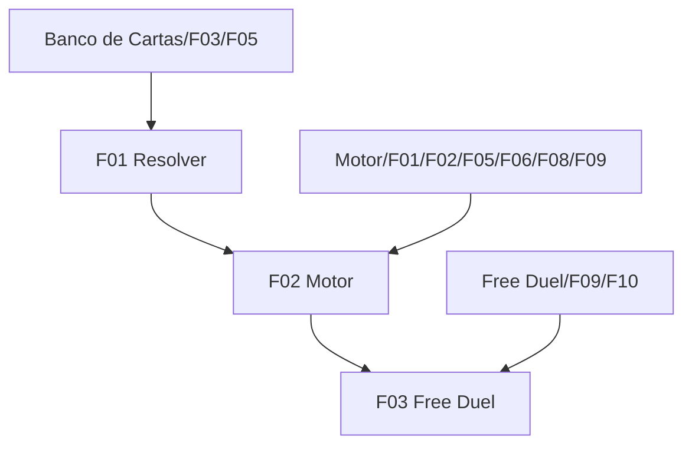

# Fusion System

## 1. Resumo Executivo

O Fusion System implementa as fusões normais do Forbidden Memories original de forma determinística e data-driven. Ele consome a tabela explícita do Banco de Cartas, resolve pares e sequências ordenadas de cartas e entrega ao Motor de Duelo um resultado verificável, sem colocar regras de fusão na interface.

Nesta versão, o jogador combina de 2 a 5 cartas exclusivamente da mão. O resultado permanece oculto até a confirmação; depois, os materiais são consumidos, cada etapa é revelada e a carta final precisa ser jogada. O sistema cobre as 50.242 combinações normais documentadas em `docs/fusoes.md`, excluindo as 15 leituras de glitch da ROM.

## 2. Problema e Oportunidade

**Tabela incompleta**
- A infraestrutura de `banco-de-cartas/F05` existe, mas o arquivo de runtime permanece vazio.
- Regras compactas, conflitos e categorias secundárias não são diretamente consultáveis pelo motor.
- Uma transcrição manual de 50.242 pares seria difícil de auditar.

**Regra ausente no duelo**
- O motor aceita apenas uma carta da mão por jogada.
- Não existe resolução sequencial nem semântica para uma tentativa sem receita.
- A UI não permite selecionar materiais em ordem.

**Oportunidade**
- Um compilador reproduzível transforma a referência humana em tabela explícita validada.
- Um resolvedor puro mantém offline, futuro servidor e testes com a mesma regra.
- Uma interação numerada preserva a regra do PS1 com feedback acessível para web.

## 3. Público-Alvo

**Jogadores do Forbidden Memories original** — esperam combinações, precedências e descarte intermediário fiéis à versão NTSC-U.

**Jogadores do remake web** — precisam montar a sequência por toque, mouse ou teclado em telas de 320 a 1920 px.

**Integradores do motor** — Free Duel, futuro Online Duel e futuras IAs precisam consumir uma única API determinística.

## 4. Objetivos

### Objetivos do Produto
- **Reproduzir** as 50.242 combinações normais sem incluir fusões de glitch.
- **Centralizar** a resolução de pares e sequências numa função pura.
- **Integrar** a fusão como uma única jogada da mão, serializável e validada pelo motor.
- **Oferecer** seleção ordenada acessível sem antecipar o resultado.

### Métricas de Sucesso
- O artefato oficial contém exatamente 50.242 pares canônicos únicos e zero IDs inválidos.
- A mesma tabela, sequência e catálogo produzem resultado byte a byte idêntico em 1.000 execuções property-based.
- Sequências aceitam de 2 a 5 índices distintos e nunca consomem mais de uma jogada da mão.
- Todos os fluxos de seleção, cancelamento, revelação e colocação passam nos testes responsivos e de teclado.

## 5. User Stories

### F01. Resolução de Pares e Sequências
- Como sistema, eu quero consultar uma tabela explícita para resolver qualquer par sem regras codificadas no motor.
- Como jogador, eu quero que cartas selecionadas sejam processadas na ordem escolhida para reproduzir as fusões sequenciais do jogo original.
- Como jogador, eu quero que uma etapa sem receita descarte o acumulador anterior e preserve o material seguinte.

### F02. Jogada de Fusão no Motor
- Como jogador, eu quero confirmar 2 a 5 cartas como uma única jogada e receber a carta final para colocação.
- Como sistema, eu quero manter a colocação pendente no estado serializável para impedir cancelamento ou outras ações após revelar o resultado.

### F03. Experiência de Fusão no Free Duel
- Como jogador, eu quero entrar no modo Fundir, numerar materiais e cancelar antes de confirmar.
- Como jogador, eu quero assistir às etapas e concluir a jogada conforme o tipo da carta final.

## 6. Funcionalidades

### F01. Resolução de Pares e Sequências

**Consumes:**
- Banco de Cartas/F03: catálogo canônico de 722 cartas (cross-PRD).
- Banco de Cartas/F05: tabela explícita de 50.242 receitas por materiais (cross-PRD).

**Provides:**
- Resolução determinística com materiais, etapas e carta final (usado por F02 e por futuras IAs/servidor).

**Capabilities:** pares são simétricos; sequências têm 2–5 cartas; resultado de sucesso vira o próximo acumulador; ausência de receita descarta o acumulador e mantém a carta seguinte; nenhuma entrada é mutada.

**Experience:** API headless sem I/O. Tabela vazia válida produz apenas etapas sem receita; tabela indisponível é erro de configuração distinto.

### F02. Jogada de Fusão no Motor

**Consumes:**
- F01: resolvedor de sequência.
- Motor de Duelo 1x1/F01, F02, F05, F06, F08 e F09: estado, ações, serialização, turno e rotas de colocação (cross-PRD).

**Provides:**
- Estado pendente de colocação e ações de iniciar/concluir fusão (usado por F03).

**Capabilities:** somente na fase principal e pelo jogador ativo; 2–5 índices distintos existentes; consome uma jogada; valida destino antes de consumir; durante a pendência só conclusão ou rendição são aceitas; monstro/ritual, magia/armadilha, equipamento, magia imediata e terreno reutilizam suas rotas existentes.

**Experience:** confirmar consome os materiais e revela as etapas. A colocação é obrigatória e não oferece cancelamento.

**Error Handling:** índices inválidos → “Materiais de fusão inválidos.”; sistema indisponível → “Fusões indisponíveis.”; sem destino legal → “Não há destino válido para esta fusão.”; outra ação durante pendência → “Conclua a fusão antes de continuar.”

### F03. Experiência de Fusão no Free Duel

**Consumes:**
- F02: ações e estado pendente.
- Free Duel/F09 e F10: runtime e duelo jogável (cross-PRD).

**Capabilities:** botão Fundir após selecionar a primeira carta; até 4 materiais adicionais; badges 1–5; remoção renumera; confirmação só com 2+; sem preview; `prefers-reduced-motion` conclui cues imediatamente; responsivo 320–1920 px.

**Experience:** o jogador seleciona a primeira carta, aciona Fundir, escolhe as demais e confirma. A UI anima as etapas e apresenta apenas o controle de destino compatível até a conclusão.

**Error Handling:** tabela inválida desabilita Fundir sem bloquear ações normais; recusa do motor mantém mensagem específica; fechamento/reabertura usa o estado pendente serializado.

## 7. Fora de Escopo

- Fusões com monstro já no campo.
- Escolha de fusões por IA; cada personagem terá sua IA posteriormente.
- Online Duel e transporte WebSocket.
- Preview do resultado antes da confirmação ou cálculo automático da melhor ordem.
- Fusões de glitch e efeitos de magia ainda não implementados pelo sistema de efeitos.
- Adicionar resultados temporários à coleção do jogador.

## 8. Grafo de Dependências

### Parte 1: Tabela de Dependências

| # | Feature | Prioridade | Dependências |
|---|---|---|---|
| F01 | Resolução de Pares e Sequências | 1 | Banco de Cartas/F03, Banco de Cartas/F05 (cross-PRD) |
| F02 | Jogada de Fusão no Motor | 1 | F01, Motor de Duelo 1x1/F01/F02/F05/F06/F08/F09 (cross-PRD) |
| F03 | Experiência de Fusão no Free Duel | 1 | F02, Free Duel/F09/F10 (cross-PRD) |

### Parte 2: Foundation Features

F01 é a Foundation do módulo: todas as integrações dependem do resolvedor puro.

### Parte 3: Execution Waves

- **Wave 1:** F01
- **Wave 2:** F02
- **Wave 3:** F03

### Parte 4: Legenda de Prioridade

### Níveis de prioridade
- **1** = Essencial — o módulo não funciona sem isso
- **2** = Importante — adição significativa de valor
- **3** = Desejável — melhoria incremental

### Parte 5: Diagrama Mermaid

## 9. Critérios de Aceite

### F01. Resolução de Pares e Sequências
- [ ] A tabela oficial contém exatamente 50.242 pares canônicos únicos, zero referências inválidas e não contém as 15 fusões de glitch.
- [ ] Consultar A+B ou B+A devolve o mesmo resultado.
- [ ] Sequências de 2–5 cartas resolvem na ordem informada e uma etapa sem receita preserva o material seguinte.
- [ ] Mesmas entradas produzem sempre a mesma resolução sem mutação.

### F02. Jogada de Fusão no Motor
- [ ] Iniciar fusão consome exatamente os materiais, marca a jogada da mão e cria uma pendência serializável.
- [ ] Ações diferentes de concluir ou render-se são recusadas durante a pendência.
- [ ] Cada tipo final é encaminhado à rota de colocação existente e a pendência é removida somente no sucesso.
- [ ] Índices, fase, jogador, destino e disponibilidade do resolvedor são revalidados pelo motor.

### F03. Experiência de Fusão no Free Duel
- [ ] O fluxo Fundir permite ordenar, remover, renumerar, cancelar antes da confirmação e confirmar 2–5 cartas.
- [ ] O resultado não aparece antes da confirmação; depois, etapas são exibidas e a colocação não pode ser cancelada.
- [ ] Falha da tabela desabilita somente a fusão com feedback e o fluxo respeita teclado, movimento reduzido e 320–1920 px.

### Cross-Feature Integration
- [ ] A resolução de F01 armazenada por F02 é reproduzida na mesma ordem visual por F03.
- [ ] Uma sequência inteira conta como uma única jogada da mão e o resultado usa os eventos normais de invocação/colocação.

### Cross-PRD Integration
- [ ] O artefato gerado fecha o critério pendente de Banco de Cartas/F05 e é consumido sem duplicar regras.
- [ ] O snapshot do Motor de Duelo preserva uma fusão pendente em round-trip idempotente.
- [ ] O Free Duel carrega catálogo e tabela da mesma versão antes de habilitar Fundir.
