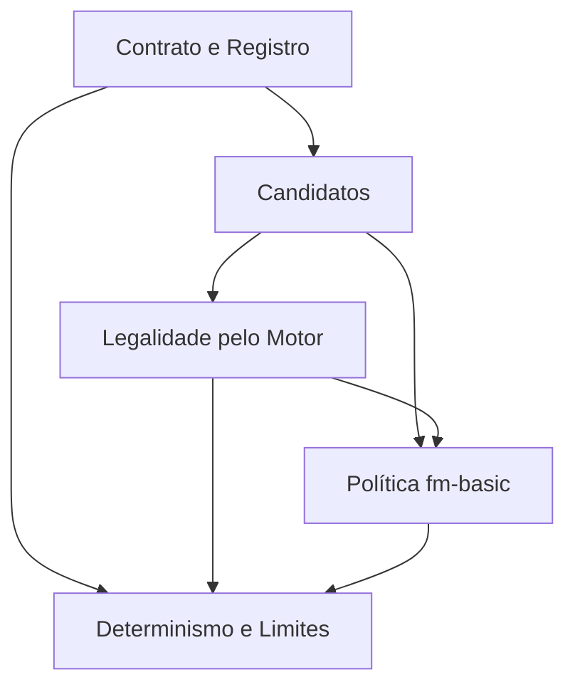

# IA de NPCs

## 1. Resumo Executivo

A **IA de NPCs** é o subsistema que decide as jogadas do lado da CPU em um duelo. Ela é a
contraparte do jogador humano: recebe o estado público do duelo pela ótica do NPC, escolhe uma
ação e a devolve ao orquestrador, que a submete ao Motor de Duelo 1x1. É um dos pilares de
arquitetura declarados do projeto — "IA de NPCs com dificuldades e estratégias por duelista" — e
o único ainda inexistente: `packages/ai` está previsto em `docs/arquitetura.md` §3 e nunca foi
escrito.

Hoje o lado da CPU é conduzido por um **andaime declarado**: o agente passivo introduzido por
`free-duel` F09, que devolve `advance_phase` para sempre. Ele cumpre o contrato e mantém o duelo
rodando, mas o NPC nunca invoca, nunca ataca e nunca vence — o que torna todo duelo do Free Duel
uma partida contra um adversário inerte. Com Teana e Jono já no roster com decks reais, a
ausência da IA é o que separa o Free Duel de ser um modo jogável de verdade.

Este módulo entrega um agente que **enumera as jogadas possíveis a partir do estado público,
descarta as ilegais consultando o próprio motor, pontua as restantes por uma política de
comportamento e devolve a melhor** — de forma determinística e dentro de limites que garantem que
o turno da CPU sempre termina. A estratégia de cada NPC vem do `profile` do duelista no roster
(`free-duel` F01), que até aqui era uma string opaca sem semântica: este PRD é quem dá
significado a ela. O valor central é que **o Free Duel, a Campanha e o Online Duel contra bot
compartilhem uma única fonte de comportamento de CPU**, do mesmo jeito que já compartilham uma
única fonte de regras.

## 2. Problema e Oportunidade

### O Problema

**O oponente não joga**
- O agente passivo devolve `advance_phase` em 100% das decisões: a CPU nunca ocupa uma das suas
  5 zonas de monstro, nunca declara ataque e nunca reduz os 8000 LP do jogador.
- Um duelo só termina por deck-out (40 cartas), por rendição ou porque o jogador atacou até zerar
  o oponente — os três desfechos que o Motor de Duelo 1x1 F12 apura ficam efetivamente reduzidos
  a um.
- A nota do duelo e a recompensa do Free Duel escalonam por desempenho, mas não há desempenho a
  medir contra um adversário que não age.

**Não existe onde colocar o comportamento**
- `profile.strategy` é validado como string não-vazia e **nunca lido por ninguém** — o roster
  declara `"passive"` para todos os duelistas e nada acontece com esse valor.
- Sem um registro de estratégias, dar comportamento a um duelista novo exigiria escrever código
  específico dele, quebrando a promessa do `free-duel` F01 de que "adicionar um novo duelista é
  uma edição de dados".

**Uma jogada ilegal da CPU mata a partida inteira**
- O orquestrador submete a ação da IA ao motor e, se o motor recusar, a sessão vira
  `failed`/`ai_unavailable`: o jogador perde o duelo em andamento por um erro de decisão do
  adversário.
- Uma IA que reimplementasse as condições de legalidade (zona livre, fase certa, monstro que já
  atacou, carta que não pode ser equipada) criaria uma segunda fonte de regras, exatamente o que a
  arquitetura proíbe — e cada divergência viraria uma partida encerrada por bug.

**Comportamento não determinístico não é testável nem reproduzível**
- Sem determinismo, um duelo com o mesmo seed não se repete, e nenhum teste de partida completa
  consegue afirmar que o duelo termina.
- Sem um limite de ações por turno, um agente que devolva sempre a mesma ação inócua prende o
  orquestrador no guarda de 100 ações e encerra a sessão como `no_progress_loop`.

### A Oportunidade

Um agente que decide a partir do estado público e **valida cada candidato no próprio motor**
resolve as duas dores centrais de uma vez: o NPC passa a jogar, e passa a jogar sem que exista uma
segunda cópia das regras para divergir da primeira. O motor já é a autoridade sobre o que é legal;
a IA só precisa perguntar. Um registro de estratégias endereçado pela string que o roster já
carrega transforma "dar personalidade a um duelista" em preencher `profile.parameters` — dado, não
código. E uma política determinística, sem PRNG própria, torna possível o teste que hoje não
existe: rodar uma partida inteira com seed fixa e afirmar que ela termina com vencedor.

## 3. Público-Alvo

### Usuários Primários

**Jogador de Free Duel offline**
Quer um adversário que ofereça resistência proporcional ao duelista escolhido. Espera que a CPU
invoque, defenda e ataque como um oponente do jogo original, que a dificuldade anunciada na
seleção corresponda ao que acontece em campo, e que o duelo nunca termine em erro do adversário.

**Jogador em treino para o Online Duel**
Usa a CPU como sparring antes do ranqueado. Espera que a IA jogue pelas mesmas regras do motor,
sem vantagens ocultas, para que o treino seja transferível.

**Mantenedor de conteúdo (quem adiciona duelistas)**
Adiciona um NPC editando dados. Espera escolher uma estratégia existente e calibrá-la por
parâmetros, e espera ser avisado — não travado — quando declarar uma estratégia que não existe.

### Perfil Comportamental

- Todos dependem de o duelo **sempre terminar**: qualquer decisão da CPU que encerre a sessão em
  erro é percebida como perda de progresso, não como falha do adversário.
- Todos esperam **consistência entre duelos**: o mesmo duelista, no mesmo estado, joga do mesmo
  jeito.
- Nenhum deles quer esperar: o turno da CPU é tempo em que o jogador não joga.

## 4. Objetivos

### Objetivos do Produto

- **Conduzir** o lado da CPU com jogadas reais — invocação, mudança de posição, magia e ataque —
  satisfazendo o contrato `AiAgent` que a orquestração já consome, sem alterá-lo.
- **Garantir** que nenhuma ação devolvida pela IA seja recusada pelo motor, verificando cada
  candidato contra o próprio motor antes de escolher.
- **Endereçar o comportamento por dados**, lendo a estratégia e os parâmetros do `profile` do
  duelista, de modo que um NPC novo não exija código novo.
- **Decidir de forma determinística e limitada**, para que uma partida com seed fixa seja
  reproduzível e o turno da CPU sempre termine.
- **Nunca derrubar a partida**: qualquer situação sem jogada boa resolve em avançar a fase, jamais
  em exceção ou ação ilegal.

### Métricas de Sucesso

- **Legalidade:** 0 ações recusadas pelo motor em 100% dos duelos simulados; 0 sessões terminadas
  em `ai_unavailable` por decisão da IA.
- **Atividade:** em 100% dos duelos completos contra um duelista do roster, a CPU realiza ao menos
  1 invocação e ao menos 1 declaração de ataque antes do desfecho.
- **Terminação:** 100% dos turnos de CPU concluem em no máximo **100** ações
  (`MAX_CPU_ACTIONS_PER_ADVANCE`); 0 sessões terminadas em `no_progress_loop`.
- **Determinismo:** para 100% dos pares (estado público, perfil) idênticos, a ação escolhida é a
  mesma — verificável por teste de propriedade.
- **Configuração por dado:** 100% dos duelistas do roster obtêm comportamento sem código
  específico; estratégia desconhecida resolve em fallback registrado em log, com 0 exceções
  propagadas.
- **Ritmo:** decisão computada em menos de **50 ms** por ação, com a pausa de apresentação
  (padrão **650 ms**) aplicada fora do cálculo.

## 5. User Stories

### F01. Contrato do Agente e Registro de Estratégias
- Como sistema, eu quero expor um agente que satisfaça o contrato `AiAgent` já consumido pela
  orquestração para que o lado da CPU troque de comportamento sem que a sessão de duelo ou a tela
  mudem.
- Como mantenedor de conteúdo, eu quero escolher a estratégia de um duelista pelo campo
  `profile.strategy` do roster para dar comportamento a um NPC novo sem escrever código.
- Como sistema, eu quero que uma estratégia desconhecida caia em um comportamento seguro e
  registrado em log para que um erro de digitação no roster não derrube o duelo.

### F02. Leitura do Estado e Geração de Candidatos
- Como sistema, eu quero enumerar todas as jogadas plausíveis a partir do estado público visto
  pelo NPC para que a escolha aconteça sobre um conjunto explícito, e não sobre uma sequência
  fixa de heurísticas.
- Como sistema, eu quero enxergar a própria mão do NPC, os dois campos e os pontos de vida para
  poder avaliar uma jogada, sem enxergar nada que o jogador humano esconde.

### F03. Legalidade Verificada pelo Motor
- Como sistema, eu quero descartar candidatos consultando o próprio motor para que a IA nunca
  devolva uma ação recusada e nunca vire uma segunda fonte de regras.
- Como jogador, eu quero que uma jogada impossível do meu adversário simplesmente não aconteça,
  em vez de encerrar minha partida com falha da IA.

### F04. Política `fm-basic`
- Como jogador, eu quero que o NPC invoque o melhor monstro que tem, se defenda quando está atrás
  e ataque quando a troca é favorável, para que o duelo pareça uma partida de verdade.
- Como jogador, eu quero que o NPC ataque diretamente quando meu campo está vazio para que eu
  seja punido por não defender.
- Como mantenedor de conteúdo, eu quero calibrar agressividade e uso de magia por `parameters`
  para diferenciar dois duelistas que compartilham a mesma política.

### F05. Determinismo, Limites e Falha Segura
- Como sistema, eu quero que a mesma entrada produza sempre a mesma ação para que um duelo com
  seed fixa seja reproduzível em teste.
- Como sistema, eu quero um limite de ações por turno de CPU para que nenhuma sequência de
  decisões prenda a partida.
- Como jogador, eu quero que a CPU passe a vez quando não tem jogada boa, em vez de travar ou
  errar.

## 6. Funcionalidades

### F01. Contrato do Agente e Registro de Estratégias

**Consumes:**
- `free-duel`/F01 (cross-PRD): perfil de dificuldade do duelista — `strategy` (string) e
  `parameters` (mapa de número/string/booleano)
- `motor-duelo-1x1`/F01–F12 (cross-PRD): o vocabulário de ações aceitas pelo motor

**Provides:**
- Agente de decisão que satisfaz `AiAgent` (usado por `free-duel`/F03 e F09 — cross-PRD)
- Registro `strategy → política`, aberto a novas políticas (usado por F04)

**Capabilities:**
- O agente satisfaz a assinatura já declarada: recebe o estado público do duelo e o perfil do
  duelista, devolve **exatamente uma** ação por chamada. A assinatura **não muda** — trocar o
  agente passivo pelo agente real não toca na sessão de duelo nem na tela.
- O registro é endereçado pela string `strategy`, sem enum fechado: `free-duel` F01 fixou que a
  string é opaca para o roster e que a semântica pertence a este módulo.
- Estratégias registradas nesta versão: **2** — `passive` (o andaime de `free-duel` F09, mantido
  e agora registrado) e `fm-basic` (F04).
- `strategy` desconhecida ou vazia resolve em `passive`, registra um log de nível `warn` com o
  identificador recebido, e **nunca lança**.
- `parameters` desconhecidos são ignorados; parâmetro com tipo errado usa o padrão da política.

**Experience:** invisível ao jogador. Para quem adiciona um duelista, o efeito é: preencher
`"strategy": "fm-basic"` no arquivo-fonte do personagem e o NPC passa a jogar; errar o nome e o
NPC passa a vez, com o aviso no log apontando o valor recebido.

### F02. Leitura do Estado e Geração de Candidatos

**Consumes:**
- F01: a chamada de decisão, com estado público e perfil
- `motor-duelo-1x1`/F04 (cross-PRD): projeção do estado público pela ótica de um jogador — mão
  própria visível, mão adversária apenas contada, monstros virados para baixo ocultos

**Provides:**
- Lista de ações candidatas para o estado atual (usado por F03, F04)

**Capabilities:**
- Gera candidatos apenas para as ações que o motor aceita hoje: invocar monstro, jogar
  magia/armadilha em zona, jogar carta de campo, equipar carta, ativar magia imediata, mudar
  posição, declarar ataque e avançar fase.
- **Invocação:** um candidato por combinação de carta de monstro na mão × zona de monstro livre ×
  4 posições (ataque/defesa × virado para cima/para baixo). Com 5 zonas e mão de 5 cartas, o teto
  é **100** candidatos de invocação.
- **Ataque:** um candidato por monstro próprio que ainda não atacou × cada monstro adversário,
  mais um candidato de ataque direto quando o campo adversário está vazio. Teto de **30**
  candidatos com 5 zonas de cada lado.
- **Magia:** um candidato por carta de magia/armadilha/equipamento na mão × destino aplicável
  (zona livre, monstro próprio, ou sem destino no caso de efeito imediato).
- `advance_phase` é candidato em **todo** estado — é o piso que garante que a lista nunca é vazia.
- **Rendição nunca é candidata.** O NPC não desiste; o desfecho é do motor.
- A geração lê exclusivamente o estado público recebido. Não consulta o estado interno do motor,
  não conhece a mão do jogador humano nem a ordem do deck de ninguém.

**Experience:** invisível ao jogador.

### F03. Legalidade Verificada pelo Motor

**Consumes:**
- F02: lista de ações candidatas

**Provides:**
- Lista de candidatos aceitos pelo motor, cada um com o estado resultante (usado por F04)

**Capabilities:**
- Cada candidato é submetido ao motor em uma aplicação de teste; o candidato entra na lista final
  **apenas se o motor aceitar**. A aplicação de teste não altera o estado da partida — o motor é
  uma função pura de estado e ação.
- A recusa do motor é um valor, não uma exceção: um candidato recusado é descartado em silêncio,
  sem log de erro. Recusa é o funcionamento normal deste filtro, não uma falha.
- **Nenhuma condição de legalidade é reimplementada aqui**: zona ocupada, fase errada, monstro que
  já atacou, ataque no primeiro turno, equipamento em host inválido — tudo isso é decidido pela
  recusa do motor, não por uma checagem paralela.
- Se todos os candidatos forem recusados — situação que `advance_phase` deveria tornar impossível
  — a IA devolve `advance_phase` mesmo assim, deixando a recusa final para o orquestrador tratar
  como incidente.

**Experience:** invisível ao jogador. O efeito observável é a ausência do sintoma: nenhum duelo
termina com "Falha na IA do oponente".

### F04. Política `fm-basic`

**Consumes:**
- F02: lista de candidatos
- F03: candidatos legais e o estado resultante de cada um
- F01: `parameters` do duelista

**Provides:**
- A ação escolhida para o turno atual (usado por F01, que a devolve ao orquestrador)

**Core Scope:**
- Invocação, escolha de posição, ataque e avanço de fase — o ciclo mínimo para um duelo real.

**Full Scope additions:**
- Uso de magia com efeito conhecido, equipamento no próprio monstro, terreno.

**Capabilities:**
- **Uma única política, parametrizada.** Teana e Jono usam a mesma IA genérica dos duelistas
  iniciais do jogo original, e duelistas com comportamento próprio ganham uma política nova
  quando o comportamento realmente divergir — não antes.
- **A IA sempre escolhe a melhor jogada segundo a heurística.** Não existe erro proposital nem
  taxa de acerto por dificuldade: a dificuldade vem do deck do duelista. O deck da Teana tem teto
  de 500 de ataque, e é isso que a torna fácil.
- **Invocação:** invoca o monstro de maior ataque da mão, um por turno (limite do motor). Escolhe
  a posição comparando o ataque do invocado com o **maior ataque adversário visível**:
  - ataque do invocado > maior ataque adversário visível → **ataque, virado para cima**
  - caso contrário, e defesa do invocado ≥ ataque do invocado → **defesa, virada para baixo**
  - caso contrário → **defesa, virada para baixo** (a posição defensiva é o padrão quando o
    monstro não vence a troca)
  - campo adversário vazio → **ataque, virado para cima**
- **Ataque:** declara ataque com cada monstro próprio ainda não usado, em ordem decrescente de
  ataque, contra o alvo em que a troca é favorável — ataque do atacante > ataque do alvo em
  posição de ataque, ou > defesa do alvo em posição de defesa. Campo adversário vazio → ataque
  direto. Nenhuma troca favorável → não ataca.
- **Mudança de posição:** vira para ataque um monstro em defesa cujo ataque supere o maior ataque
  adversário visível; vira para defesa um monstro em ataque que não vença nenhum alvo e cuja
  defesa seja maior que o próprio ataque.
- **Magia:** joga apenas cartas com efeito conhecido pela tabela de efeitos do projeto. Carta sem
  efeito especificado é **inerte** — ocuparia uma das 5 zonas de magia sem fazer nada — e por isso
  fica na mão. Isso é material: 6 das 40 cartas da Teana e 4 das 40 do Jono são inertes.
- **Equipamento:** equipa o próprio monstro de maior ataque quando o bônus se aplica à classe
  dele. Um equipamento cuja restrição de classe o host não satisfaz contribui 0 e não é jogado.
- **Terreno:** joga carta de campo quando o parâmetro `playsFieldSpells` estiver ativo. Padrão:
  desligado — nem Teana nem Jono têm terreno no deck.
- **Ordem de preferência** dentro de um turno, quando mais de uma jogada é legal: invocação →
  equipamento/magia com efeito → mudança de posição → ataque → avançar fase.
- **Parâmetros reconhecidos** (todos opcionais, com padrão declarado):

  | Parâmetro | Tipo | Padrão | Efeito |
  |---|---|---|---|
  | `aggression` | número 0–1 | `0.5` | Acima de `0.5`, aceita trocas empatadas no ataque; abaixo, exige margem estrita |
  | `playsSpells` | booleano | `true` | Desliga o uso de magia e equipamento |
  | `playsFieldSpells` | booleano | `false` | Liga o uso de carta de campo |
  | `defensiveThreshold` | número | `0` | Diferença de ataque a partir da qual prefere defesa mesmo vencendo |

**Experience:** o jogador vê o NPC baixar um monstro por turno, virar para defesa quando está em
desvantagem e atacar quando tem vantagem — com a pausa de apresentação já usada pelo agente
passivo (**650 ms** por ação) para que a jogada seja legível. Contra Teana e Jono, a experiência
esperada é a de um oponente ativo mas frágil: ele ocupa o campo, mas quase nada no deck dele vence
um monstro comum do jogador.

### F05. Determinismo, Limites e Falha Segura

**Consumes:**
- F01: a chamada de decisão
- F03: candidatos legais
- F04: a pontuação de cada candidato

**Capabilities:**
- **Sem PRNG.** A política não sorteia nada. Empate de pontuação é resolvido por critério estável
  e declarado: menor índice de zona, depois menor índice de mão. Mesma entrada, mesma saída,
  sempre.
- O turno completo da CPU cabe no guarda de **100** ações por avanço
  (`MAX_CPU_ACTIONS_PER_ADVANCE`): no máximo 1 invocação + 5 mudanças de posição + 5 ataques + 5
  cartas de magia + os avanços de fase, muito abaixo do teto.
- A decisão **nunca lança**. Qualquer caminho sem escolha resolve em `advance_phase`.
- Custo de decisão alvo: menos de **50 ms** por ação em um estado de campo cheio (10 zonas
  ocupadas, mão de 5), com o teto de candidatos da F02.
- A pausa de apresentação é aplicada pelo agente, não pela política, e é configurável — um teste
  injeta pausa zero e roda uma partida completa sem esperar.

**Error Handling:**
- Estratégia desconhecida no perfil → cai em `passive`, log `warn` com o valor recebido, duelo
  segue.
- Nenhum candidato legal além de avançar fase → devolve `advance_phase`, sem log.
- Exceção inesperada dentro da política → capturada na fronteira do agente, log `error`, devolve
  `advance_phase`; a partida continua em vez de virar `ai_unavailable`.
- Estado público malformado (campo ausente que o contrato exige) → devolve `advance_phase` e
  registra `warn`; a IA não valida o motor.

## 7. Fora de Escopo

**Regras e ações que o motor ainda não tem**
- **Fusão.** O motor não expõe ação de fusão e a tabela de fusões do projeto está vazia — a IA não
  pode fundir, e não simula fusão de nenhuma forma. Entra quando a fusão entrar no motor.
- **Ritual, tributo e mão de tamanho variável.** No jogo original, duelistas avançados jogam com
  mão maior (até 18 cartas); o motor distribui mão fixa. O `handSize` fica registrado nos dados do
  personagem por fidelidade, sem efeito.
- **Reação em janela aberta.** A orquestração já drena as janelas de reação antes de consultar a
  IA; responder a uma janela não é decisão deste módulo nesta versão.

**Comportamento**
- **Erro proposital por dificuldade.** Decidido: a dificuldade vem dos dados do duelista, não de
  uma taxa de erro artificial.
- **Estratégias por duelista avançado** (Seto, Heishin, os Mages e seus terrenos preferidos) —
  cada uma vira uma política nova quando o duelista correspondente entrar no roster.
- **Aprendizado, busca em profundidade ou avaliação de mais de um turno à frente.** A política
  avalia o estado resultante de uma ação, não uma árvore.
- **Blefe e leitura do jogador** (deduzir a mão adversária pelo descarte, guardar carta para um
  turno futuro).

**Fronteiras com outros módulos**
- **Decidir o desfecho do duelo, validar regra ou resolver combate** — tudo do Motor de Duelo 1x1.
- **Montar a partida, transportar a ação e tratar o incidente da sessão** — do Free Duel.
- **Escolher qual estratégia cada duelista usa** — dado do roster (`free-duel` F01); este módulo
  só dá semântica ao valor.
- **Rendição do NPC** e concessão de recompensa.

## 8. Grafo de Dependências

### Tabela de Dependências

| # | Feature | Prioridade | Dependências |
|---|---------|------------|---------------|
| F01 | Contrato do Agente e Registro de Estratégias | 1 | None |
| F02 | Leitura do Estado e Geração de Candidatos | 1 | F01 |
| F03 | Legalidade Verificada pelo Motor | 1 | F02 |
| F04 | Política `fm-basic` | 1 | F02, F03 |
| F05 | Determinismo, Limites e Falha Segura | 1 | F01, F03, F04 |

### Foundation Features

**F01** é fundação do módulo: o contrato e o registro são a fronteira por onde todo o resto entra
no jogo. Nenhuma outra feature é observável sem ela.

### Execution Waves

- **Wave 1**: F01
- **Wave 2**: F02
- **Wave 3**: F03
- **Wave 4**: F04
- **Wave 5**: F05

### Níveis de prioridade
- **1** = Essencial — o módulo não funciona sem isso
- **2** = Importante — adição significativa de valor
- **3** = Desejável — melhoria incremental

## 9. Critérios de Aceite

### F01. Contrato do Agente e Registro de Estratégias
- [ ] O agente satisfaz o contrato `AiAgent` sem que a assinatura mude, e substitui o agente
      passivo na composição do duelo sem alterar a sessão nem a tela.
- [ ] Um duelista com `"strategy": "fm-basic"` joga pela política de F04; um com `"passive"` passa
      a vez.
- [ ] `strategy` desconhecida resolve em `passive`, registra `warn` com o valor recebido e não
      lança.
- [ ] `parameters` vazio produz o comportamento padrão declarado em F04.

### F02. Leitura do Estado e Geração de Candidatos
- [ ] Com 5 zonas livres e 5 monstros na mão, a geração produz os 100 candidatos de invocação
      esperados e nenhum a mais.
- [ ] Nenhum candidato referencia carta oculta do adversário nem carta que não está na mão do NPC.
- [ ] `advance_phase` está presente na lista de candidatos em todo estado testado.
- [ ] Rendição nunca aparece entre os candidatos.

### F03. Legalidade Verificada pelo Motor
- [ ] Um candidato que o motor recusa não é escolhido, e a recusa não gera log de erro.
- [ ] Em um estado com todas as 5 zonas de monstro ocupadas, nenhum candidato de invocação
      sobrevive ao filtro.
- [ ] A aplicação de teste não altera o estado da partida: o estado antes e depois da geração de
      candidatos é idêntico.
- [ ] Nenhuma condição de legalidade do motor aparece duplicada no código do módulo —
      verificável por revisão.

### F04. Política `fm-basic`
- [ ] Com dois monstros na mão, o NPC invoca o de maior ataque.
- [ ] Monstro invocado com ataque maior que o maior ataque adversário visível entra em ataque
      virado para cima; caso contrário entra em defesa virado para baixo.
- [ ] Campo adversário vazio e monstro próprio disponível → o NPC declara ataque direto.
- [ ] Nenhuma troca favorável disponível → o NPC não declara ataque.
- [ ] Carta de magia sem efeito na tabela do projeto permanece na mão do NPC.
- [ ] `playsSpells: false` impede qualquer jogada de magia ou equipamento.

### F05. Determinismo, Limites e Falha Segura
- [ ] A mesma dupla (estado público, perfil) devolve a mesma ação em execuções repetidas.
- [ ] Um turno completo de CPU em campo cheio conclui em menos de 100 ações.
- [ ] A decisão nunca lança, mesmo com estado público malformado — devolve `advance_phase`.
- [ ] Um duelo completo com seed fixa contra um duelista do roster termina com desfecho apurado
      pelo motor, nunca em `failed`.

### Cross-Feature Integration
- [ ] O agente registrado por F01 escolhe pela política de F04 apenas candidatos aprovados por
      F03, e o orquestrador do Free Duel aceita 100% deles sem recusa.
- [ ] Um duelo do Free Duel contra Teana e outro contra Jono rodam do primeiro turno até a tela de
      resultado com a CPU invocando e atacando (cross-PRD: `free-duel` F03, F09, F10).
- [ ] Trocar `profile.strategy` de um duelista no roster muda o comportamento dele em duelo sem
      nenhuma alteração de código (cross-PRD: `free-duel` F01).
- [ ] O desfecho do duelo continua sendo apurado exclusivamente pelo motor (cross-PRD:
      `motor-duelo-1x1` F12); a IA nunca encerra a partida.
