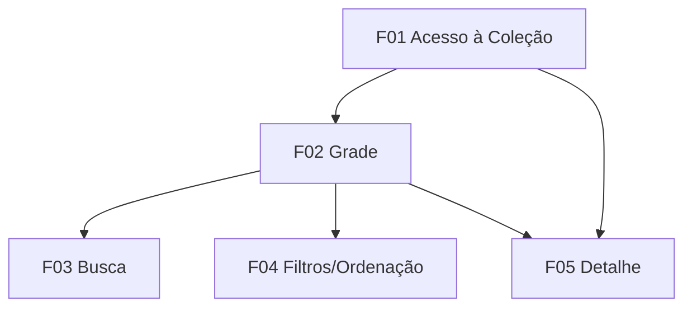

# Library

## 1. Resumo Executivo

A **Library** é o módulo de enciclopédia e consulta de cartas do *YuGiOh Forbidden Memories Remastered*. Ela permite que o jogador navegue, busque, filtre e visualize em detalhe as informações de todas as cartas que já obteve, tendo como fonte o banco de **722 cartas** do jogo (`cards-data/dados/*.json` + artes em `cards-data/*.jpg`). É um módulo predominantemente **somente-leitura**: a Library não altera a coleção, não monta decks e não libera cartas — apenas exibe o que o jogador já possui e mostra, opcionalmente, o que ainda falta para completar a coleção.

Em alto nível, a Library carrega o banco de cartas e o estado de coleção do jogador (quais cartas já foram obtidas), monta uma grade responsiva com as cartas obtidas, oferece busca por nome/número, filtros por tipo, ordenação e um filtro de status de coleção, e abre uma tela de detalhe com todos os campos do schema da carta (nome, número, classe, tipo, ATK/DEF, os dois Guardiões Estelares, senha e preço em estrelas). O valor central é servir de **referência rápida** para o jogador: entender atributos antes de montar decks no Build Deck, consultar a senha de uma carta para usá-la no módulo Password, e acompanhar o progresso de coleção ao longo da Campanha e dos Free Duels.

Por ser um módulo de referência, a Library conversa com vários outros: consome o **banco de cartas** (pilar de dados da arquitetura) e o **estado de coleção do jogador** (mantido fora deste módulo — cross-PRD). Ela não implementa lógica de duelo, fusão ou cálculo de Guardiões/terrenos; quando esses dados existirem, poderão ser incorporados em versões futuras da tela de detalhe.

## 2. Problema e Oportunidade

### O Problema

**Ausência de referência centralizada de cartas**
- No Forbidden Memories original de PS1 não existia uma enciclopédia navegável; o jogador só via cartas dentro do trunk/Build Deck, misturado com a montagem de baralho.
- Consultar ATK/DEF, classe ou Guardiões de uma carta exigia entrar na tela de deck e rolar manualmente, sem contexto de "todas as cartas".
- Não havia como revisar cartas fora do fluxo de montar deck, tornando o planejamento estratégico mais lento.

**Dificuldade de localizar uma carta específica em 700+ cartas**
- Com 722 cartas no banco, encontrar uma carta pelo nome ou número sem busca é inviável na prática.
- A navegação puramente sequencial (rolar a lista inteira) custa dezenas de segundos por consulta.
- Sem filtros por tipo, comparar cartas de uma mesma categoria (ex.: só magias) é impossível de forma direta.

**Informação de senha e atributos pouco acessível**
- Cada carta tem uma `password` que o jogador precisa para liberá-la no módulo Password, mas no original essa senha não ficava visível de forma consolidada.
- Os dois Guardiões Estelares (`guardiao1`, `guardiao2`) de cada monstro são decisivos em duelo, mas o jogador não tinha onde consultá-los com calma fora da partida.

**Falta de senso de progresso de coleção**
- O original não mostrava "quantas cartas você já tem de X total", removendo um forte motivador de colecionismo.
- Sem visão do que falta, o jogador não sabe quais duelos/senhas perseguir para completar a coleção.

### A Oportunidade

A Library web resolve cada dor com um módulo dedicado e responsivo: (1) centraliza **todas as 722 cartas** em uma tela própria de consulta, desacoplada da montagem de deck; (2) oferece **busca em tempo real e filtro por tipo** para localizar qualquer carta em poucas interações mesmo com centenas de registros; (3) expõe em uma **tela de detalhe** todos os campos do schema — incluindo senha e Guardiões — dando ao jogador a referência que o original nunca teve; e (4) adiciona um **indicador de progresso ("X de 722 obtidas")** e um filtro de status que revela as cartas faltantes, transformando a coleção em uma meta clara e motivadora. Tudo isso reusando o banco de cartas já existente no repositório, sem duplicar dados nem inventar regras.

## 3. Público-Alvo

### Usuários Primários

**Colecionador de Campanha** — joga a Campanha e Free Duels acumulando cartas ao longo do tempo. Usa a Library para ver o que já conquistou, sentir progresso e descobrir o que ainda falta. Valoriza o indicador de progresso e o filtro de "não obtidas".

**Montador de Deck / Jogador Estratégico** — antes de ir ao Build Deck (ou de comprar cartas via Password), consulta a Library como referência de atributos: compara ATK/DEF, verifica Guardiões e busca a senha de cartas específicas. Valoriza busca, filtro por tipo e ordenação.

### Perfil Comportamental

- Consulta a Library em sessões curtas e frequentes, geralmente **entre** duelos ou antes de montar/ajustar um deck.
- Espera resposta imediata: busca e filtros devem reagir em tempo real, sem recarregar a tela.
- Acessa de dispositivos variados (desktop e mobile), exigindo uma grade totalmente responsiva.
- Não espera editar nada aqui — o modelo mental é "enciclopédia", não "inventário editável".

## 4. Objetivos

### Objetivos do Produto

- **Centralizar** a consulta de todas as cartas obtidas em uma única tela de referência, exibindo integralmente o schema de cada carta.
- **Acelerar** a localização de qualquer carta da coleção por meio de busca textual e filtros.
- **Comunicar** o progresso de coleção do jogador de forma clara e persistente.
- **Garantir** uma experiência responsiva e fluida com o volume completo de 722 cartas, em qualquer tamanho de tela.

### Métricas de Sucesso

- **Cobertura de dados**: 100% das cartas obtidas exibem todos os 12 campos do schema (`id, numero, nome, img, classe, atk, def, guardiao1, guardiao2, password, estrelas, tipo`) na tela de detalhe, sem campo faltante ou inventado.
- **Velocidade de localização**: o jogador encontra qualquer carta da coleção em **≤ 3 interações** (abrir Library → digitar/filtrar → selecionar) e a busca atualiza a grade em **≤ 200 ms** sobre a coleção completa.
- **Progresso visível**: o indicador "X de 722 obtidas" aparece em **100%** das aberturas da Library e se atualiza sempre que a coleção muda.
- **Responsividade**: a grade permanece funcional e sem scroll horizontal de **320 px a 1920 px** de largura, e a carga inicial da tela ocorre em **≤ 1 s** com as 722 cartas carregadas.

## 5. User Stories

### F01. Acesso à Coleção do Jogador
- Como sistema, eu quero carregar o banco de cartas e o estado de coleção do jogador para que a Library saiba quais cartas exibir e quais estão obtidas
- Como sistema, eu quero calcular o total de cartas do jogo e o total de obtidas para que o progresso de coleção possa ser exibido

### F02. Grade da Coleção
- Como jogador, eu quero ver em uma grade todas as cartas que já obtive para consultar minha coleção de uma vez
- Como jogador, eu quero ver o indicador "X de 722 obtidas" para acompanhar meu progresso de coleção
- Como jogador, eu quero que a grade se ajuste ao tamanho da minha tela para usar a Library no celular ou no desktop

### F03. Busca por Nome/Número
- Como jogador, eu quero digitar parte do nome ou o número de uma carta para localizá-la rapidamente entre centenas de cartas
- Como jogador, eu quero ver uma mensagem clara quando nenhuma carta corresponde à busca para saber que o termo não retornou resultados

### F04. Filtros e Ordenação
- Como jogador, eu quero filtrar a grade por tipo de carta (monstro, magica, armadilha, equipamento) para focar em uma categoria
- Como jogador, eu quero ordenar a grade por número, nome, ATK, DEF ou estrelas para comparar cartas
- Como jogador, eu quero alternar o status entre "obtidas", "não obtidas" e "todas" para ver o que ainda falta na minha coleção

### F05. Tela de Detalhe da Carta
- Como jogador, eu quero abrir uma carta e ver todos os seus dados (arte, classe, tipo, ATK/DEF, Guardiões, senha e estrelas) para consultar seus atributos completos
- Como jogador, eu quero ver a senha (password) da carta na tela de detalhe para usá-la depois no módulo Password
- Como jogador, eu quero navegar para a carta anterior/próxima direto da tela de detalhe para percorrer a coleção sem voltar à grade

## 6. Funcionalidades

### F01. Acesso à Coleção do Jogador

**Consumes:**
- Banco de cartas: registros de todas as 722 cartas com os campos `id, numero, nome, img, classe, atk, def, guardiao1, guardiao2, password, estrelas, tipo` (fonte de dados `cards-data/dados/*.json` + artes `cards-data/*.jpg` — recurso de dados compartilhado, pilar "banco de dados das cartas" da arquitetura)
- Estado de coleção do jogador: conjunto de cartas obtidas pelo jogador, no modelo booleano obtida/não-obtida, indexado por `numero` (**dependência cross-PRD** — mantido fora da Library, escrito por Password/Campanha/Free Duel e persistido por Save)

**Provides:**
- Lista de cartas obtidas com todos os campos do schema (usado por F02, F05)
- Conjunto total de cartas do jogo e contagem de obtidas vs. total (usado por F02)
- Registro completo de uma carta por `numero`, incluindo status obtida/não-obtida (usado por F04, F05)

**Capabilities:** carrega e indexa por `numero` as 722 cartas do banco; cruza o banco com o estado de coleção para marcar cada carta como obtida/não-obtida (modelo booleano, sem contagem de cópias); expõe o total do jogo (722) e o total de obtidas; carrega os dados uma vez por abertura do módulo e mantém em memória durante a navegação; não escreve nada na coleção (módulo somente-leitura).

**Experience:** ao entrar na Library, exibe um estado de carregamento (esqueleto/spinner) enquanto lê o banco de cartas e o estado de coleção. Concluído o carregamento, disponibiliza os dados para a grade. Se a coleção do jogador estiver vazia (nenhuma carta obtida), sinaliza esse estado para a F02 exibir mensagem apropriada. A resolução de artes usa o `numero` da carta; quando `img` for nulo, aplica-se um placeholder padrão de arte ausente.

**Error Handling:**
- **Falha ao carregar o banco de cartas**: exibir "Não foi possível carregar as cartas. Tente novamente." com botão de recarregar; a Library não abre a grade sem o banco.
- **Falha ao carregar o estado de coleção do jogador**: exibir "Não foi possível carregar sua coleção. Tente novamente." e não assumir cartas como obtidas por engano (fail-safe: nenhuma marcada como obtida até carregar).
- **Carta do banco sem arquivo de arte correspondente**: não quebrar a grade; usar placeholder de arte e seguir exibindo os demais campos.

---

### F02. Grade da Coleção

**Consumes:**
- F01: lista de cartas obtidas com todos os campos do schema
- F01: total de cartas do jogo (722) e contagem de obtidas

**Provides:**
- Conjunto de cartas atualmente visível na grade (usado por F03, F04)
- Carta selecionada pelo jogador (usado por F05)

**Core Scope:**
- Grade responsiva com as cartas obtidas (arte, nome e número)
- Indicador de progresso "X de 722 obtidas"
- Abertura da tela de detalhe ao selecionar uma carta

**Full Scope additions:**
- Renderização virtualizada para manter fluidez com centenas de cartas
- Rótulo de tipo/classe visível em cada célula da grade

**Capabilities:** exibe por padrão **somente as cartas obtidas**; cada célula mostra arte (ou placeholder), nome e `numero`; grade fluida que reflui de **1 coluna (≥320 px) até múltiplas colunas (até 1920 px)** sem scroll horizontal; indicador de progresso no formato "X de 722 obtidas" fixo no topo do módulo; suporta renderizar as 722 cartas quando o filtro de status pedir "todas" (via F04) mantendo desempenho fluido; seleção de uma célula dispara a abertura do detalhe (F05).

**Experience:** ao carregar, a grade preenche com as cartas obtidas ordenadas por `numero` crescente (ordenação padrão). O topo mostra o indicador de progresso. Cada célula é clicável/tocável e destaca-se no hover/foco. Ao clicar/tocar, abre a tela de detalhe da carta (F05). Se a coleção estiver vazia, exibe estado vazio: "Você ainda não obteve nenhuma carta. Vença duelos ou use senhas para começar sua coleção." Em telas pequenas, a grade vira lista de 1 coluna com célula compacta; em telas largas, expande em várias colunas.

---

### F03. Busca por Nome/Número

**Consumes:**
- F02: conjunto de cartas atualmente visível na grade

**Capabilities:** campo de texto único que filtra por **nome** (correspondência parcial, sem diferenciar maiúsculas/minúsculas e acentos) ou por **número** da coleção (`numero`); atualização da grade em tempo real a cada tecla, em **≤ 200 ms** sobre a coleção completa; a busca opera em conjunto (E) com o filtro por tipo e o filtro de status ativos em F04; botão/ação para limpar a busca.

**Experience:** o campo de busca fica no topo da Library, acima da grade. Conforme o jogador digita, a grade reflui mostrando apenas as cartas cujo nome contém o termo ou cujo `numero` corresponde. Um ícone de limpar (×) esvazia o campo e restaura a grade ao estado dos demais filtros. Quando a busca combinada com os filtros ativos não retorna nenhuma carta, exibe: "Nenhuma carta encontrada para '{termo}'." A busca preserva os filtros/ordenação de F04 já aplicados (não os reseta).

---

### F04. Filtros e Ordenação

**Consumes:**
- F02: conjunto de cartas atualmente visível na grade
- F01: status obtida/não-obtida por carta e conjunto total de cartas (para o filtro de status)

**Capabilities:**
- **Filtro por tipo**: valores `monstro`, `magica`, `armadilha`, `equipamento` e "todos" (padrão); multiseleção opcional dentro de tipos.
- **Ordenação**: por `numero` (padrão, crescente), `nome` (A–Z), `atk`, `def` e `estrelas`, com alternância crescente/decrescente; cartas sem valor numérico (ex.: magias sem `atk`/`def`) vão para o fim da ordenação numérica.
- **Filtro de status de coleção**: `obtidas` (padrão), `não obtidas` e `todas`. Em `não obtidas`/`todas`, as cartas ainda não obtidas aparecem **bloqueadas** (silhueta/placeholder + `numero`, com nome e atributos ocultos, exibindo "???").
- Todos os filtros e a busca (F03) operam em conjunto (semântica E); há ação de "limpar filtros" que restaura tipo=todos, status=obtidas e ordenação=`numero` crescente.

**Experience:** os controles de filtro e ordenação ficam em uma barra acima da grade (em mobile, recolhíveis em um botão "Filtros"). Alterar qualquer controle reflui a grade imediatamente. O filtro de status padrão mantém a experiência de "somente obtidas"; ao escolher "não obtidas" ou "todas", a grade passa a incluir células bloqueadas para as cartas faltantes, permitindo ao jogador ver o que falta sem revelar atributos de cartas não conquistadas. A ordenação escolhida persiste enquanto o jogador navega dentro da mesma sessão da Library. Selecionar uma célula bloqueada não abre o detalhe completo (ver F05).

---

### F05. Tela de Detalhe da Carta

**Consumes:**
- F02: carta selecionada pelo jogador
- F01: registro completo da carta por `numero`, incluindo status obtida/não-obtida

**Core Scope:**
- Exibição de todos os campos do schema para cartas obtidas
- Retorno à grade

**Full Scope additions:**
- Navegação anterior/próxima entre cartas respeitando a ordenação/filtros ativos
- Ação de copiar a senha (password) para a área de transferência

**Capabilities:** para uma carta **obtida**, exibe: arte (ou placeholder se `img` nulo), `nome`, `numero`, `classe`, `tipo`, `atk` e `def` (ocultando ATK/DEF quando vazios, como em magias/armadilhas), `guardiao1` e `guardiao2` (exibidos como rótulos dos Guardiões Estelares, **sem** cálculo de vantagem/desvantagem), `password` e `estrelas` (preço de compra). Para uma carta **não obtida** (alcançável apenas via filtro de status), exibe estado bloqueado: silhueta, `numero` e a mensagem "Carta ainda não obtida", sem revelar demais campos. Navegação anterior/próxima percorre a sequência atual da grade (respeitando busca/filtros/ordenação ativos).

**Experience:** ao selecionar uma carta obtida na grade, abre-se a tela/painel de detalhe com a arte em destaque e os campos organizados em blocos: identificação (nome, número, classe, tipo), combate (ATK/DEF), Guardiões Estelares (guardião 1 e 2) e liberação (senha e estrelas). Há botão/gesto de "voltar" para a grade e setas anterior/próxima. Uma ação de copiar exibe feedback "Senha copiada". A tela é responsiva: em desktop pode abrir como painel lateral/modal; em mobile ocupa a tela cheia. Ao chegar em uma carta bloqueada durante a navegação anterior/próxima (quando o status inclui não obtidas), o detalhe mostra o estado bloqueado descrito acima.

> **Pendência de dados (Fase 0 / evolução futura):** esta tela **não** exibe fusões, drops de duelistas nem bônus de terreno da classe nesta versão — esses dados dependem de tabelas ainda inexistentes no repositório (tabela de fusões, tabela de drops e a tabela classe↔terreno / Guardiões, esta última marcada como pendente na Fase 0). Quando essas tabelas forem fornecidas, a tela de detalhe poderá ser estendida sem alterar o schema atual das cartas.

## 7. Fora de Escopo

**Edição da coleção e do deck**
- A Library não adiciona/remove cartas de decks nem monta baralhos — isso é responsabilidade do **Build Deck**.
- A Library não libera, compra nem desbloqueia cartas — liberação por senha é do módulo **Password**; drops/recompensas vêm de **Campanha/Free Duel**.

**Modelo de posse por quantidade (trunk)**
- Nesta versão a posse é **booleana** (obtida/não-obtida). A Library não rastreia nem exibe quantas cópias o jogador tem de cada carta; a contagem de cópias (e o limite de 3 por deck) é tratada no Build Deck.

**Cálculos de regra de jogo**
- Não há cálculo de vantagem/desvantagem entre Guardiões Estelares nem de bônus/penalidade de terreno — a Library apenas mostra os nomes dos Guardiões e a classe; as tabelas correspondentes seguem pendentes (Fase 0).
- Não há simulação de combate, fusão ou efeitos de carta (isso pertence ao Motor de Duelo).

**Dados dependentes de tabelas inexistentes**
- Fusões da carta, duelistas que a dropam e bônus de terreno por classe ficam fora desta versão da tela de detalhe (dependem de tabelas de dados ainda não criadas).

**Administração de dados**
- A Library é somente-leitura: não edita, cria ou corrige registros do banco de cartas.

## 8. Grafo de Dependências

### Parte 1: Tabela de Dependências

| # | Feature | Prioridade | Dependências |
|---|---------|------------|---------------|
| F01 | Acesso à Coleção do Jogador | 1 | None |
| F02 | Grade da Coleção | 1 | F01 |
| F03 | Busca por Nome/Número | 2 | F02 |
| F04 | Filtros e Ordenação | 2 | F02 |
| F05 | Tela de Detalhe da Carta | 1 | F01, F02 |

> **Dependências cross-PRD (não internas ao módulo):** F01 consome o **banco de cartas** (recurso de dados compartilhado `cards-data/`) e o **estado de coleção do jogador** (mantido fora da Library, escrito por Password/Campanha/Free Duel e persistido por Save). Essas dependências são de dados externos ao módulo e não aparecem como features na tabela acima.

### Parte 2: Foundation Features

- **F01 — Acesso à Coleção do Jogador** é a feature de fundação do módulo: é a camada de acesso a dados que carrega o banco de cartas e o estado de coleção e alimenta todas as demais features. Nenhuma outra feature funciona sem ela.

### Parte 3: Execution Waves

- **Wave 1**: F01
- **Wave 2**: F02
- **Wave 3**: F05, F03, F04

*(dentro da Wave 3, ordenado por prioridade ascendente e depois por ID: F05 (prio 1), F03 (prio 2), F04 (prio 2))*

### Parte 4: Legenda de Prioridade

### Níveis de prioridade
- **1** = Essencial — o módulo não funciona sem isso
- **2** = Importante — adição significativa de valor
- **3** = Desejável — melhoria incremental

### Parte 5: Diagrama Mermaid

## 9. Critérios de Aceite

### F01. Acesso à Coleção do Jogador
- [ ] Ao abrir a Library, as 722 cartas do banco são carregadas e indexadas por `numero`, com todos os 12 campos do schema disponíveis.
- [ ] Cada carta é marcada corretamente como obtida ou não-obtida cruzando o banco com o estado de coleção (modelo booleano; nenhuma contagem de cópias é gerada).
- [ ] O total do jogo (722) e a contagem de obtidas são expostos corretamente para o indicador de progresso.
- [ ] Falha ao carregar o banco de cartas exibe "Não foi possível carregar as cartas. Tente novamente." e não abre a grade.
- [ ] Falha ao carregar a coleção exibe "Não foi possível carregar sua coleção. Tente novamente." e nenhuma carta é assumida como obtida (fail-safe).
- [ ] Carta com `img` nulo ou sem arquivo de arte usa placeholder, sem quebrar o carregamento.

### F02. Grade da Coleção
- [ ] Por padrão, a grade exibe somente as cartas obtidas, ordenadas por `numero` crescente.
- [ ] Cada célula mostra arte (ou placeholder), nome e `numero`, e é selecionável por clique/toque.
- [ ] O indicador "X de 722 obtidas" aparece no topo e reflete a contagem real de obtidas.
- [ ] A grade reflui sem scroll horizontal de 320 px a 1920 px (1 coluna em telas pequenas, múltiplas colunas em telas largas).
- [ ] Coleção vazia exibe o estado "Você ainda não obteve nenhuma carta..." em vez de grade em branco.
- [ ] Selecionar uma carta obtida abre a tela de detalhe (F05).

### F03. Busca por Nome/Número
- [ ] Digitar parte do nome filtra a grade por correspondência parcial, ignorando maiúsculas/minúsculas e acentos.
- [ ] Digitar um `numero` filtra a grade para a(s) carta(s) correspondente(s).
- [ ] A grade atualiza em ≤ 200 ms por tecla sobre a coleção completa.
- [ ] A busca opera em conjunto (E) com os filtros de tipo/status ativos, sem resetá-los.
- [ ] Busca sem resultados exibe "Nenhuma carta encontrada para '{termo}'.".
- [ ] Limpar a busca (×) restaura a grade ao estado dos demais filtros.

### F04. Filtros e Ordenação
- [ ] O filtro por tipo restringe a grade a `monstro`, `magica`, `armadilha` ou `equipamento`, e "todos" mostra todas.
- [ ] A ordenação por `numero`, `nome`, `atk`, `def` e `estrelas` funciona em ordem crescente e decrescente; cartas sem valor numérico vão para o fim na ordenação numérica.
- [ ] O filtro de status "obtidas" (padrão) mostra só obtidas; "não obtidas" e "todas" incluem cartas bloqueadas (silhueta + `numero`, atributos ocultos como "???").
- [ ] Todos os filtros e a busca combinam em semântica E.
- [ ] "Limpar filtros" restaura tipo=todos, status=obtidas e ordenação=`numero` crescente.
- [ ] Selecionar uma célula bloqueada não revela os atributos completos da carta.

### F05. Tela de Detalhe da Carta
- [ ] Para uma carta obtida, a tela exibe arte (ou placeholder), `nome`, `numero`, `classe`, `tipo`, `atk`, `def`, `guardiao1`, `guardiao2`, `password` e `estrelas`.
- [ ] ATK/DEF vazios (ex.: magias/armadilhas) são ocultados, sem exibir campos em branco.
- [ ] Os Guardiões são exibidos apenas como rótulos, sem qualquer cálculo de vantagem/desvantagem.
- [ ] A senha (password) é exibida e a ação de copiar mostra "Senha copiada".
- [ ] Uma carta não obtida (via filtro de status) exibe estado bloqueado ("Carta ainda não obtida") sem revelar demais campos.
- [ ] A navegação anterior/próxima percorre a sequência atual da grade respeitando busca/filtros/ordenação ativos.
- [ ] **[Pendente de dados]** Fusões, drops e bônus de terreno **não** são exibidos nesta versão; quando as tabelas correspondentes existirem, poderão ser adicionados sem alterar o schema das cartas.

### Cross-Feature Integration
- [ ] Cartas marcadas como obtidas em F01 aparecem na grade de F02 e abrem detalhe completo em F05.
- [ ] Busca (F03) e filtros/ordenação (F04) aplicados na grade de F02 refletem-se na sequência de navegação anterior/próxima de F05.
- [ ] O filtro de status "não obtidas"/"todas" (F04) faz surgir células bloqueadas na grade (F02), e essas células mostram apenas o estado bloqueado em F05.
- [ ] O indicador "X de 722 obtidas" (F02) usa a contagem exposta por F01 e muda quando a coleção subjacente muda.

### Cross-PRD Integration
- [ ] Quando o módulo **Password** libera uma nova carta, essa carta passa a constar como obtida na Library após recarregar o estado de coleção (a Library reflete, não escreve).
- [ ] Quando **Campanha/Free Duel** concedem uma carta como recompensa, ela aparece como obtida na próxima abertura da Library.
- [ ] A Library nunca modifica o estado de coleção mantido por Save/Password/Campanha — consome-o em modo somente-leitura.
- [ ] A Library e o **Build Deck** consomem o mesmo banco de cartas (`cards-data/`), exibindo `atk/def/classe/guardioes` de forma consistente entre os módulos.
