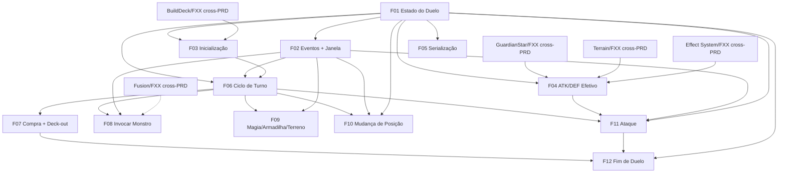

# Motor de Duelo 1x1

## 1. Resumo Executivo

O **Motor de Duelo 1x1** é o núcleo de regras do YuGiOh Forbidden Memories Remastered: o subsistema que executa uma partida completa entre dois lados (P1 e P2), do embaralhamento inicial até a declaração de vencedor. Ele modela o estado do duelo (pontos de vida, mão, deck, campo de 5 zonas de monstro + 5 de magia/armadilha, terreno ativo, turno e fase), valida cada ação segundo as regras do jogo e resolve o combate de forma fiel ao Forbidden Memories original do PS1.

Este módulo implementa diretamente o pilar de arquitetura "Game Engine desacoplado da interface": ele roda inteiramente em memória, sem dependência de renderização, e é **agnóstico de transporte e de oponente** — recebe ações de P1 e P2 sem saber se cada lado é um humano local, uma IA de NPC ou um jogador remoto. Por isso, é a fundação consumida pelos módulos **Free Duel** e **Online Duel**, e o ponto onde a **IA de NPCs**, o **Sistema de Efeitos**, o **Guardian Star Engine**, o **Terrain Engine** e o **Fusion System** se conectam.

O valor central do motor é ser a **fonte única e determinística da verdade** sobre o que é uma jogada legal e qual é o resultado de cada combate. Ao centralizar as regras aqui — testáveis isoladamente e reproduzíveis a partir de um mesmo estado inicial e sequência de ações — o projeto garante duelos justos offline e cria a base necessária para a validação servidor-autoritativa do modo online.

## 2. Problema e Oportunidade

### O Problema

**Regras de duelo espalhadas e inconsistentes**
- Sem um motor central, cada modo (Campanha, Free Duel, Online Duel) tenderia a reimplementar as regras de combate, gerando divergências de comportamento entre modos.
- A resolução de combate do FM tem casos sutis (ataque a monstro em defesa não causa dano; empate de ATK destrói ambos) que, se codificados ad hoc, produzem bugs de "por que perdi vida aqui e não ali".
- Regras acopladas à interface impedem testes automatizados, deixando o comportamento verificado apenas "jogando na mão".

**Acoplamento com a interface trava evolução e testes**
- Lógica de jogo misturada ao frontend impossibilita rodar milhares de duelos de teste por segundo (necessário para balancear IA e validar fusões).
- Qualquer mudança de UI arrisca quebrar regras de jogo e vice-versa.
- Sem separação, o modo online não tem como revalidar as jogadas no servidor.

**Ausência de determinismo bloqueia online e replays**
- Sem um estado serializável e reproduzível, é impossível implementar o servidor autoritativo, detectar trapaças ou oferecer replays.
- Bugs de duelo ficam irreprodutíveis: sem snapshot do estado, não há como reencenar a sequência que levou ao erro.

**Efeitos de carta hard-coded não escalam**
- Com mais de 800 cartas, amarrar efeitos diretamente na lógica de combate é insustentável.
- Sem pontos de gatilho padronizados (onSummon, onAttack, onDestroy...), cada armadilha viraria um `if` especial no meio do combate.

### A Oportunidade

Um motor de regras isolado resolve cada dor acima: **uma implementação única** das regras do FM elimina divergência entre modos; o **desacoplamento total da UI** libera testes automatizados e prepara a revalidação online; o **determinismo por estado + seed** habilita servidor autoritativo, detecção de trapaça e replays; e o **barramento de eventos com janela de reação** entrega ao Sistema de Efeitos um contrato estável, mantendo as regras específicas de cada carta fora do núcleo. O motor vira, assim, o ativo reutilizável de maior alavancagem do projeto.

## 3. Público-Alvo

### Usuários Primários

**Jogador de duelo (campanha e Free Duel)**
Joga contra a CPU no fluxo offline. Espera que as regras sejam fiéis ao PS1, que jogadas ilegais sejam bloqueadas com clareza e que o resultado de cada combate seja previsível e explicável. Não conhece a arquitetura interna — percebe o motor pela ausência de bugs e pela justiça das partidas.

**Jogador competitivo (base para o Online Duel)**
Valoriza correção absoluta das regras, ausência de ambiguidade e reprodutibilidade. É o usuário para quem o determinismo e a validação de cada ação importam mais, pois sustentam a confiança no modo ranqueado online que consumirá este motor.

**Módulos consumidores e time de desenvolvimento (integradores)**
Free Duel, Online Duel e IA de NPCs consomem a API do motor e o estado serializável. Precisam de um contrato estável de ações e eventos, estado inspecionável e comportamento determinístico para construir seus próprios recursos sobre uma base confiável.

### Perfil Comportamental

- Todos dependem de que "a mesma jogada produza sempre o mesmo resultado".
- Todos são sensíveis a divergências entre o que o jogo faz e o que as regras do FM prometem.
- Jogadores querem feedback imediato de por que uma ação foi recusada; integradores querem que a recusa seja programática e inspecionável.

## 4. Objetivos

### Objetivos do Produto

- **Reproduzir fielmente** as regras do duelo 1x1 do Forbidden Memories (estrutura de turno, invocação sem tributo, tabela de resolução de combate sem perfuração, posições, condições de derrota).
- **Desacoplar** 100% da lógica de jogo da interface, entregando um motor executável apenas por API.
- **Garantir determinismo** do estado final dado o mesmo estado inicial, a mesma sequência de ações e o mesmo seed de embaralhamento.
- **Expor um modelo de eventos por gatilho** com janela de reação, servindo de contrato para o Sistema de Efeitos.
- **Fornecer estado serializável** (snapshot) para consumo pelo Online Duel, replays e testes.

### Métricas de Sucesso

- **Fidelidade de regras:** 100% dos casos da tabela de resolução de combate e das regras centrais da Fase 0 cobertos por testes automatizados, com 0 divergências conhecidas em relação às regras documentadas.
- **Desacoplamento:** 0 imports de bibliotecas de UI/renderização no pacote do motor (verificável por análise estática); 100% das transições de estado exercíveis via API headless.
- **Determinismo:** em 1.000 execuções repetidas do mesmo estado inicial + mesma sequência de ações + mesmo seed, 100% de estados finais idênticos.
- **Modelo de eventos:** ≥ 8 tipos de evento de gatilho emitidos (onTurnStart, onDraw, onSummon, onSet, onFlip, onPositionChange, onAttack, onDamage, onDestroy, onTurnEnd), 100% deles com janela de reação documentada.
- **Serialização:** round-trip snapshot → estado → snapshot idempotente em 100% dos estados de teste (sem perda de informação).

## 5. User Stories

### F01. Modelo de Estado do Duelo
- Como sistema, eu quero manter todo o estado do duelo (LP, mão, deck, campo de 5+5 zonas, terreno ativo, turno e fase) em uma estrutura única para que todas as regras leiam e escrevam de uma só fonte da verdade.

### F02. Barramento de Eventos e Janela de Reação
- Como sistema, eu quero emitir eventos de gatilho e pausar o fluxo abrindo uma janela de reação para que o Sistema de Efeitos possa resolver armadilhas e magias sem que o núcleo conheça carta por carta.

### F03. Inicialização do Duelo
- Como jogador, eu quero que o duelo comece com meu deck embaralhado, 8000 de LP e 5 cartas na mão para que a partida inicie em condições justas e iguais para os dois lados.
- Como sistema, eu quero sortear aleatoriamente quem joga primeiro para que nenhum lado tenha vantagem fixa.

### F04. Cálculo de ATK/DEF Efetivo
- Como jogador, eu quero que o poder final do meu monstro considere Guardião Estelar, terreno ativo e equipamentos para que o combate reflita todos os modificadores em vigor.

### F05. Serialização e Snapshot do Estado
- Como sistema, eu quero serializar e recarregar o estado completo do duelo para que o modo online, replays e testes possam reproduzir qualquer situação.

### F06. Ciclo de Turno e Fases
- Como jogador, eu quero que meu turno siga compra → jogada principal → batalha → fim para que eu saiba o que posso fazer em cada momento.
- Como sistema, eu quero impedir ataque no primeiro turno do duelo para que a regra da Fase 0 seja respeitada.

### F07. Compra e Deck-out
- Como jogador, eu quero que minha mão seja completada até 5 cartas no início do turno para que eu sempre tenha opções.
- Como jogador, eu quero perder o duelo se meu deck acabar e eu não puder completar a compra para que a condição de deck-out do FM seja aplicada.

### F08. Invocar e Posicionar Monstro
- Como jogador, eu quero invocar um monstro da mão em uma zona livre escolhendo sua posição (ataque/defesa, face para cima/baixo) para que eu monte minha estratégia.
- Como jogador, eu quero receber um monstro resultante de fusão no mesmo slot de invocação para que fusões cheguem ao campo pela via normal de invocação.

### F09. Jogar Magia / Armadilha / Terreno
- Como jogador, eu quero colocar uma armadilha ou magia em uma zona de magia/armadilha para que ela fique disponível ao Sistema de Efeitos.
- Como jogador, eu quero jogar uma carta de terreno para que o campo ativo mude e afete o combate.

### F10. Mudança de Posição
- Como jogador, eu quero mudar a posição de um monstro já no campo uma vez por turno para que eu reaja à situação da partida.

### F11. Declaração e Resolução de Ataque
- Como jogador, eu quero declarar ataque de um monstro contra um monstro inimigo ou diretamente contra o oponente para que eu cause dano segundo a tabela de combate do FM.
- Como jogador, eu quero que um monstro inimigo virado para baixo seja revelado antes da resolução para que o resultado use seu valor real.

### F12. Condições de Fim de Duelo
- Como jogador, eu quero vencer quando o LP do oponente chegar a 0 para que a condição principal de vitória se aplique.
- Como jogador, eu quero poder me render para encerrar um duelo perdido.
- Como sistema, eu quero declarar o resultado (vencedor, perdedor, motivo) para que os módulos consumidores saibam como a partida terminou.

## 6. Funcionalidades

### F01. Modelo de Estado do Duelo

**Provides:**
- Objeto de estado do duelo — por jogador: LP, mão (lista de cartas), deck (lista ordenada), campo com 5 zonas de monstro e 5 zonas de magia/armadilha; e, global: terreno ativo, jogador ativo, número do turno e fase atual (usado por F02, F03, F04, F05, F06, F07, F08, F09, F10, F11, F12)

**Capabilities:**
- Exatamente **5 zonas de monstro** + **5 zonas de magia/armadilha** por jogador (Fase 0); cada zona de monstro guarda a carta, sua posição (uma de 4: ataque face-cima, ataque face-baixo, defesa face-cima, defesa face-baixo) e flags de turno (já atacou, já mudou de posição)
- **8000 de LP** iniciais por jogador (Fase 0); **1 terreno ativo** por vez (Fase 0), inicialmente nenhum
- Estado 100% em memória, sem qualquer dependência de UI; toda mutação ocorre por ações validadas (F06–F12)
- Cada carta em campo/mão referencia o schema do banco de cartas (`id, numero, nome, img, classe, atk, def, guardiao1, guardiao2, password, estrelas, tipo`), sem inventar campos novos

**Experience:** Estrutura interna consumida via API. Toda leitura de regra parte deste objeto; nenhuma feature mantém estado paralelo. Modificadores temporários (equip, terreno, guardião) não sobrescrevem o `atk`/`def` base da carta — são aplicados no cálculo efetivo (F04).

### F02. Barramento de Eventos e Janela de Reação

**Consumes:**
- F01: objeto de estado do duelo

**Provides:**
- Fluxo de eventos de gatilho + API de janela de reação (consumido pelo **Effect System/FXX — cross-PRD**; e usado internamente por F06, F08, F09, F10, F11 para emitir seus eventos)

**Capabilities:**
- Tipos de evento mínimos: `onTurnStart`, `onDraw`, `onSummon`, `onSet`, `onFlip`, `onPositionChange`, `onAttackDeclared`, `onDamage`, `onDestroy`, `onTurnEnd` (≥ 8 tipos)
- Cada evento carrega: tipo, jogador de origem, cartas/zonas envolvidas e um instantâneo mínimo do contexto
- Ao emitir um evento com janela de reação, o motor **pausa** o fluxo, publica o evento e aguarda o Effect System (cross-PRD) resolver 0..N efeitos antes de **retomar**; a resolução dos efeitos em si é responsabilidade do Effect System, não deste PRD
- Ordem de resolução quando múltiplos efeitos disparam no mesmo evento é **delegada ao Effect System**; o motor garante apenas a ordem de emissão dos eventos (determinística)

**Experience:** Ao declarar um ataque, o motor emite `onAttackDeclared`, abre a janela (permitindo, p. ex., uma armadilha reagir), e só então resolve o combate emitindo `onDamage`/`onDestroy`. Se nenhum efeito reage, a janela fecha imediatamente e o fluxo segue. É o contrato que realiza o pilar "efeitos por eventos".

**Nota de fidelidade:** modernização de arquitetura (o FM original não expunha eventos), transparente ao jogador.

### F03. Inicialização do Duelo

**Consumes:**
- **BuildDeck/FXX (cross-PRD):** deck validado de exatamente 40 cartas por jogador (máx. 3 cópias por carta)
- F01: objeto de estado do duelo (para popular)

**Provides:**
- Estado inicial do duelo (mãos de 5 cartas, decks embaralhados, LP 8000, campo vazio, terreno nenhum, jogador inicial definido) (usado por F06)

**Capabilities:**
- Valida que cada deck tem **exatamente 40 cartas** e **no máximo 3 cópias** por carta antes de iniciar (Fase 0); recusa iniciar caso contrário
- Embaralha cada deck usando um **seed** fornecido/registrado, garantindo reprodutibilidade (determinismo)
- Distribui **5 cartas** de mão inicial a cada jogador (Fase 0)
- Sorteia o **primeiro jogador aleatoriamente** (derivado do seed); marca a flag "primeiro turno do duelo" para F06
- LP inicial **8000** para ambos (Fase 0)

**Experience:** Recebe os dois decks (via Build Deck, cross-PRD), embaralha por seed, entrega 5 cartas a cada lado, zera o campo e sorteia quem começa. A partir daqui, F06 assume o controle do fluxo.

**Error Handling:**
- Deck com quantidade ≠ 40 cartas → recusa iniciar: "Deck inválido: são necessárias exatamente 40 cartas."
- Deck com 4+ cópias de uma mesma carta → recusa iniciar: "Deck inválido: máximo de 3 cópias por carta."
- Carta do deck não encontrada no banco de cartas → recusa iniciar: "Deck inválido: carta desconhecida (numero X)."
- Seed ausente quando determinismo é exigido → gera e registra um seed, mantendo reprodutibilidade.

### F04. Cálculo de ATK/DEF Efetivo

**Consumes:**
- F01: monstro-alvo e terreno ativo, lidos do estado
- **GuardianStar/FXX (cross-PRD):** modificador de combate a partir do par de guardiões envolvido — *tabela de compatibilidade a ser fornecida*
- **Terrain/FXX (cross-PRD):** modificador de ATK/DEF por classe do monstro × terreno ativo — *tabela de compatibilidade a ser fornecida*
- **Effect System/FXX (cross-PRD):** modificador de equipamento acumulado sobre o monstro

**Provides:**
- ATK/DEF efetivo de um monstro (base do schema + guardião + terreno + equipamento) (usado por F11)

**Capabilities:**
- ATK/DEF efetivo = `atk`/`def` base (do schema) **+** modificador de Guardião Estelar **+** modificador de Terreno **+** modificador de Equipamento, nessa composição aditiva
- Nunca inventa valores das tabelas de Guardião ou Terreno: consome os modificadores dos engines cross-PRD; enquanto essas tabelas não existirem, o modificador correspondente é tratado como 0 e a **pendência fica registrada** (ver Seção 9)
- O cálculo é puro (sem efeitos colaterais): não altera o estado, apenas reporta os valores efetivos no momento da consulta

**Experience:** Chamado por F11 no instante da resolução de combate para obter os valores reais de atacante e defensor. Como é puro e determinístico, pode ser consultado também pela IA/UI para prever resultados.

**Nota de fidelidade:** fiel ao FM (guardião + terreno + equip compõem o poder efetivo); os valores concretos dependem das tabelas cross-PRD ainda não definidas.

### F05. Serialização e Snapshot do Estado

**Consumes:**
- F01: objeto de estado do duelo

**Provides:**
- Snapshot serializável do estado + operação de carga do snapshot (usado por **Online Duel/FXX — cross-PRD**, e por replays/testes)

**Capabilities:**
- Serializa o estado completo (ambos os jogadores, campo, terreno, turno, fase, seed, flags) para um formato de dados portável
- Round-trip **idempotente**: `carregar(serializar(estado)) == estado` para 100% dos estados
- Inclui o seed de embaralhamento para permitir continuação determinística
- Não inclui referências de UI (mantém o desacoplamento)

**Experience:** A qualquer momento é possível tirar um snapshot e, mais tarde, recarregá-lo para retomar exatamente o mesmo ponto — base para o servidor autoritativo (cross-PRD) e para reencenar bugs.

### F06. Ciclo de Turno e Fases

**Consumes:**
- F03: estado inicial do duelo (duelo já inicializado)
- F01: objeto de estado do duelo
- F02: emissão de `onTurnStart`/`onTurnEnd`

**Provides:**
- Turno e fase atuais, jogador ativo e flag "primeiro turno do duelo" (usado por F07, F08, F09, F10, F11)

**Capabilities:**
- Sequência de fases por turno: **Compra** (F07) → **Principal** (jogada da mão, F08/F09) → **Batalha** (ataques e posições, F10/F11) → **Fim** (passa a vez)
- **1 jogada vinda da mão por turno** (Fase 0): invocar/posicionar monstro, colocar/ativar magia-armadilha, ou jogar carta de terreno — as três são mutuamente exclusivas no mesmo turno
- Ataque (F11) e mudança de posição (F10) **não** consomem a jogada da mão: cada monstro pode atacar **1x por turno** e mudar de posição **1x por turno**, à parte
- **Primeiro turno do duelo (de quem começa): proibido atacar** (Fase 0); demais turnos, um monstro pode atacar no mesmo turno em que foi invocado (fiel ao FM)
- Emite `onTurnStart` ao abrir o turno e `onTurnEnd` ao fechá-lo; ao encerrar, reseta as flags de turno (já atacou / já mudou de posição) dos monstros do jogador ativo

**Experience:** No começo do turno, o jogador recebe cartas até ter 5 (F07); pode fazer 1 jogada da mão; move e ataca com seus monstros dentro dos limites; encerra e passa a vez. Tentar uma 2ª jogada da mão é bloqueado (ver F08/F09). No primeiríssimo turno, a opção de ataque fica desabilitada.

**Nota de fidelidade:** fiel ao FM (sem fases modernas de invocação; ataque liberado no turno da invocação exceto no 1º turno).

### F07. Compra e Deck-out

**Consumes:**
- F06: entrada na fase de Compra

**Provides:**
- Evento/registro de compra realizada e flag de **deck-out** do jogador (usado por F12)

**Capabilities:**
- No início do turno, **completa a mão até 5 cartas** (Fase 0): compra `5 − (cartas na mão)` cartas do topo do deck; se a mão já tem 5, compra 0
- Emite `onDraw` por carta comprada (via F02)
- Se, ao precisar comprar, o **deck estiver vazio**, sinaliza deck-out: o jogador que não conseguiu completar a compra **perde** (Fase 0), resultado consolidado por F12
- Compra é determinística (topo do deck embaralhado por seed)

**Experience:** O jogador vê a mão ser recomposta até 5 no começo do turno. Se o deck se esgota e ainda falta comprar, o duelo termina imediatamente com derrota por deck-out.

**Error Handling:**
- Deck vazio no momento de uma compra obrigatória → aciona deck-out (derrota), não erro: encaminha a F12 com motivo "deck-out".
- Solicitação de compra fora da fase de Compra → recusa: ação ignorada e reportada como inválida ao chamador.

### F08. Invocar e Posicionar Monstro

**Consumes:**
- F06: turno ativo com a jogada da mão ainda disponível
- F02: emissão de `onSummon`/`onSet`
- **Fusion System/FXX (cross-PRD, opcional):** carta de monstro resultante de fusão, para preencher o slot de invocação

**Provides:**
- Registro de monstro invocado/posicionado em uma zona de monstro (refletido no estado F01; usado na Batalha por F10 e F11 via estado)

**Capabilities:**
- Invoca **1 monstro por turno** (consome a jogada da mão do turno, F06) em uma das **5 zonas de monstro** livres
- Escolha entre as **4 posições** no momento da invocação (ataque/defesa × face-cima/face-baixo, Fase 0); "set" = defesa face-baixo
- **Sem tributo/sacrifício** (fiel ao FM): qualquer monstro pode ser invocado diretamente, independentemente de ATK/DEF/estrelas
- O `numero`/`id` da carta invocada deve existir na mão (ou ser um resultado válido de fusão vindo do Fusion System, cross-PRD)
- Emite `onSummon` (face-cima) ou `onSet` (face-baixo) e abre janela de reação (F02)

**Experience:** O jogador seleciona uma carta de monstro na mão, escolhe a zona e a posição; a carta sai da mão e ocupa a zona. Se a invocação vier de uma fusão (cross-PRD), o motor recebe a carta resultante e a coloca pela mesma via, consumindo a jogada do turno.

**Error Handling:**
- Zona de monstro escolhida já ocupada → recusa: "Zona ocupada — escolha outra."
- Todas as 5 zonas de monstro ocupadas → recusa: "Sem espaço para invocar."
- Jogada da mão já usada neste turno → recusa: "Você já fez sua jogada neste turno."
- Carta não presente na mão → recusa: "Carta indisponível."

### F09. Jogar Magia / Armadilha / Terreno

**Consumes:**
- F06: turno ativo com a jogada da mão ainda disponível
- F02: emissão de `onSet` (magia/armadilha colocada) e do gatilho de troca de terreno

**Provides:**
- Carta de magia/armadilha posicionada em zona de magia/armadilha, e/ou **terreno ativo** atualizado no estado (refletido em F01; lido por F04 e pelo **Effect System/FXX — cross-PRD**)

**Capabilities:**
- Colocar 1 magia/armadilha por turno em uma das **5 zonas de magia/armadilha** livres (consome a jogada da mão, F06)
- Jogar 1 carta de **terreno** (`tipo: magica`, `classe: Magic`) substitui o **único terreno ativo** (Fase 0)
- A **resolução do efeito** (o que a armadilha/magia faz, o buff do equipamento) é do **Effect System (cross-PRD)**; este PRD apenas posiciona a carta, atualiza o terreno ativo e emite os eventos
- Distingue os tipos do schema (`armadilha`, `equipamento`, `magica` de terreno, `magica` de efeito) para rotear ao slot correto e ao evento correto

**Experience:** O jogador seleciona uma magia/armadilha e uma zona livre; a carta ocupa a zona (face-baixo, no caso de armadilha) e fica disponível para o Effect System reagir a eventos. Ao jogar um terreno, o campo ativo muda e passa a influenciar o cálculo de combate (F04) na próxima resolução.

**Error Handling:**
- Zona de magia/armadilha escolhida já ocupada → recusa: "Zona ocupada — escolha outra."
- Todas as 5 zonas de magia/armadilha ocupadas → recusa: "Sem espaço para esta carta."
- Jogada da mão já usada neste turno → recusa: "Você já fez sua jogada neste turno."

### F10. Mudança de Posição

**Consumes:**
- F06: turno ativo, fase de Batalha
- F01: monstro-alvo lido do estado
- F02: emissão de `onFlip`/`onPositionChange`

**Provides:**
- Posição atualizada do monstro no estado (refletido em F01; lido por F11 via estado)

**Capabilities:**
- Cada monstro pode mudar de posição **1x por turno** (não consome a jogada da mão, F06)
- Alterna entre ataque e defesa e/ou revela um monstro face-baixo; emite `onFlip` quando um monstro face-baixo é virado para cima
- Não permitido no primeiro turno do jogo? — mudança de posição é permitida; apenas o **ataque** é bloqueado no 1º turno (F06)

**Experience:** Na fase de batalha, o jogador seleciona um monstro seu e alterna sua posição uma vez. A flag "já mudou de posição" bloqueia uma segunda troca no mesmo turno.

### F11. Declaração e Resolução de Ataque

**Consumes:**
- F06: turno ativo, fase de Batalha; respeita a proibição de ataque no 1º turno
- F04: ATK/DEF efetivo de atacante e defensor
- F01: monstros em campo (atacante e alvo) lidos do estado
- F02: emissão de `onAttackDeclared`, `onDamage`, `onDestroy` e janela de reação

**Provides:**
- Resultado do combate: destruições aplicadas e dano de LP aplicado a cada jogador (usado por F12)

**Capabilities:**
- Um monstro pode atacar **1x por turno** (Fase 0); só monstros em **posição de ataque** podem declarar ataque
- Um monstro face-baixo do defensor é **revelado** antes da resolução (`onFlip`), e usa seu valor real
- Tabela de resolução (fiel ao FM, **sem perfuração**):
  - **Atacante (ATK) vs Defensor (ATK, face-cima):** maior ATK efetivo vence; o monstro perdedor é destruído; o dono do perdedor toma **(ATK maior − ATK menor)** de dano. **ATK igual:** ambos destruídos, **sem dano**.
  - **Atacante (ATK) vs Defensor (DEF):** `ATK > DEF` → defensor destruído, **sem dano de LP**; `ATK < DEF` → **atacante sobrevive**, dono do atacante toma **(DEF − ATK)** de dano; `ATK = DEF` → nada acontece.
  - **Campo inimigo sem monstros:** ataque direto = **ATK efetivo total** em dano de LP ao oponente.
- Abre janela de reação em `onAttackDeclared` (armadilhas podem reagir via Effect System, cross-PRD) antes de resolver; emite `onDamage` e `onDestroy` conforme o resultado
- Marca a flag "já atacou" do monstro atacante

**Experience:** O jogador escolhe um monstro em ataque e um alvo inimigo (ou ataque direto, se não houver monstros). O motor emite a declaração, permite reações, revela face-baixo se necessário, calcula ATK/DEF efetivos (F04) e aplica destruição e dano segundo a tabela acima, comunicando cada passo por eventos.

**Error Handling:**
- Ataque no 1º turno do duelo → recusa: "Não é permitido atacar no primeiro turno."
- Monstro em defesa tentando atacar → recusa: "Monstros em defesa não podem atacar."
- Monstro que já atacou neste turno → recusa: "Este monstro já atacou neste turno."
- Ataque direto com o oponente ainda tendo monstros → recusa: "Existem monstros para atacar — ataque direto indisponível."

### F12. Condições de Fim de Duelo

**Consumes:**
- F07: flag de deck-out
- F11: LP resultante após aplicação de dano
- F01: LP atual de cada jogador
- Ação de rendição do jogador ativo/inativo

**Provides:**
- Resultado do duelo: vencedor, perdedor e motivo (usado por **Free Duel/FXX** e **Online Duel/FXX** — cross-PRD)

**Capabilities:**
- Encerra o duelo quando: **LP de um jogador chega a 0** (Fase 0), **deck-out** (F07, Fase 0), ou **rendição** de um jogador
- Motivos possíveis no resultado: `lp_zerado`, `deck_out`, `rendicao`
- Se ambos os jogadores chegam a 0 de LP simultaneamente (via dano mútuo/efeito), o resultado é **empate** (`empate`)
- **Timeout/abandono por desconexão não são tratados aqui** — ficam no PRD Online Duel (cross-PRD)
- Após declarar o resultado, o motor congela o estado (nenhuma ação adicional é aceita) e o expõe para serialização (F05)

**Experience:** Assim que uma condição de derrota é atingida, o motor interrompe o fluxo, determina vencedor/perdedor/motivo e devolve esse resultado ao módulo consumidor (Free Duel/Online Duel), que cuida da tela de fim de partida. A rendição pode ser acionada a qualquer momento pelo jogador.

**Error Handling:**
- Ação de jogo recebida após o duelo terminado → recusa: "O duelo já terminou."
- Rendição de jogador não participante → recusa: "Rendição inválida."

## 7. Fora de Escopo

**Subsistemas de regra que viram PRDs próprios (fronteiras definidas na Fase 1):**
- **Guardian Star Engine** — a tabela de vantagem/desvantagem entre guardiões e o cálculo do bônus; este motor apenas **consome** o modificador (cross-PRD).
- **Terrain Engine** — a tabela classe × terreno e o cálculo do bônus/penalidade; consumido como modificador (cross-PRD).
- **Fusion System** — a lógica de quais cartas fundem em quê; o motor apenas recebe a carta resultante no slot de invocação (cross-PRD).
- **Effect System** — a resolução concreta de armadilhas, magias de efeito e equipamentos; o motor só **emite eventos e abre a janela de reação** (cross-PRD).
- **IA de NPCs** — a decisão de jogadas de um lado CPU; o motor é agnóstico de quem gera as ações (cross-PRD).

**Modo online e rede:**
- Servidor autoritativo, validação server-side, matchmaking, sincronismo de estado, reconexão e **timeout/abandono** — todos no PRD **Online Duel** (cross-PRD). Este motor é local/offline e agnóstico de transporte.

**Montagem e origem dos decks:**
- Construção, edição e salvamento de decks — no PRD **Build Deck** (cross-PRD). O motor **recebe** decks já validados.

**Interface e apresentação:**
- Renderização, animações, sons, layout responsivo e feedback visual concreto — pertencem à camada de UI que consome o motor. O PRD descreve validações e mensagens em nível lógico, não sua aparência.

**Modos e variações:**
- Duelos **2x2** (expansão futura, Fase 0), progressão de campanha, drops de cartas e recompensas — fora deste motor.

## 8. Grafo de Dependências

### Parte 1: Tabela de Dependências

| # | Feature | Prioridade | Dependências |
|---|---------|------------|---------------|
| F01 | Modelo de Estado do Duelo | 1 | None |
| F02 | Barramento de Eventos e Janela de Reação | 1 | F01 |
| F03 | Inicialização do Duelo | 1 | F01, BuildDeck/FXX (cross-PRD) |
| F04 | Cálculo de ATK/DEF Efetivo | 1 | F01, GuardianStar/FXX (cross-PRD), Terrain/FXX (cross-PRD), Effect System/FXX (cross-PRD) |
| F05 | Serialização e Snapshot do Estado | 2 | F01 |
| F06 | Ciclo de Turno e Fases | 1 | F01, F02, F03 |
| F07 | Compra e Deck-out | 1 | F06 |
| F08 | Invocar e Posicionar Monstro | 1 | F06, F02, Fusion System/FXX (cross-PRD, opcional) |
| F09 | Jogar Magia / Armadilha / Terreno | 2 | F06, F02 |
| F10 | Mudança de Posição | 2 | F06, F02, F01 |
| F11 | Declaração e Resolução de Ataque | 1 | F06, F04, F02, F01 |
| F12 | Condições de Fim de Duelo | 1 | F07, F11, F01 |

### Parte 2: Foundation Features

Duas features carregam a infraestrutura compartilhada da qual todo o restante do módulo depende, direta ou indiretamente:

- **F01 — Modelo de Estado do Duelo:** a fonte única da verdade; todas as demais features leem e escrevem neste estado.
- **F02 — Barramento de Eventos e Janela de Reação:** o canal pelo qual as ações emitem gatilhos e o Effect System (cross-PRD) se integra; toda ação com efeito colateral observável passa por ele.

Recomenda-se implementar F01 e F02 antes de qualquer feature de ação.

### Parte 3: Execution Waves

- **Wave 1:** F01
- **Wave 2:** F02, F03, F04, F05
- **Wave 3:** F06
- **Wave 4:** F07, F08, F11, F09, F10
- **Wave 5:** F12

*(Dependências cross-PRD são tratadas como externas/disponíveis e não deslocam as waves internas. Dentro de cada wave, a ordem segue prioridade ascendente e depois o ID.)*

### Parte 4: Legenda de Prioridade

### Níveis de prioridade
- **1** = Essencial — o módulo não funciona sem isso
- **2** = Importante — adição significativa de valor
- **3** = Desejável — melhoria incremental

### Parte 5: Diagrama Mermaid

## 9. Critérios de Aceite

### F01. Modelo de Estado do Duelo
- [ ] O estado expõe, por jogador, LP, mão, deck e um campo com exatamente 5 zonas de monstro e 5 de magia/armadilha, além de terreno ativo, jogador ativo, turno e fase globais.
- [ ] Cada zona de monstro registra a carta, uma das 4 posições e as flags "já atacou" / "já mudou de posição".
- [ ] Modificadores (guardião/terreno/equip) não alteram o `atk`/`def` base da carta armazenada.
- [ ] Cartas referenciam apenas campos do schema existente (`id, numero, nome, ..., tipo`), sem campos novos.

### F02. Barramento de Eventos e Janela de Reação
- [ ] Emite ao menos 8 tipos de evento, incluindo onTurnStart, onDraw, onSummon, onSet, onFlip, onAttackDeclared, onDamage, onDestroy, onTurnEnd.
- [ ] Ao emitir um evento com janela de reação, o fluxo pausa, permite 0..N resoluções externas e retoma; sem reações, a janela fecha imediatamente.
- [ ] A ordem de emissão dos eventos é determinística para a mesma sequência de ações.

### F03. Inicialização do Duelo
- [ ] Recusa iniciar com deck ≠ 40 cartas ou com 4+ cópias de uma carta, exibindo a mensagem específica.
- [ ] Cada jogador começa com 8000 LP e 5 cartas na mão; o campo inicia vazio e sem terreno.
- [ ] O primeiro jogador é sorteado a partir do seed; com o mesmo seed, o sorteio e o embaralhamento se repetem identicamente.

### F04. Cálculo de ATK/DEF Efetivo
- [ ] ATK/DEF efetivo = base + guardião + terreno + equip (composição aditiva), sem mutar o estado.
- [ ] Enquanto as tabelas de Guardião/Terreno não existirem, o modificador correspondente é 0 e o cálculo não quebra.
- [ ] **(Pendente — cross-PRD)** Quando o Guardian Star Engine e o Terrain Engine fornecerem suas tabelas de compatibilidade, F04 aplica os modificadores corretos; critério a validar após a definição das tabelas.

### F05. Serialização e Snapshot do Estado
- [ ] `carregar(serializar(estado))` reproduz o estado idêntico (round-trip idempotente) para os estados de teste.
- [ ] O snapshot inclui o seed e permite continuação determinística do duelo.
- [ ] O snapshot não contém referências de UI.

### F06. Ciclo de Turno e Fases
- [ ] As fases seguem Compra → Principal → Batalha → Fim, alternando o jogador ativo ao encerrar.
- [ ] Apenas 1 jogada vinda da mão é aceita por turno; a 2ª é recusada.
- [ ] No 1º turno do duelo, a declaração de ataque é bloqueada; nos demais, um monstro pode atacar no mesmo turno em que foi invocado.
- [ ] Ao encerrar o turno, as flags "já atacou" e "já mudou de posição" dos monstros do jogador ativo são resetadas.

### F07. Compra e Deck-out
- [ ] No início do turno, a mão é completada até 5 cartas (compra 0 se já tem 5).
- [ ] Cada carta comprada emite onDraw.
- [ ] Deck vazio no momento de uma compra obrigatória resulta em derrota por deck-out, encaminhada a F12 com motivo `deck_out`.

### F08. Invocar e Posicionar Monstro
- [ ] Invoca 1 monstro por turno em zona livre, com escolha entre as 4 posições, sem exigir tributo.
- [ ] Recusa invocar em zona ocupada, sem zonas livres, com jogada já usada, ou com carta ausente da mão — cada caso com a mensagem específica.
- [ ] Um monstro resultante de fusão (cross-PRD) é aceito no slot de invocação e consome a jogada do turno.
- [ ] Emite onSummon (face-cima) ou onSet (face-baixo) com janela de reação.

### F09. Jogar Magia / Armadilha / Terreno
- [ ] Coloca 1 magia/armadilha por turno em zona livre; recusa se a zona/todas as zonas estiverem ocupadas ou a jogada já tiver sido usada.
- [ ] Jogar carta de terreno substitui o único terreno ativo no estado.
- [ ] O motor não resolve o efeito da carta (delegado ao Effect System, cross-PRD), apenas posiciona e emite o evento.

### F10. Mudança de Posição
- [ ] Cada monstro muda de posição no máximo 1x por turno; a 2ª troca é recusada.
- [ ] Virar um monstro face-baixo para cima emite onFlip.
- [ ] Mudança de posição não consome a jogada da mão do turno.

### F11. Declaração e Resolução de Ataque
- [ ] ATK vs ATK: maior ATK vence, perdedor destruído, dono do perdedor toma a diferença; ATK igual destrói ambos sem dano.
- [ ] ATK vs DEF: ATK>DEF destrói o defensor sem dano; ATK<DEF mantém o atacante e causa (DEF−ATK) ao dono do atacante; ATK=DEF não faz nada.
- [ ] Ataque direto (campo inimigo vazio) causa dano igual ao ATK efetivo total.
- [ ] Defensor face-baixo é revelado (onFlip) antes da resolução e usa o valor real.
- [ ] Recusa: ataque no 1º turno, monstro em defesa atacando, monstro que já atacou, e ataque direto com monstros inimigos presentes — cada um com a mensagem específica.
- [ ] Um monstro só ataca 1x por turno.

### F12. Condições de Fim de Duelo
- [ ] Declara resultado quando LP chega a 0 (`lp_zerado`), em deck-out (`deck_out`) ou em rendição (`rendicao`), com vencedor e perdedor corretos.
- [ ] LP zerado simultâneo dos dois jogadores resulta em `empate`.
- [ ] Após o fim, qualquer ação de jogo é recusada com "O duelo já terminou."
- [ ] Timeout/abandono por desconexão não são tratados aqui (cross-PRD Online Duel).

### Cross-Feature Integration
- [ ] Uma partida completa roda de ponta a ponta: F03 inicializa → F06 conduz turnos → F07 compra → F08/F09 jogam da mão → F10/F11 batalham → F12 encerra, sem estado inconsistente.
- [ ] Todos os eventos emitidos pelas ações (F06–F11) passam por F02 e abrem janela de reação quando aplicável.
- [ ] O mesmo estado inicial + mesma sequência de ações + mesmo seed produz o mesmo resultado final em execuções repetidas (determinismo verificado via F05).
- [ ] Nenhuma capacidade do motor depende de UI (verificação de desacoplamento).

### Cross-PRD Integration
- [ ] **Build Deck:** um deck de 40 cartas exportado pelo Build Deck é aceito por F03 ao iniciar o duelo (cross-PRD).
- [ ] **Fusion System:** uma carta resultante de fusão é entregue e posicionada por F08 pela via de invocação (cross-PRD).
- [ ] **Effect System:** armadilhas/magias posicionadas por F09 reagem aos eventos emitidos por F02 na janela de reação (cross-PRD).
- [ ] **Guardian Star Engine / Terrain Engine:** os modificadores consumidos por F04 refletem as tabelas oficiais assim que forem fornecidas — pendência registrada até a definição das tabelas (cross-PRD).
- [ ] **Online Duel:** o snapshot serializado por F05 é aceito pelo servidor autoritativo do Online Duel para revalidação e sincronismo (cross-PRD).
