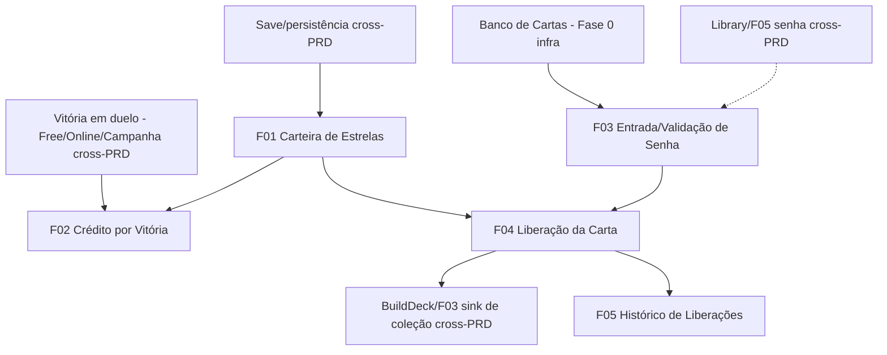

# Password

## 1. Resumo Executivo

O **Password** é o módulo em que o jogador **libera cartas para a sua coleção digitando a senha (`password`) da carta e pagando o preço dela em estrelas** (`estrelas`). Ele funde os dois campos de aquisição do schema da Fase 0 em uma única ação: a senha identifica *qual* carta se quer, e as estrelas — a moeda do jogo, acumulada ao **vencer duelos** — são o *custo* para trazê-la para a coleção. Não é uma loja com grade navegável de produtos: é uma **tela de código**, na qual o jogador digita o password de 8 dígitos (ex.: `89 63 11 39`), o sistema mostra a carta correspondente e seu preço, e a liberação só acontece se o saldo de estrelas cobrir o valor.

O módulo é dono de **dois recursos próprios**: a **carteira de estrelas** do jogador (saldo persistido na conta) e o **fluxo de liberação por senha**. As estrelas entram na carteira como recompensa paralela por vitória — vencer um duelo continua concedendo **1 carta** (via `BuildDeck/F03`) **e** passa a conceder também **N estrelas** (este módulo). As estrelas saem da carteira quando o jogador libera uma carta: o preço é debitado e a carta é adicionada à coleção usando **o mesmo "sink" de crescimento de coleção do Build Deck** (`BuildDeck/F03`), sem que este módulo crie uma coleção paralela.

Das 821 cartas do banco, **722 possuem senha** e são liberáveis por esta tela; as **99 sem senha** só chegam à coleção por outras fontes (drops de duelo). O preço é o campo `estrelas`: **600 cartas têm preço real (10 a 50.000⭐)**, e as demais **122 estão em 999999⭐** (98 já cadastradas assim + 24 sem preço tratadas como 999999) — efetivamente inatingíveis até o jogador acumular muito saldo, funcionando como *gate* natural para cartas "chefe" (Blue-Eyes, Raigeki etc.). O valor central do módulo é oferecer uma **via determinística de aquisição** — "eu sei o código e junto estrelas, logo eu conquisto a carta" — complementando a via aleatória dos drops de duelo. Este PRD implementa o pilar de **banco de dados de cartas em arquivos de dados** (consome senha/preço do schema sem inventar campos) e prepara terreno para o **servidor autoritativo** (carteira e liberações validadas no servidor).

## 2. Problema e Oportunidade

### O Problema

**Aquisição de cartas puramente aleatória frustra o planejamento**
- Se a única fonte de cartas for o drop de 1 carta por vitória (`BuildDeck/F03`), o jogador não tem como perseguir uma carta específica de que precisa para uma sinergia.
- Montar um deck em torno de uma carta-chave vira questão de sorte, não de estratégia, esvaziando o loop "quero a carta X → trabalho para consegui-la".
- Sem uma via determinística, cartas raras podem nunca cair, gerando frustração de longo prazo.

**A tela de senha do Forbidden Memories original era limitada e desconectada de economia**
- No PS1, a entrada de senha existia, mas era uma liberação isolada, sem custo nem relação com o progresso de quem jogava — dava a mesma carta de graça a quem nunca duelou e a quem duelou 500 vezes.
- Não havia moeda de jogo: vencer duelos não construía nenhum "poder de compra" tangível, então o esforço do jogador não se convertia em escolha.
- A senha ficava escondida; sem consulta, o jogador nem sabia que códigos existiam.

**Recompensa de vitória rasa desmotiva o grind**
- Se vencer só entrega uma carta aleatória, sessões de muitas vitórias sem a carta desejada parecem improdutivas.
- Falta um recurso acumulável que faça cada vitória "valer alguma coisa" mesmo quando a carta dropada não interessa.

**Risco de inconsistência de economia (estrela debitada sem carta)**
- Qualquer fluxo que envolva "gastar moeda para receber item" corre o risco de debitar o saldo e falhar em conceder o item (ou o inverso), corrompendo a economia do jogador.
- Sem atomicidade e idempotência, uma falha de rede no meio da liberação pode fazer o jogador perder estrelas duramente conquistadas.

### A Oportunidade

O módulo Password web resolve cada dor: (1) cria uma **via determinística de aquisição** — o jogador que conhece a senha e junta estrelas consegue *exatamente* a carta que quer, complementando o drop aleatório; (2) transforma a antiga tela de senha em um **ponto de economia significativo**, onde o código identifica a carta e o preço em `estrelas` conecta a aquisição ao esforço em duelo; (3) dá **valor persistente a cada vitória** ao acumular estrelas na carteira, de modo que nenhuma vitória seja "desperdiçada" mesmo quando o drop não agrada; e (4) trata a liberação como uma **operação atômica e idempotente** (debita o saldo e concede a carta como uma unidade, sem duplicar créditos de vitória), protegendo a economia do jogador contra falhas de rede. Tudo reusando os campos `password` e `estrelas` já existentes no banco e o "sink" de coleção do Build Deck, sem duplicar dados nem inventar regras.

## 3. Público-Alvo

### Usuários Primários

**Caçador de carta específica (jogador estratégico)**
Já entende o pool de cartas e sabe qual carta quer para fechar uma combinação no deck. Consulta a senha (na Library) e usa o Password como via direta: acumula estrelas vencendo duelos e libera exatamente a carta-alvo. Valoriza a **previsibilidade** (saber o preço e o quanto falta juntar) e o preview claro da carta antes de confirmar o gasto.

**Colecionador econômico (jogador de progressão)**
Joga muitos duelos e trata as estrelas como um recurso a otimizar. Gosta de ver o saldo crescer a cada vitória e de decidir quando "torrar" estrelas em uma carta cara. Valoriza o **saldo sempre visível**, o histórico de liberações e a sensação de que cada vitória constrói poder de compra.

### Perfil Comportamental

- Ambos alternam entre **duelar (ganhar estrelas)** e **abrir o Password (gastar estrelas)** em ciclos curtos.
- Ambos consultam a **senha na Library** antes de vir liberar a carta (dependência cross-PRD de descoberta de códigos).
- Ambos são sensíveis a confiança na economia: querem certeza de que uma liberação nunca cobra sem entregar a carta.
- Ambos esperam que saldo e cartas liberadas **persistam** na conta e acompanhem o jogador entre dispositivos.

## 4. Objetivos

### Objetivos do Produto

- **Oferecer uma via determinística de aquisição de cartas** por senha + pagamento em estrelas, complementar ao drop aleatório de duelo.
- **Manter uma carteira de estrelas confiável**, creditada a cada vitória e persistida na conta do jogador (servidor + cache local).
- **Garantir a integridade da economia**, tornando toda liberação atômica (debita e concede juntos) e todo crédito de vitória idempotente (uma vez por duelo).
- **Reaproveitar o schema e a coleção existentes**, liberando cartas via o "sink" do Build Deck (`BuildDeck/F03`) e usando `password`/`estrelas` sem inventar campos.

### Métricas de Sucesso

- **Integridade da liberação:** 100% das liberações concluídas debitam o preço em estrelas **e** adicionam +1 cópia à coleção de forma atômica; **0** ocorrências de estrela debitada sem carta concedida ou carta concedida sem débito.
- **Consistência do saldo:** o saldo **nunca fica negativo**; 100% das tentativas com saldo < preço são bloqueadas antes de qualquer débito.
- **Idempotência do crédito:** cada evento de vitória credita estrelas **exatamente 1 vez**; **0** créditos duplicados em reprocessamento do mesmo identificador de duelo.
- **Cobertura de catálogo:** as **722** cartas com senha são liberáveis; as **99** sem senha nunca são liberadas por esta tela (rejeição 100%).
- **Persistência confiável:** 100% dos créditos e débitos refletidos no servidor e no cache local; em falha de rede, **0** perdas de saldo e **0** cartas concedidas sem o débito correspondente após a sincronização.
- **Feedback de senha:** senha válida resolve a carta correta e mostra preço + saldo em **≤ 300 ms**; senha inexistente é rejeitada com mensagem específica em 100% dos casos.

## 5. User Stories

### F01. Carteira de Estrelas
- Como sistema, eu quero manter o saldo de estrelas do jogador como um inteiro persistido na conta para que créditos (vitórias) e débitos (liberações) tenham uma fonte única da verdade.
- Como jogador, eu quero ver meu saldo atual de estrelas para saber quanto poder de compra eu tenho.

### F02. Crédito de Estrelas por Vitória
- Como jogador, eu quero ganhar estrelas ao vencer um duelo para que cada vitória aumente meu poder de compra, além da carta que já recebo.
- Como sistema, eu quero creditar as estrelas de uma vitória exatamente uma vez por duelo para que reprocessamentos não dupliquem o saldo.

### F03. Entrada e Validação de Senha
- Como jogador, eu quero digitar o código de senha de uma carta para identificar qual carta desejo liberar.
- Como jogador, eu quero ver a carta correspondente (arte, nome, preço e se posso pagar) antes de confirmar para não gastar por engano.
- Como jogador, eu quero uma mensagem clara quando a senha for inválida para saber que digitei um código inexistente.

### F04. Liberação da Carta (pagamento em estrelas)
- Como jogador, eu quero liberar a carta pagando seu preço em estrelas para adicioná-la à minha coleção.
- Como jogador, eu quero liberar a mesma carta mais de uma vez para acumular cópias e poder usar até 3 no deck.
- Como jogador, eu quero ser impedido de liberar uma carta quando não tenho estrelas suficientes para não ficar com saldo negativo.
- Como sistema, eu quero que o débito do saldo e a concessão da carta ocorram de forma atômica para que a economia do jogador nunca fique inconsistente.

### F05. Histórico de Liberações
- Como jogador, eu quero ver o histórico das cartas que liberei e quantas estrelas gastei para acompanhar meus gastos.

## 6. Funcionalidades

### F01. Carteira de Estrelas

**Provides:**
- Saldo de estrelas do jogador — inteiro `≥ 0` persistido na conta (usado por F02 para creditar, F04 para debitar, F03/F05 para exibição; e por **Save/FXX — cross-PRD** para persistência)

**Capabilities:**
- Saldo é um inteiro **`≥ 0`**; a carteira **nunca** assume valor negativo (invariante do módulo)
- Saldo inicial no cadastro = **valor de balanceamento tunável** (sugestão inicial: `0⭐`) — ver Fora de Escopo (dado de balanceamento, não regra da Fase 0)
- Operações de crédito e débito são **atômicas** e serializadas por conta (sem corrida entre uma vitória e uma liberação simultâneas)
- Persistida na **conta do jogador (servidor) com cache local**, no mesmo padrão de persistência do deck (`BuildDeck/F07`): grava local imediatamente e replica ao servidor em até **2 s** em rede normal
- É a **fonte única da verdade** sobre poder de compra; nenhum outro módulo mantém saldo paralelo

**Experience:** O saldo fica visível de forma persistente no topo da tela Password (ex.: `Saldo: 1.240⭐`) e é atualizado imediatamente após qualquer crédito (F02) ou débito (F04). Não há tela isolada só para a carteira — ela é o recurso-fonte consumido pelas demais features do módulo.

**Nota de fidelidade:** modernização — o FM de PS1 não tinha uma moeda de estrelas persistida em conta; a carteira é uma adição de progressão/economia.

**Error Handling:**
- Falha ao carregar o saldo do servidor → usa o **cache local** mais recente e sinaliza "Saldo carregado do cache; sincronizando…"; não assume `0` por engano (fail-safe: mantém o último saldo conhecido).
- Divergência entre saldo local e servidor na reconexão → prevalece a versão consistente com o log de créditos/débitos aplicados (reconciliação por identificadores), evitando "criar" ou "sumir" estrelas.

---

### F02. Crédito de Estrelas por Vitória

**Consumes:**
- F01: carteira de estrelas (para creditar o saldo)
- **Free Duel/FXX, Online Duel/FXX, Campanha/FXX (cross-PRD):** evento de vitória em duelo, com o **identificador único do duelo** (o mesmo evento que dispara a recompensa de carta em `BuildDeck/F03`)

**Provides:**
- Carteira atualizada com `+N` estrelas (refletido em F01; visível em F03/F05)

**Capabilities:**
- Cada **vitória** credita **`+N` estrelas** ao saldo, onde `N` é um **valor de balanceamento tunável** (dado de balanceamento — ver Fora de Escopo); pode ser um valor fixo por vitória na versão base
- **Coexiste** com `BuildDeck/F03`: vencer concede **1 carta** (Build Deck) **e** `+N` estrelas (este módulo), disparados pelo mesmo evento de vitória — decisão confirmada na Fase 2 ("Carta + estrelas")
- **Idempotente por duelo:** cada evento de vitória é creditado **exatamente uma vez**, identificado pelo `id` do duelo; reprocessar o mesmo evento **não** soma de novo
- **Não** decide qual carta é dropada nem calcula tabela de drop (isso é do módulo de duelo, cross-PRD); este módulo apenas credita estrelas
- Este módulo **não** define a regra de derrota/empate; só reage ao evento de **vitória**

**Experience:** Ao vencer um duelo, o jogador vê o saldo aumentar (ex.: notificação "Você ganhou N⭐") e, na próxima vez que abrir o Password, o saldo já reflete o crédito. O ganho de estrelas é apresentado ao lado da carta conquistada (drop) na tela de vitória do duelo (a tela de vitória em si é do módulo de duelo, cross-PRD).

**Nota de fidelidade:** modernização — a economia "vitória → estrelas" não existia no FM; é a ponte que dá valor persistente à vitória.

**Error Handling:**
- Falha ao persistir o crédito → aplica no **cache local** e enfileira sincronização; sinaliza "Estrelas creditadas localmente; sincronizando…".
- Evento de vitória **duplicado** (mesmo `id` de duelo) → ignora sem creditar de novo, registrando "Recompensa de estrelas já aplicada.".
- Evento de vitória sem `id` ou malformado → não credita e registra inconsistência, sem alterar o saldo.

---

### F03. Entrada e Validação de Senha

**Consumes:**
- **Banco de cartas (infra Fase 0):** registros das cartas com `numero, nome, img, classe, atk, def, password, estrelas, tipo` (fonte `cards-data/dados/*.json` + artes `cards-data/*.jpg`) — para resolver a senha em carta e obter o preço
- F01: saldo de estrelas (para informar, no preview, se o jogador pode pagar)

**Provides:**
- Carta resolvida pela senha — `numero`, `nome`, arte, `tipo`, `classe` e **preço em estrelas** — junto do estado `válido/inválido` da senha e `pode pagar/não pode` (usado por F04 para executar a liberação)

**Capabilities:**
- Campo único de entrada de **senha** no formato de código de dígitos (ex.: `89 63 11 39`)
- **Normalização** da entrada: aceita o código com ou sem espaços e ignora espaçamento extra (`"89631139"` == `"89 63 11 39"`); comparação insensível a espaços
- Resolve a senha contra o banco de cartas: apenas as **722 cartas que possuem `password`** podem ser resolvidas; senha inexistente = **inválida**
- As **99 cartas sem senha** nunca resolvem por esta tela (não há código para digitá-las)
- Determina o **preço**: usa o campo `estrelas` da carta; carta com `estrelas` vazio (24 casos) é tratada como **`999999⭐`** (decisão da Fase 2), mesma faixa das 98 já cadastradas em `999999`
- Calcula, para o preview, se `saldo (F01) ≥ preço` → habilita ou não a ação de liberar (F04)
- É **somente leitura** sobre carteira e coleção — apenas identifica a carta e prepara a liberação

**Experience:** No corpo da tela Password há o campo "Digite a senha da carta" e um botão "Buscar/Confirmar". Ao inserir um código válido, aparece um **preview** com a arte, o nome, o `tipo`/`classe`, o **preço** (`Custa X⭐`) e o **saldo** atual, além do botão de liberar (habilitado apenas se der para pagar). O jogador descobre as senhas na **Library** (`Library/F05` expõe o `password` de cada carta — cross-PRD). Como não há grade navegável de loja (decisão da Fase 2), é preciso conhecer/consultar o código.

**Nota de fidelidade:** fiel ao FM na mecânica de entrada de senha (código de 8 dígitos); o acréscimo de preview com preço/saldo é modernização (qualidade de vida).

**Error Handling:**
- Senha **inexistente** no banco → "Senha inválida. Verifique o código." (não abre preview nem habilita liberar).
- Senha de carta **sem `password`** (não deveria resolver) → mesmo tratamento de senha inválida.
- Formato irreconhecível (caracteres não numéricos) → "Senha inválida. Use apenas os números do código."

---

### F04. Liberação da Carta (pagamento em estrelas)

**Consumes:**
- F03: carta resolvida pela senha + preço em estrelas + estado `pode pagar`
- F01: saldo de estrelas (para debitar)
- **BuildDeck/F03 (cross-PRD):** "sink" de adicionar carta à coleção do jogador — a carta liberada entra na coleção **pelo mesmo mecanismo** que o drop de duelo usa

**Provides:**
- Concessão de **+1 cópia** da carta liberada à coleção do jogador (via `BuildDeck/F03` — cross-PRD; reflete em `BuildDeck/F01` e no **Library/FXX**)
- Saldo debitado em `preço` (refletido em F01)
- Registro da liberação (carta + estrelas gastas + timestamp) (usado por F05)

**Core Scope:**
- Debitar o preço do saldo e conceder +1 cópia da carta à coleção, de forma **atômica**
- Bloquear a liberação quando `saldo < preço`

**Full Scope additions:**
- Confirmação explícita para liberações caras (ex.: acima de um limiar configurável) antes de debitar
- Sincronização em segundo plano de liberações feitas offline assim que a conexão volta

**Capabilities:**
- Só executa se **`saldo ≥ preço`**; caso contrário, bloqueia **antes** de qualquer débito (invariante: saldo nunca negativo)
- **Atomicidade:** debitar o saldo (F01) e conceder a carta (`BuildDeck/F03`) formam **uma única transação** — ou ambos ocorrem, ou nenhum; nunca debita sem conceder nem concede sem debitar
- **Cópias ilimitadas:** cada liberação soma **`+1`** à quantidade possuída da carta; **não há teto de posse** (o limite de **3 cópias** é regra de **deck**, aplicada no Build Deck, não na coleção — decisão da Fase 2)
- Liberar a **mesma** carta repetidamente é permitido: paga o preço a cada vez e soma outra cópia
- Preço = campo `estrelas` da carta (sem preço → `999999⭐`); cartas em `999999⭐` são efetivamente inatingíveis até o jogador juntar saldo suficiente (**gate** natural para cartas "chefe")
- **Não** cria coleção própria: a carta entra na coleção existente via o sink do Build Deck (cross-PRD)

**Experience:** Com uma carta válida no preview (F03) e saldo suficiente, o jogador clica em "Liberar (custa X⭐)". O sistema debita, concede a carta e exibe um toast: "**{Nome}** adicionada à coleção. Saldo: **Y⭐**." O saldo no topo (F01) atualiza na hora e a carta fica imediatamente disponível no Build Deck para montar/trocar no deck. Se o jogador tentar liberar sem saldo, o botão fica desabilitado e uma mensagem explica o quanto falta.

**Nota de fidelidade:** síntese fiel + modernização — a liberação **por senha** é fiel ao FM; **cobrar estrelas** por ela é uma modernização deliberada (no FM a senha era gratuita), alinhada ao pilar da Fase 0 de decidir, feature a feature, o que é fiel vs. modernizado.

**Error Handling:**
- **Saldo insuficiente** → "Estrelas insuficientes: esta carta custa X⭐, você tem Y⭐." (nenhum débito é feito).
- **Falha ao concluir a transação atômica** (rede/servidor no meio) → nada é aplicado parcialmente: **reverte** o débito se a concessão falhar (e vice-versa) ou registra a transação no cache local para reprocessar como unidade; mensagem "Não foi possível concluir a liberação. Seu saldo não foi alterado. Tente novamente.".
- **Sessão expirada / sem autorização** ao debitar/conceder → não aplica e solicita reautenticação: "Faça login novamente para liberar cartas."; o saldo permanece intacto.
- **Carta de senha sem correspondência no banco** (inconsistência de dados) → não libera e registra "Carta indisponível para liberação (numero X)."; nenhum débito ocorre.

---

### F05. Histórico de Liberações

**Consumes:**
- F04: registro de cada liberação (carta liberada, estrelas gastas, timestamp)

**Provides:**
- Lista das liberações do jogador com carta, custo e data (uso interno de exibição; opcionalmente consultável pelo jogador)

**Capabilities:**
- Registra cada liberação bem-sucedida (F04) com `numero`/`nome` da carta, `estrelas` gastas e data/hora
- Exibe as liberações em ordem **cronológica decrescente** (mais recentes primeiro)
- **Somente leitura** — não altera saldo nem coleção; é um extrato
- Persistido junto à conta (cache local + servidor), consistente com a carteira (F01)

**Experience:** Uma aba/painel "Histórico" na tela Password lista as cartas já liberadas e quanto custaram, com o total de estrelas gastas. Ajuda o jogador a acompanhar seus gastos e a lembrar o que já conquistou pela senha.

**Nota de fidelidade:** modernização (qualidade de vida) — extrato de aquisições não existia no FM.

## 7. Fora de Escopo

**Loja com grade navegável de cartas**
- Não há catálogo navegável nem "vitrine" de cartas à venda: a aquisição é **por código de senha** (decisão da Fase 2). Filtrar/procurar cartas para comprar não faz parte deste módulo — a consulta ao catálogo e às senhas é da **Library** (cross-PRD).

**Descoberta/consulta das senhas**
- Exibir o `password` de cada carta e permitir copiá-lo é responsabilidade da **Library** (`Library/F05`, cross-PRD). Este módulo apenas **valida e consome** a senha digitada.

**Seleção da carta de drop e regra de recompensa de carta**
- *Qual* carta o jogador ganha ao vencer (o drop) e a tabela de drops são do **módulo de duelo** (Free/Online/Campanha) e registradas via `BuildDeck/F03` (cross-PRD). Este módulo só credita **estrelas** pela vitória; não decide nem entrega a carta de drop.

**Coleção e deck**
- A **coleção** (quantidades possuídas) e o **deck** (montagem, limite de 3 cópias, validação de 40 cartas) são do **Build Deck** (cross-PRD). Este módulo escreve na coleção **via o sink do Build Deck**, mas não a gerencia nem monta decks.

**Outras fontes/gastos de estrelas**
- Trocar estrelas por outros itens que não cartas, vender cartas por estrelas, presentear estrelas entre jogadores, ou pacotes/boosters aleatórios pagos em estrelas — fora desta versão.

**Persistência e conta (infraestrutura)**
- O mecanismo de persistência de conta e sincronização (servidor autoritativo, resolução de conflito entre dispositivos) é o pilar de **Save/servidor** (cross-PRD); este PRD descreve **o que** persiste (saldo, liberações) e as regras de integridade, não a implementação do backend.

**Interface e apresentação**
- Layout responsivo concreto, animações, sons e a tela de vitória do duelo (onde o crédito de estrelas é anunciado) — camada de UI e do módulo de duelo; este PRD descreve fluxos, validações e mensagens em nível lógico.

**Dado de balanceamento (pendência, não regra da Fase 0)**
- O **valor de `N` estrelas por vitória** e o **saldo inicial** no cadastro são dados tunáveis de balanceamento a definir; não são tabelas de regra protegidas da Fase 0. O tratamento de `estrelas` vazio como `999999` e o custo por senha são decisões desta feature (Fase 2), não da Fase 0.

## 8. Grafo de Dependências

### Parte 1: Tabela de Dependências

| # | Feature | Prioridade | Dependências |
|---|---------|------------|---------------|
| F01 | Carteira de Estrelas | 1 | None (infra: conta/persistência — Save cross-PRD) |
| F02 | Crédito de Estrelas por Vitória | 1 | F01, Vitória-em-duelo (Free/Online/Campanha — cross-PRD) |
| F03 | Entrada e Validação de Senha | 1 | None (infra: banco de cartas — Fase 0) |
| F04 | Liberação da Carta (pagamento em estrelas) | 1 | F01, F03, BuildDeck/F03-sink (cross-PRD) |
| F05 | Histórico de Liberações | 3 | F04 |

> **Dependências cross-PRD / infra (não internas ao módulo):** F01 depende do pilar de persistência de conta (**Save**, cross-PRD). F02 consome o **evento de vitória em duelo** dos módulos de duelo (Free/Online/Campanha, cross-PRD). F03 consome o **banco de cartas** (`cards-data/`, infra da Fase 0). F04 concede a carta via o **sink de coleção do Build Deck** (`BuildDeck/F03`, cross-PRD). Essas dependências são externas ao módulo e não aparecem como features na tabela.

### Parte 2: Foundation Features

- **F01 — Carteira de Estrelas** é a feature de fundação do módulo: é o recurso de estado (saldo) sobre o qual o crédito por vitória (F02) e a liberação por senha (F04) operam. Sem a carteira não há economia; recomenda-se implementá-la primeiro. **F03 — Entrada e Validação de Senha** é a segunda raiz do módulo (camada de resolução senha→carta), independente da carteira, e habilita F04 em conjunto com F01.

### Parte 3: Execution Waves

- **Wave 1:** F01, F03
- **Wave 2:** F02, F04
- **Wave 3:** F05

*(Wave 1 = features com `Dependencies: None` internas — F01 e F03, ambas prioridade 1, ordenadas por ID. Wave 2: F02 depende de F01; F04 depende de F01 e F03 — ambas prioridade 1, ordenadas por ID. Wave 3: F05 depende de F04. Dependências cross-PRD/infra são tratadas como externas/disponíveis e não deslocam as waves internas.)*

### Parte 4: Legenda de Prioridade

### Níveis de prioridade
- **1** = Essencial — o módulo não funciona sem isso
- **2** = Importante — adição significativa de valor
- **3** = Desejável — melhoria incremental

### Parte 5: Diagrama Mermaid



## 9. Critérios de Aceite

### F01. Carteira de Estrelas
- [ ] O saldo é um inteiro `≥ 0` e **nunca** assume valor negativo em nenhuma operação.
- [ ] O saldo persiste na conta (servidor + cache local) e é o mesmo em qualquer dispositivo após a sincronização.
- [ ] Créditos (F02) e débitos (F04) são atômicos e serializados por conta, sem corrida entre vitória e liberação simultâneas.
- [ ] Falha ao carregar o saldo recorre ao cache local com aviso e não assume `0` por engano.
- [ ] **(Pendente — dado de balanceamento)** Quando o saldo inicial no cadastro for definido, novas contas começam com esse valor (default sugerido `0⭐`).

### F02. Crédito de Estrelas por Vitória
- [ ] Vencer um duelo credita `+N` estrelas ao saldo, **além** da carta de drop concedida por `BuildDeck/F03` (as duas recompensas coexistem).
- [ ] Cada evento de vitória credita estrelas **exatamente uma vez** (idempotência pelo `id` do duelo); reprocessar não duplica o saldo.
- [ ] Evento de vitória duplicado é ignorado sem creditar de novo, com registro.
- [ ] Evento sem `id`/malformado não altera o saldo.
- [ ] **(Pendente — dado de balanceamento)** Quando o valor `N` por vitória for definido, o crédito usa esse valor; critério a validar após o balanceamento.

### F03. Entrada e Validação de Senha
- [ ] Uma senha existente resolve a **carta correta** e exibe arte, nome, `tipo`/`classe`, preço em estrelas e o saldo atual em ≤ 300 ms.
- [ ] A entrada é normalizada: o mesmo código com ou sem espaços resolve a mesma carta.
- [ ] As 722 cartas com `password` são resolvíveis; as 99 sem senha nunca resolvem (senha inválida).
- [ ] Carta com `estrelas` vazio é precificada como `999999⭐`.
- [ ] Senha inexistente exibe "Senha inválida. Verifique o código." e não habilita a liberação.
- [ ] O preview indica corretamente se o jogador pode ou não pagar (`saldo ≥ preço`).

### F04. Liberação da Carta (pagamento em estrelas)
- [ ] Liberar debita exatamente o preço da carta do saldo **e** adiciona `+1` cópia à coleção (via `BuildDeck/F03`), de forma atômica.
- [ ] Com `saldo < preço`, a liberação é bloqueada **antes** de qualquer débito, com "Estrelas insuficientes: esta carta custa X⭐, você tem Y⭐.".
- [ ] Liberar a mesma carta repetidamente é permitido; cada liberação paga o preço e soma outra cópia, sem teto de posse (o limite 3 é apenas de deck).
- [ ] Falha no meio da transação **não** deixa estado parcial: nunca há estrela debitada sem carta concedida nem carta concedida sem débito; o saldo é preservado e a operação pode ser retomada.
- [ ] Sessão expirada ao liberar não altera saldo/coleção e solicita reautenticação.
- [ ] Cartas em `999999⭐` só são liberadas quando o saldo alcança esse valor (gate respeitado).

### F05. Histórico de Liberações
- [ ] Cada liberação bem-sucedida é registrada com `numero`/`nome`, estrelas gastas e data/hora.
- [ ] O histórico é exibido em ordem cronológica decrescente e é somente leitura (não altera saldo nem coleção).
- [ ] O histórico persiste na conta de forma consistente com a carteira.

### Cross-Feature Integration
- [ ] Fluxo completo: F02 credita estrelas na carteira (F01) → F03 valida a senha e mostra preço/saldo → F04 debita (F01) e concede a carta → F05 registra a liberação, sem estado inconsistente entre saldo e coleção.
- [ ] O saldo exibido (F01) sempre reflete a soma de todos os créditos (F02) menos todos os débitos (F04) aplicados, sem divergência.
- [ ] Uma liberação bloqueada por saldo insuficiente (F04) não gera registro em F05 nem altera F01.

### Cross-PRD Integration
- [ ] **Build Deck:** a carta liberada por F04 entra na coleção via `BuildDeck/F03` e fica imediatamente disponível no editor de deck (`BuildDeck/F04/F05`) para montar/trocar (respeitando o limite de 3 cópias no deck).
- [ ] **Módulos de duelo (Free/Online/Campanha):** o evento de vitória que dispara o drop de carta (`BuildDeck/F03`) também dispara o crédito de estrelas (F02), com o mesmo `id` de duelo, sem duplicação.
- [ ] **Library:** as senhas exibidas em `Library/F05` correspondem às aceitas por F03 (mesmo banco de cartas), e cartas liberadas por este módulo passam a constar como obtidas na Library após atualizar o estado de coleção.
- [ ] **Save/persistência:** saldo (F01), liberações (F05) e a coleção resultante persistem na conta e sobrevivem à troca de dispositivo (cross-PRD).
```
