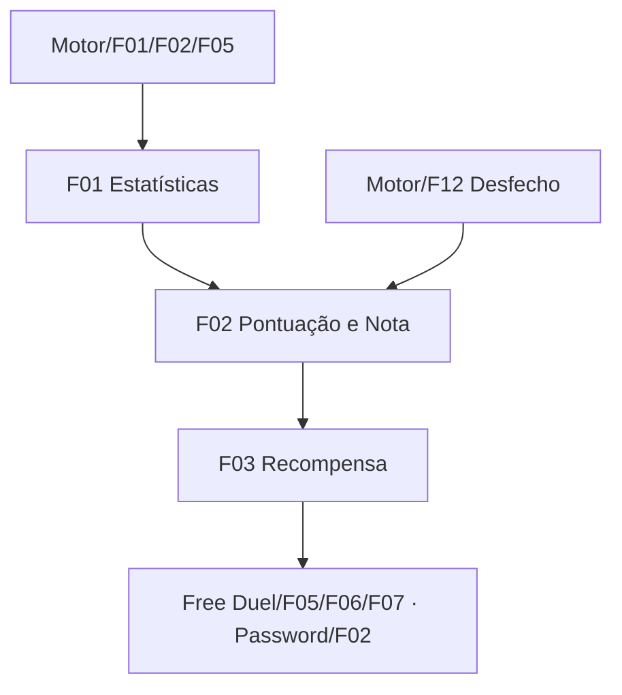

# Rating Engine

## 1. Resumo Executivo

O Rating Engine é o subsistema transversal que avalia **como** um duelo foi vencido e converte esse
julgamento em recompensa. Ele recebe o snapshot final de um duelo encerrado, calcula a pontuação do
Forbidden Memories original, traduz essa pontuação numa **nota** (`S`, `A`, `B`, `C`, `D` combinada
com `POW` ou `TEC`) e devolve a recompensa correspondente: quantas estrelas creditar e de qual faixa
de raridade sortear a carta de drop.

Ele é a peça que três PRDs já escritos declararam como pendência e ficaram esperando:
`free-duel/F05` consome a nota e a tabela nota→recompensa, `free-duel/F06` usa a faixa de raridade
para sortear a carta do pool do oponente, e `free-duel/F07` + `password/F02` creditam as estrelas.
Enquanto ele não existiu, toda vitória caiu na recompensa mínima garantida — nota nenhuma, zero
estrelas e sempre a faixa comum, deixando os pools `sa-pow` e `sa-tec` já extraídos dos duelistas
completamente inalcançáveis.

O módulo é **fiel ao jogo original**: a fórmula, os coeficientes, os limiares de nota, o número de
estrelas por nota e o mapeamento nota→pool de drop são portados do Forbidden Memories de PS1, não
inventados. A modernização está apenas na exposição: o jogo original nunca explicava ao jogador por
que ele tirou `B-POW` em vez de `S-TEC`, e este módulo entrega os contadores que tornam isso
explicável.

## 2. Problema e Oportunidade

**A recompensa não existe para o jogador**
- Toda vitória credita `0` estrelas, porque não há tabela nota→recompensa e o fallback mínimo é zero.
- Toda vitória sorteia da faixa comum, porque nenhuma nota jamais devolve outra faixa.
- Os pools `sa-pow` (19 cartas em teana, 56 em jono) e `sa-tec` (23 e 58) estão gravados no roster e
  nunca podem cair — dois terços do conteúdo de drop de cada duelista é inacessível.
- A carteira de estrelas existe, o RPC atômico existe, e o saldo nunca sai de zero: o módulo
  `password` de liberação por senha não tem fonte de renda.

**O motor não sabe como o duelo foi jogado**
- `DuelState` carrega turno, pontos de vida, mão, deck e campo — e mais nada.
- Não há contagem de ataques efetivos, vitórias defensivas, fusões, equipamentos ou magias.
- Distinguir `POW` de `TEC` é impossível a partir do estado final: as duas notas descrevem
  **trajetórias** diferentes que terminam no mesmo lugar.
- O barramento de eventos (`onSummon`, `onSet`, `onDestroy`…) já emite tudo que seria necessário, e
  ninguém acumula nada a partir dele.

**A nota é opaca no jogo original**
- O Forbidden Memories de PS1 mostrava a nota e nunca justificava.
- Jogadores levaram anos e engenharia reversa para descobrir que `A-TEC` se consegue **acumulando
  penalidade de propósito** — 15 fusões, poucos ataques efetivos — porque a escala é um eixo único
  onde pontuação alta vira `POW` e pontuação baixa vira `TEC`.
- Quem não conhecia esse folclore ficava preso ao pool comum a vida inteira sem saber o motivo.

**Oportunidade**
- Uma função pura sobre o snapshot final produz a mesma nota do original, testável e determinística.
- Instrumentar o motor num único ponto de acumulação entrega os dez parâmetros da fórmula sem
  espalhar contagem por dezenas de arquivos.
- Expor os contadores que geraram a nota transforma o folclore em regra visível, sem alterar a
  fórmula: fidelidade na matemática, modernização na explicação.
- Fechar este módulo resolve de uma vez três pendências registradas em `docs/arquitetura.md` §10 —
  escala de notas, tabela nota→recompensa e o valor `N` de estrelas por vitória do `password`.

## 3. Público-Alvo

**Usuários Primários**

**Jogador nostálgico do Forbidden Memories** — já sabe o que `S-POW` e `A-TEC` significam, conhece
as rotas de farm do original e espera que a nota saia exatamente igual à do PS1 para a mesma
sequência de jogadas. Uma divergência de um único ponto quebra o setup que ele decorou.

**Jogador novo do remake web** — nunca ouviu falar de POW ou TEC. Vence um duelo, recebe uma letra
e precisa entender, sem consultar fórum, por que a nota foi essa e o que fazer diferente.

**Caçador de cartas** — joga Free Duel repetidamente para farmar um drop específico. Precisa que a
relação nota→pool seja previsível e que as estrelas acumulem, para decidir entre farmar o drop ou
comprar a carta por senha.

**Perfil Comportamental**
- Repete duelos contra o mesmo oponente muitas vezes; qualquer não-determinismo aparece rápido.
- Compara resultados com a comunidade e com o jogo original.
- Percebe imediatamente quando a recompensa não muda entre uma vitória rasteira e uma vitória
  perfeita.

## 4. Objetivos

### Objetivos do Produto

- **Reproduzir** a pontuação e a nota do Forbidden Memories original a partir do snapshot final de
  qualquer duelo encerrado, sem inventar coeficiente algum.
- **Instrumentar** o motor com os contadores que a fórmula exige, mantendo o núcleo puro,
  serializável e sem alterar nenhuma regra de duelo já implementada.
- **Fechar** a tabela nota→recompensa que `free-duel/F05`, `free-duel/F06`, `free-duel/F07` e
  `password/F02` declararam como pendência bloqueante.
- **Tornar alcançáveis** as três faixas de drop de cada duelista, em vez de apenas a comum.

### Métricas de Sucesso

- A pontuação de qualquer duelo cai sempre no intervalo `[-140, +139]`, os limites teóricos
  publicados para o jogo original — verificado por teste de propriedade em 1.000 execuções.
- Os dez parâmetros da fórmula somam exatamente `-150` no pior caso e `+49` no melhor, e a base é
  `50`: a transcrição das tabelas é conferível por aritmética, não por inspeção visual.
- A escala tem exatamente 10 notas em faixas de 10 pontos, cobrindo o intervalo inteiro sem lacuna e
  sem sobreposição.
- Recompensa monotônica: para 100% dos pares de notas, uma nota de faixa mais extrema concede
  estrelas `≥` e faixa de drop `≥` à de uma faixa mais central — zero inversões.
- O mesmo snapshot avaliado 1.000 vezes devolve a mesma nota e a mesma recompensa, sem PRNG e sem
  I/O.
- As três faixas de drop (`common`, `sa-pow`, `sa-tec`) são todas atingíveis por pelo menos uma nota.

## 5. User Stories

### F01. Estatísticas do Duelo
- Como sistema, eu quero contar ataques efetivos, vitórias defensivas, cartas baixadas, fusões,
  equipamentos, magias e armadilhas de cada jogador durante o duelo para que a nota possa ser
  calculada ao final.
- Como sistema, eu quero que esses contadores façam parte do estado serializável do duelo para que
  um duelo salvo e recarregado produza a mesma nota.
- Como jogador, eu quero que a contagem não altere nenhuma regra de duelo para que instrumentar o
  motor não mude como o jogo se joga.

### F02. Pontuação e Nota do Duelo
- Como jogador, eu quero receber `S-POW` quando vencer rápido e agressivo, e `S-TEC` quando vencer
  com muitas fusões e magias, para que meu estilo de jogo seja reconhecido como no original.
- Como jogador nostálgico, eu quero que a mesma sequência de jogadas do PS1 produza a mesma nota
  para que meus setups de farm continuem valendo.
- Como sistema, eu quero calcular a nota como função pura do snapshot final para que o resultado
  seja determinístico e reproduzível.

### F03. Tabela de Recompensa por Nota
- Como jogador, eu quero que uma nota melhor renda mais estrelas para que jogar bem valha a pena.
- Como caçador de cartas, eu quero que notas `S` e `A` abram os pools `sa-pow`/`sa-tec` do oponente
  para que as cartas raras de cada duelista sejam alcançáveis.
- Como sistema, eu quero devolver a recompensa como um par estrelas + faixa de raridade para que
  `free-duel/F06` e `free-duel/F07` consumam a mesma decisão sem recalcular nada.

## 6. Funcionalidades

### F01. Estatísticas do Duelo

**Consumes:**
- Motor de Duelo 1x1/F01: modelo de estado do duelo (cross-PRD).
- Motor de Duelo 1x1/F02: barramento de eventos do duelo (cross-PRD).
- Motor de Duelo 1x1/F05: serialização e snapshot do estado (cross-PRD).

**Provides:**
- Contadores de duelo por jogador, dentro do estado serializável (usado por F02).

**Capabilities:**

Sete contadores inteiros `≥ 0` por jogador, zerados na inicialização do duelo e nunca decrementados:

| Contador | Incrementa quando |
|---|---|
| `effectiveAttacks` | um monstro do jogador destrói um monstro adversário que estava em posição de **ataque** |
| `defensiveVictories` | um monstro do jogador em posição de **defesa** sobrevive a um ataque adversário |
| `faceDownPlays` | o jogador baixa uma carta virada para baixo |
| `fusions` | o jogador conclui uma fusão |
| `equips` | o jogador joga uma magia de equipamento |
| `pureMagics` | o jogador ativa uma magia de efeito ou de terreno |
| `triggeredTraps` | o jogador dispara uma armadilha |

Os outros três parâmetros da fórmula — duração em turnos, cartas restantes no deck e pontos de vida
restantes — **não** viram contador: são lidos diretamente do estado final, que já os carrega.

A acumulação acontece num **único ponto** do motor, junto do carimbo de fim de duelo, derivada dos
eventos que cada ação já emite mais o estado anterior à ação. Nenhuma ação individual conta nada por
conta própria, e nenhuma regra de duelo muda de comportamento.

Os contadores são campo obrigatório do estado, não opcional: um duelo sem estatísticas não existe.
Um duelo encerrado congela os contadores junto com o resto do estado.

**PENDÊNCIA DECLARADA:** `triggeredTraps` permanece sempre `0` enquanto o Motor de Duelo não
implementar ativação de armadilha. O contador existe, é serializado e alimenta a fórmula com peso
`+2` (o valor de "nenhuma armadilha disparada"), que é o comportamento correto para um duelo sem
armadilhas. Nenhum valor é simulado.

**Experience:** headless, sem interface. O jogador não vê os contadores durante o duelo; eles
existem para F02 e, opcionalmente, para a tela de resultado justificar a nota.

### F02. Pontuação e Nota do Duelo

**Consumes:**
- F01: contadores de duelo por jogador.
- Motor de Duelo 1x1/F05: snapshot final do duelo (cross-PRD).
- Motor de Duelo 1x1/F12: desfecho do duelo com vencedor, perdedor e motivo (cross-PRD).

**Provides:**
- Pontuação inteira e nota do duelo (usado por F03; consumido por Free Duel/F05 cross-PRD).

**Capabilities:**

A pontuação parte de uma **base de 50** e é ajustada por dez parâmetros mais o tipo de vitória:

```
pontuação = 50 + Σ(pontos dos 10 parâmetros) + pontos do tipo de vitória
```

Cada parâmetro tem quatro limiares e cinco faixas de pontos. A regra de leitura é: encontra-se o
primeiro limiar tal que `valor < limiar` e usa-se o ponto de mesmo índice; se o valor for maior ou
igual a todos os limiares, usa-se o último ponto.

| Parâmetro | Limiares | Pontos |
|---|---|---|
| Turnos | 5, 9, 29, 33 | 12, 8, 0, −8, −12 |
| Ataques efetivos | 2, 4, 10, 20 | 4, 2, 0, −2, −4 |
| Vitórias defensivas | 2, 6, 10, 15 | 0, −10, −20, −30, −40 |
| Cartas baixadas | 1, 11, 21, 31 | 0, −2, −4, −6, −8 |
| Fusões | 1, 5, 10, 15 | 4, 0, −4, −8, −12 |
| Equipamentos | 1, 5, 10, 15 | 4, 0, −4, −8, −12 |
| Magias | 1, 4, 7, 10 | 2, −4, −8, −12, −16 |
| Armadilhas disparadas | 1, 3, 5, 7 | 2, −8, −16, −24, −32 |
| Cartas restantes no deck | 4, 8, 28, 32 | −7, −5, 0, 12, 15 |
| Pontos de vida restantes | 100, 1000, 7000, 8000 | −7, −5, 0, 4, 6 |

Tipo de vitória:

| Tipo | Pontos | Situação no motor |
|---|---|---|
| Aniquilação | +2 | o adversário chegou a 0 pontos de vida |
| Deck-out | −40 | o adversário ficou sem cartas para comprar |
| Exodia | +40 | **não implementado** — registrado por fidelidade, inalcançável |

A pontuação vira nota em dez faixas de dez pontos. O eixo é único: pontuação **alta** é `POW`,
pontuação **baixa** é `TEC`, e o meio é `B`/`C`/`D`.

| Pontuação | Nota |
|---|---|
| ≤ 9 | `S-TEC` |
| 10–19 | `A-TEC` |
| 20–29 | `B-TEC` |
| 30–39 | `C-TEC` |
| 40–49 | `D-TEC` |
| 50–59 | `D-POW` |
| 60–69 | `C-POW` |
| 70–79 | `B-POW` |
| 80–89 | `A-POW` |
| ≥ 90 | `S-POW` |

A escala é **fechada em dez valores** — não é uma string livre. Os limites teóricos são `-140` no
pior caso e `+139` no melhor, o que valida a transcrição das tabelas por soma.

A avaliação é uma função **pura**: mesmo snapshot, mesma nota. Sem PRNG, sem relógio, sem I/O. Só o
vencedor é avaliado; a nota do perdedor não é calculada porque derrota não gera recompensa
(`free-duel/F05`).

**FIDELIDADE:** fórmula, coeficientes, limiares e escala são portados do jogo original e conferidos
por duas fontes independentes que concordam entre si — os limites teóricos publicados (`-140`/`+139`)
batem exatamente com a soma dos coeficientes transcritos, e o corte de faixas de drop derivado da
escala coincide com o corte documentado. Nenhum valor foi inventado.

**Error Handling:**
- Snapshot sem desfecho registrado → erro de domínio `duel_outcome_missing`; nenhuma nota é
  produzida e o consumidor aplica sua recompensa mínima.
- Desfecho de empate ou de derrota do jogador avaliado → erro de domínio; empate e derrota não têm
  nota por decisão de `free-duel/F05`.
- Motivo de fim de duelo sem pontuação definida (rendição) → erro de domínio; um jogador não vence
  por rendição própria, e a rendição do adversário não é uma ação existente no motor.
- Contadores ausentes no snapshot (estado gravado antes desta feature) → erro de domínio explícito,
  nunca contadores assumidos como zero, que produziriam uma nota silenciosamente errada.

### F03. Tabela de Recompensa por Nota

**Consumes:**
- F02: nota do duelo.

**Provides:**
- Recompensa do duelo com quantidade de estrelas e faixa de raridade de drop (usado por Free
  Duel/F05, Free Duel/F06, Free Duel/F07 e Password/F02 — cross-PRD).

**Capabilities:**

Cada nota concede um número de estrelas de 1 a 5 e abre exatamente uma faixa de raridade do pool de
drop do oponente derrotado:

| Nota | Estrelas | Faixa de drop |
|---|---|---|
| `S-TEC` | 5 | `sa-tec` |
| `A-TEC` | 4 | `sa-tec` |
| `B-TEC` | 3 | `common` |
| `C-TEC` | 2 | `common` |
| `D-TEC` | 1 | `common` |
| `D-POW` | 1 | `common` |
| `C-POW` | 2 | `common` |
| `B-POW` | 3 | `common` |
| `A-POW` | 4 | `sa-pow` |
| `S-POW` | 5 | `sa-pow` |

As faixas de raridade são exatamente as três já extraídas para cada duelista do roster: `common`
(equivalente ao pool BCD do original), `sa-pow` e `sa-tec`. As seis notas centrais compartilham o
pool comum; só `S` e `A` abrem os pools raros, dos dois lados do eixo.

Este módulo **decide a faixa, não a carta**. O sorteio ponderado dentro da faixa é de
`free-duel/F06`, e a chance de cada carta é `peso/2048` conforme o dado extraído do original.

Este módulo também **não credita** as estrelas nem grava nada: apenas informa quantas. O crédito
atômico e idempotente por duelo é de `free-duel/F07`.

A quantidade de estrelas por vitória fecha a pendência de balanceamento de `password/F02`: o valor
`N` não é fixo por vitória, é a estrela do original — de 1 a 5 conforme a nota.

**Experience:** headless. O par estrelas + faixa viaja junto da nota para a tela de resultado, que
exibe "Vitória! Nota `S-POW` — +5 estrelas" e a carta conquistada logo abaixo.

## 7. Fora de Escopo

**Concessão e persistência**
- Sortear qual carta cai dentro da faixa — é `free-duel/F06`.
- Somar a carta à coleção e creditar as estrelas na carteira — são `build-deck/F03` e
  `free-duel/F07`, atômicos e idempotentes por duelo.
- Gasto de estrelas e liberação por senha — é `password/F04`.

**Composição dos pools de drop**
- Quais cartas compõem `common`, `sa-pow` e `sa-tec` de cada duelista, e com que peso — é dado do
  roster (`banco-de-cartas/F08` e `free-duel/F01`). Este módulo escolhe a faixa e nunca olha dentro
  dela.

**Nota fora do Free Duel**
- Nota em Campanha e em Online Duel. A fórmula é a mesma e o módulo é reutilizável, mas os dois
  módulos não existem.
- Nota para o perdedor, empate ou duelo abandonado — sem nota por decisão de `free-duel/F05`.

**Histórico e agregados**
- Guardar notas passadas, média de notas, melhor nota por duelista, conquistas. Candidatos ao futuro
  módulo Save.
- Exibir os contadores individuais que geraram a nota na tela de resultado. F01 os disponibiliza; a
  decisão de mostrá-los é da tela de resultado e fica para depois.

**Fidelidade não alcançável hoje**
- Vitória por Exodia (+40): o motor não implementa Exodia. A constante fica registrada e inalcançável.
- Armadilhas disparadas: o motor não implementa ativação de armadilha. O contador existe e permanece
  em zero.

## 8. Grafo de Dependências

### Parte 1: Tabela de Dependências

| # | Feature | Prioridade | Dependências |
|---|---|---|---|
| F01 | Estatísticas do Duelo | 1 | Motor de Duelo 1x1/F01, Motor de Duelo 1x1/F02, Motor de Duelo 1x1/F05 (cross-PRD) |
| F02 | Pontuação e Nota do Duelo | 1 | F01, Motor de Duelo 1x1/F05, Motor de Duelo 1x1/F12 (cross-PRD) |
| F03 | Tabela de Recompensa por Nota | 1 | F02 |

### Parte 2: Foundation Features

F01 é a Foundation do módulo: sem os contadores no estado, nenhuma pontuação pode ser calculada e o
módulo inteiro fica bloqueado. É também a única feature que toca o Motor de Duelo — F02 e F03 são
funções puras sobre o que F01 produz.

### Parte 3: Execution Waves

- **Wave 1:** F01
- **Wave 2:** F02
- **Wave 3:** F03

### Parte 4: Legenda de Prioridade

### Níveis de prioridade
- **1** = Essencial — o módulo não funciona sem isso
- **2** = Importante — adição significativa de valor
- **3** = Desejável — melhoria incremental

### Parte 5: Diagrama Mermaid



## 9. Critérios de Aceite

### F01. Estatísticas do Duelo
- [ ] O estado do duelo carrega sete contadores inteiros `≥ 0` por jogador, zerados na inicialização.
- [ ] Um monstro do jogador que destrói um monstro adversário em posição de ataque incrementa
      `effectiveAttacks` do jogador, e apenas dele.
- [ ] Um monstro do jogador em defesa que sobrevive a um ataque incrementa `defensiveVictories` do
      **dono do monstro atacado**, não do atacante.
- [ ] Baixar carta virada para baixo, concluir fusão, jogar equipamento e ativar magia/terreno
      incrementam respectivamente `faceDownPlays`, `fusions`, `equips` e `pureMagics`.
- [ ] Uma ação recusada pelo motor não incrementa contador algum.
- [ ] Os contadores sobrevivem a um round-trip de serialização sem perda nem alteração.
- [ ] Um duelo encerrado congela os contadores junto com o resto do estado.
- [ ] Nenhum teste de regra de duelo já existente muda de resultado por causa da instrumentação.
- [ ] **(Pendência declarada)** `triggeredTraps` permanece `0` enquanto o motor não implementar
      ativação de armadilha; nenhum valor é simulado.

### F02. Pontuação e Nota do Duelo
- [ ] A pontuação é `50 + Σ(dez parâmetros) + tipo de vitória`, com os coeficientes da tabela de
      Capabilities.
- [ ] Cada parâmetro usa o primeiro limiar tal que `valor < limiar`; valores acima de todos os
      limiares recebem o último ponto.
- [ ] A pontuação de qualquer duelo válido cai em `[-140, +139]`, verificado por teste de propriedade.
- [ ] Vencer por pontos de vida zerados soma `+2`; vencer por deck-out do adversário soma `−40`.
- [ ] A nota é uma das dez da escala, em faixas de dez pontos, sem lacuna e sem sobreposição:
      `≤ 9` é `S-TEC`, `50–59` é `D-POW`, `≥ 90` é `S-POW`.
- [ ] Uma vitória rápida, agressiva e com poucas cartas usadas produz nota da faixa `POW`; uma
      vitória lenta e carregada de fusões e magias produz nota da faixa `TEC`.
- [ ] O mesmo snapshot avaliado 1.000 vezes devolve a mesma nota; nenhuma chamada de PRNG, relógio
      ou I/O acontece na avaliação.
- [ ] Snapshot sem desfecho, com empate, com derrota do avaliado, ou sem contadores devolve erro de
      domínio e nenhuma nota — nunca uma nota adivinhada.

### F03. Tabela de Recompensa por Nota
- [ ] Cada uma das dez notas mapeia para uma quantidade de estrelas entre 1 e 5 e para exatamente
      uma faixa de raridade.
- [ ] `S-POW` e `A-POW` abrem `sa-pow`; `S-TEC` e `A-TEC` abrem `sa-tec`; as seis notas restantes
      abrem `common`.
- [ ] As três faixas são todas atingíveis: nenhuma faixa do roster fica inalcançável.
- [ ] A recompensa é monotônica: nenhuma nota mais extrema concede menos estrelas que uma nota mais
      central do mesmo lado do eixo.
- [ ] A tabela não credita, não persiste e não sorteia carta — apenas informa estrelas e faixa.

### Cross-Feature Integration
- [ ] Os contadores que F01 acumula durante um duelo completo são exatamente os que F02 lê do
      snapshot final; nenhum parâmetro da fórmula fica sem fonte.
- [ ] Uma vitória por deck-out com deck cheio e muitos turnos atravessa F01→F02→F03 e chega a uma
      faixa `TEC`, demonstrando que o eixo funciona ponta a ponta.

### Cross-PRD Integration
- [ ] `free-duel/F05` passa a receber nota e recompensa reais e deixa de aplicar a recompensa mínima
      no caminho feliz; a recompensa mínima continua valendo apenas para falha do módulo.
- [ ] A faixa que F03 devolve é a faixa que `free-duel/F06` usa para sortear, e o pool
      correspondente do oponente é consultado — não a faixa comum por padrão.
- [ ] As estrelas que F03 devolve são as creditadas por `free-duel/F07` no mesmo RPC idempotente que
      soma a carta à coleção, fechando a pendência de valor `N` de `password/F02`.
- [ ] Este módulo fecha as três pendências de `docs/arquitetura.md` §10 relativas a escala de notas,
      tabela nota→recompensa e estrelas por vitória.
