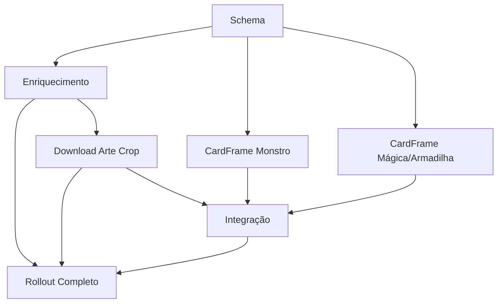

# Renderização de Cartas

## 1. Resumo Executivo

O módulo Renderização de Cartas substitui a exibição atual de cada carta — uma imagem JPEG completa e
pré-renderizada de ~280×390px, achatando nome, ícone de atributo, estrelas de nível, ilustração, ATK/DEF e
descrição num único arquivo — por um componente React que monta a carta em tempo real a partir de dados
estruturados e de uma imagem de ilustração isolada (sem moldura), em resolução mais alta. O valor central é
duplo: qualidade visual (a arte deixa de estar limitada à resolução do arquivo achatado) e flexibilidade
(uma carta montada em partes pode ser estilizada, animada ou ter estados de interface — hover, seleção,
zoom — sem depender de um novo arquivo de imagem para cada variação).

Para isso, o módulo tem duas responsabilidades que não existem hoje no repositório: enriquecer o banco de
cartas com os campos que faltam para desenhar a carta (atributo, nível de monstro, descrição) buscando-os
na API pública do YGOPRODeck e casando por nome com as 722 cartas do jogo; e baixar, para cada carta, a
imagem de arte "crop" (só a ilustração, sem moldura) que a mesma API expõe. O componente resultante,
`CardFrame`, tem duas variantes de cor — dourada para monstro, verde/rosa para mágica/armadilha — e
substitui o uso direto de ``/`CardArt`/`DuelCardArt` em todos os pontos onde uma carta é exibida hoje:
Library, Build Deck, Free Duel (mão, tabuleiro, tela de vitória) e Password.

Esta primeira entrega cobre um piloto de ~15-20 cartas representativas (cobrindo os 5 tipos de carta e uma
variedade de atributos) para validar o pipeline de dados e o componente ponta a ponta. O rollout para as
demais ~700 cartas (F07) é a mesma capacidade aplicada em escala, tratada como uma fase separada porque
depende de revisão manual dos nomes que não baterem automaticamente contra a API externa.

## 2. Problema e Oportunidade

**O Problema**

**Qualidade visual limitada por um arquivo achatado**
- As imagens atuais (`cards-data/NNN.jpg`) têm ~273–280×384–396px e 22–34KB — resolução de miniatura, não
  de tela cheia ou de zoom
- Qualquer melhoria de nitidez exige recriar os 722 arquivos inteiros, não só a parte que mudou
- Texto (nome, ATK/DEF, descrição) fica preso na resolução da imagem, ficando borrado em telas maiores ou
  com zoom

**Nenhuma flexibilidade de interface**
- Hoje não é possível destacar visualmente um estado (carta selecionada, em hover, virada para baixo) sem
  sobrepor elementos por cima de uma imagem estática já lotada de informação
- Zonas de duelo pequenas (tabuleiro) e telas de detalhe grandes (Library) usam a mesma imagem no mesmo
  formato, sem adaptação de layout ao espaço disponível

**Dados de carta incompletos para qualquer exibição rica**
- O schema atual (`packages/shared/src/card/schema.ts`) não tem atributo, nível de monstro nem descrição —
  a única forma de um jogador ver essa informação hoje é textual, incrustada na imagem achatada, e nem
  sempre visível dependendo do enquadramento do arquivo de origem
- Sem esses campos, nenhuma tela pode filtrar/ordenar por atributo ou nível, funcionalidade comum em
  qualquer app de cartas de Yu-Gi-Oh

**A Oportunidade**

Buscar os dados que faltam (atributo, nível, descrição) e a arte isolada em melhor resolução numa fonte
pública já estruturada (YGOPRODeck) resolve os três problemas de uma vez: preenche o schema, eleva a
qualidade da imagem, e viabiliza um componente montado em partes que pode se adaptar ao espaço disponível
(carta completa na Library, versão compacta no tabuleiro de duelo) sem duplicar arquivos de imagem.

## 3. Público-Alvo

**Usuários Primários**

- **Jogador que revisita a coleção** — passa tempo na Library e no Build Deck olhando cartas em detalhe;
  sente o corte de qualidade da imagem atual e se beneficia diretamente de uma ilustração mais nítida e de
  informação legível (atributo, nível) que hoje não existe.
- **Jogador em duelo** — vê a carta em espaços pequenos (mão, zonas de tabuleiro) e precisa reconhecer
  ATK/DEF e o card rapidamente; se beneficia de uma versão compacta do mesmo componente, sem poluição
  visual da descrição completa.
- **Mantenedor do catálogo** (o desenvolvedor do projeto) — roda o script de enriquecimento e precisa de
  um relatório claro de cartas não-casadas contra a API externa para resolver manualmente via overrides,
  em vez de descobrir dados faltando só quando um jogador reportar um bug visual.

**Perfil Comportamental**

Ambas as personas de jogador já convivem com a estética PS1-CRT do projeto (`docs/estetica-visual.md`) —
a expectativa não é uma reformulação visual, e sim a mesma linguagem (bevels dourados, sem cantos
arredondados, tipografia pixelada) aplicada a uma carta desenhada em maior fidelidade.

## 4. Objetivos

**Objetivos do Produto**

1. **Elevar a resolução da ilustração exibida** por carta migrada, saindo de ~280px de lado maior (imagem
   completa) para uma arte crop nativa de pelo menos 400px de lado maior.
2. **Preencher os dados faltantes** (atributo, nível, descrição) para toda carta migrada, sem inventar
   valores — só usando o que a API externa retornar ou um override manual explícito.
3. **Desacoplar a exibição da carta de um arquivo de imagem único**, permitindo variantes de layout (completa
   vs. compacta) reaproveitando os mesmos dados e a mesma arte.
4. **Não regredir a exibição de cartas ainda não migradas** — enquanto uma carta não tiver arte crop e dados
   de enriquecimento, ela continua sendo exibida com a imagem completa atual, sem quebrar nem mostrar
   espaço vazio.

**Métricas de Sucesso**

| Objetivo | Métrica |
|---|---|
| 1 | 100% das cartas do piloto (15-20) renderizadas com arte crop ≥400px de lado maior, medido no arquivo baixado |
| 2 | 100% das cartas do piloto com `atributo`, `nivel` (quando `tipo = monstro`) e `descricao` preenchidos e validados pelo schema |
| 3 | O mesmo componente `CardFrame` (variante completa e compacta) é usado em pelo menos 4 telas diferentes (Library, Build Deck, Free Duel, Password) sem duplicação de lógica de layout |
| 4 | 0 regressões: toda carta fora do piloto continua renderizando a imagem completa atual, verificado por teste automatizado de fallback |

## 5. User Stories

### F01. Extensão do Schema de Carta
- Como sistema, eu quero armazenar atributo, nível e descrição por carta para que o `CardFrame` tenha os
  dados que precisa sem inventar nem inferir informação em tempo de exibição

### F02. Enriquecimento de Metadados via YGOPRODeck
- Como mantenedor do catálogo, eu quero rodar um script que busca atributo/nível/descrição/URL de arte
  crop na API do YGOPRODeck casando por nome, para não digitar esses dados manualmente para centenas de
  cartas
- Como mantenedor do catálogo, eu quero um relatório dos nomes que não bateram automaticamente para
  resolvê-los manualmente num arquivo de overrides versionado, em vez de a carta ficar com dado faltando
  sem eu saber

### F03. Download de Arte Crop (Piloto)
- Como mantenedor do catálogo, eu quero baixar a arte crop (só a ilustração, sem moldura) das cartas do
  piloto para o repositório, para o `CardFrame` ter uma imagem de melhor resolução para exibir

### F04. Componente CardFrame — Monstro
- Como jogador, eu quero ver uma carta de monstro com nome, ícone de atributo, estrelas de nível,
  ilustração, ATK/DEF e descrição organizados como no card original, montados a partir dos dados da carta

### F05. Componente CardFrame — Mágica/Armadilha
- Como jogador, eu quero ver uma carta de mágica, equipamento, ritual ou armadilha com a paleta de cor
  correta (verde para mágica/equipamento/ritual, rosa para armadilha) e sem os campos que não se aplicam
  (estrelas, ATK/DEF)

### F06. Integração nas Telas Existentes
- Como jogador, eu quero ver o `CardFrame` novo em qualquer lugar do jogo onde uma carta aparece hoje
  (Library, Build Deck, Free Duel, Password), sem perder os estados de placeholder/silhueta/erro que já
  existem
- Como jogador, eu quero ver uma versão compacta da carta nas zonas do tabuleiro de duelo, para a
  descrição completa não ocupar um espaço pequeno demais
- Como jogador, eu quero que uma carta ainda não migrada continue aparecendo com a imagem completa atual
  em vez de um espaço vazio ou quebrado

### F07. Rollout Completo do Catálogo
- Como mantenedor do catálogo, eu quero rodar o enriquecimento e o download de arte para as ~700 cartas
  restantes, para o `CardFrame` cobrir o catálogo inteiro e a imagem completa antiga poder ser aposentada

## 6. Funcionalidades

### F01. Extensão do Schema de Carta

**Provides:**
- Campos `atributo` (enum `DARK/LIGHT/EARTH/WATER/FIRE/WIND/DIVINE`, nullable), `nivel` (inteiro 1-12,
  nullable, só preenchido quando `tipo = monstro`) e `descricao` (string, nullable) no `CardSchema` (usado
  por F02, F04, F05)

**Capabilities:**
- `CardSchema` continua `strictObject`: os 3 campos novos entram em `CARD_FIELD_ORDER` na mesma posição
  relativa aos demais, e ficam `null` para toda carta ainda não enriquecida (mesmo padrão de `atk`/`def`)
- Enum de atributo fechado nos 7 valores padrão do TCG — nenhum atributo customizado do jogo original
- `nivel` fora do intervalo 1-12, ou preenchido para carta com `tipo != monstro`, falha a validação do
  schema

**Experience:** mudança de contrato de dados, sem interface própria — se reflete em F02 (quem escreve os
campos) e F04/F05 (quem lê).

### F02. Enriquecimento de Metadados via YGOPRODeck

**Consumes:**
- F01: campos `atributo`, `nivel`, `descricao` do schema

**Provides:**
- Os 3 campos preenchidos por carta, gravados em `cards-data/dados/NNN.json` (usado por F03, F04, F05)
- URL da arte crop (`image_url_cropped`) por carta casada, disponível para F03 baixar
- Relatório de cartas não-casadas (nome local sem correspondência na API)

**Capabilities:**
- **Achado de exploração:** o campo `password` do dataset local é, byte a byte, o `id` real da carta na
  YGOPRODeck/TCG (verificado em múltiplas cartas: `password: "89 63 11 39"` de "Blue-eyes White Dragon" =
  `id: 89631139` na API; mesma correspondência em "Kurama" e "Basic Insect"). 698 das 722 cartas (97%) têm
  `password` preenchido — casamento primário é por **ID exato**
  (`GET https://db.ygoprodeck.com/api/v7/cardinfo.php?id={password sem espaços}`), não por nome
- Casamento por nome (case-insensitive, ignorando espaços nas pontas) contra
  `GET https://db.ygoprodeck.com/api/v7/cardinfo.php?name={nome}` só para as ~24 cartas sem `password`;
  nome sem correspondência exata consulta o arquivo de overrides
  `cards-data/dados/overrides-nomes-ygoprodeck.json` (mapa `nome local` → `nome YGOPRODeck`) antes de entrar
  no relatório de não-casados
- Script idempotente: rodar de novo sobre uma carta já enriquecida não duplica nem altera o resultado, a
  menos que o override para aquele nome tenha mudado
- Roda em `packages/data/scripts/` (I/O é permitido aqui; nunca em `packages/data/src/`)
- Rate limit respeitado: no máximo 1 requisição a cada 300ms, sequencial, sem paralelismo — API pública sem
  chave, e o volume final é de centenas de chamadas

**Experience:** comando de linha (`pnpm --filter @yugioh/data enrich:ygoprodeck` ou script equivalente,
nome exato a decidir no spec) que imprime progresso e, ao final, quantas cartas foram enriquecidas e quantas
ficaram na lista de não-casadas.

**Error Handling:**
- API fora do ar ou timeout numa carta → a carta entra no relatório de não-casadas com o motivo distinto de
  "sem correspondência" (é retentável, diferente de nome que genuinamente não existe na base), script
  continua para as próximas cartas
- Nome bate com mais de uma carta na API (nomes ambíguos) → carta entra no relatório como ambígua, exige
  override manual explícito para ser resolvida, nunca escolhe a primeira ocorrência silenciosamente
- Resposta da API não bate com o schema esperado (campo faltando/tipo errado) → carta é pulada e reportada,
  nunca grava dado parcial/inválido no `dados/NNN.json`

### F03. Download de Arte Crop (Piloto)

**Consumes:**
- F02: URL da arte crop por carta casada

**Provides:**
- Arquivo de arte crop por carta em `cards-data/art/NNN.jpg` (usado por F04, F05, F06)
- Manifesto de arte crop (`numero` → caminho), no mesmo formato que `arts-manifest.json` já usa hoje para
  a imagem completa (usado por F06 para decidir se uma carta tem `CardFrame` disponível)

**Capabilities:**
- Piloto: exatamente as ~15-20 cartas escolhidas para representar os 5 tipos (`monstro`, `armadilha`,
  `equipamento`, `magica`, `ritual`) e uma variedade de atributos
- Rejeita e reporta (não grava) qualquer download que não seja uma imagem JPEG válida, ou menor que 400px
  no lado maior — mesmo critério da Métrica de Sucesso 1

**Experience:** mesmo comando/relatório de F02, ou um segundo passo do mesmo script — a decidir no spec —
mas sempre reportando, por carta, sucesso ou motivo de falha (URL ausente, download falhou, imagem abaixo
da resolução mínima).

**Error Handling:**
- Download falha (rede, 404) → carta fica sem arte crop, continua caindo no fallback de F06 (imagem
  completa antiga), nunca bloqueia o restante do lote

### F04. Componente CardFrame — Monstro

**Consumes:**
- F01: `nome`, `atributo`, `nivel`, `atk`, `def`, `descricao`, `classe`
- F03: caminho da arte crop

**Provides:**
- Componente `CardFrame` variante monstro, com uma prop de tamanho (`completo` | `compacto`) (usado por
  F06)

**Capabilities:**
- Paleta dourada, reaproveitando os tokens já definidos em `globals.css` (`--color-gold`,
  `--color-gold-dark`, `--shadow-bevel-raised`, `--font-display`/`--font-body`, `--radius: 0`)
- Layout, variante completa: nome + ícone de atributo no topo, estrelas de nível (uma por nível, até 12),
  janela de arte, faixa inferior com `classe`/descrição à esquerda e ATK/DEF à direita — mesma disposição
  do exemplo do PDF de referência (`Curse of Dragon`)
- Layout, variante compacta: arte + nome + ATK/DEF, sem estrelas nem descrição — mesma informação que
  `DuelZone` já mostra hoje, só que via `CardFrame` em vez de `` cru
- Ícone de atributo: 7 ícones novos (um por valor do enum), ativo simplificado (SVG inline ou sprite),
  sem texto — a arte de cada ícone é responsabilidade de implementação, não deste PRD
- Carta sem `atributo`/`nivel`/`descricao` preenchido (ainda não enriquecida) não usa este componente — cai
  no fallback de F06

**Experience:** puramente visual/apresentação, sem interação própria — clique/hover são responsabilidade de
quem usa o componente (ex.: `CardCell` já trata clique hoje).

### F05. Componente CardFrame — Mágica/Armadilha

**Consumes:**
- F01: `nome`, `descricao`, `classe`, `tipo`
- F03: caminho da arte crop

**Provides:**
- Componente `CardFrame` variante mágica/armadilha, mesma prop de tamanho de F04 (usado por F06)

**Capabilities:**
- Paleta verde para `tipo` em `magica`/`equipamento`/`ritual`, paleta rosa/magenta para `tipo = armadilha`
  — mapeamento de `tipo` → paleta é uma constante do componente, não um campo novo no schema
- Mesmo layout estrutural de F04 (nome + ícone no topo, janela de arte, faixa inferior), sem estrelas nem
  ATK/DEF; a faixa inferior mostra só a descrição
- Variante compacta: arte + nome, sem descrição — usada nas zonas de mágica/armadilha do tabuleiro

**Experience:** igual a F04.

### F06. Integração nas Telas Existentes

**Consumes:**
- F03: manifesto de arte crop (para saber se uma carta está migrada)
- F04, F05: os dois componentes `CardFrame`

**Capabilities:**
- Pontos substituídos: `CardArt` (`library/card-art.tsx`, usado por `CardCell`/`CardDetail`),
  `DuelCardArt` (`free-duel/duel-card-art.tsx`), os `` diretos em `CollectionCardItem`/
  `CollectionCardGridItem` (`build-deck/`), `CardDropReward` (`free-duel/card-drop-reward.tsx`) e
  `CardPreview` (`password/card-preview.tsx`)
- Regra de fallback: carta com arte crop + dados de enriquecimento → `CardFrame`; carta sem isso →
  comportamento atual (imagem completa `cards-data/NNN.jpg`, com os mesmos estados de
  placeholder/silhueta/erro que `CardArt`/`DuelCardArt` já implementam)
- Variante compacta em: mão, zonas de tabuleiro (`DuelZone`) e preview de duelo (`DuelCardPreview`)
- Variante completa em: Library (`CardCell`, `CardDetail`), Build Deck (lista e grade da coleção), tela de
  vitória (`CardDropReward`), preview de Password (`CardPreview`)

**Experience:** nenhuma mudança de fluxo de navegação — as telas continuam iguais, só a exibição da carta em
si muda de imagem única para `CardFrame` (ou permanece a imagem antiga, quando a carta não está migrada).

**Error Handling:**
- Falha ao carregar a arte crop (rede/arquivo ausente apesar do manifesto apontar para ela) → mesmo
  tratamento de erro que `CardArt` já tem hoje (`onError` cai para placeholder), nunca quebra a tela

### F07. Rollout Completo do Catálogo

**Consumes:**
- F02: pipeline de enriquecimento (rodado para as ~700 cartas restantes)
- F03: pipeline de download de arte crop (idem)

**Provides:**
- Catálogo com 100% das cartas cobertas por `CardFrame` (usado por F06, que deixa de precisar do fallback
  para a imagem completa)

**Capabilities:**
- Mesmo script de F02/F03, rodado sobre as ~700 cartas restantes do catálogo, não uma reimplementação
- Relatório final de cobertura (cartas migradas vs. pendentes de override manual), no mesmo espírito do
  `checarCoberturaDeArte` de `banco-de-cartas/F02`
- Aposentar `cards-data/NNN.jpg` (as imagens completas antigas) só depois da cobertura ficar em 100% —
  nunca antes, para não regredir nenhuma carta ainda pendente

**Experience:** execução única (não recorrente), tratada como uma sessão de implementação separada do
piloto — não faz parte da entrega inicial deste PRD.

## 7. Fora de Escopo

**Dados e fonte de arte**
- Qualquer atributo, nível ou texto de descrição inventado pelo time do projeto quando a API não retornar
  correspondência — a carta fica sem esses dados até um override manual resolver o nome
- Edição manual do texto de descrição para divergir do texto oficial do TCG (ex.: adaptar para o efeito
  específico de Forbidden Memories) — decisão de conteúdo fora do escopo deste módulo
- Cartas sem equivalente real no TCG (se houver) — ficam permanentemente no relatório de não-casadas, sem
  dado de atributo/nível/descrição

**Visual**
- Animações de carta (glow, holográfico, flip 3D) — este módulo entrega o componente estático; animação é
  responsabilidade de quem consome o `CardFrame`, se um PRD futuro pedir
- Redesenho da estética PS1-CRT do projeto — o `CardFrame` usa os tokens de design já existentes, não
  propõe uma paleta nova
- Ícones de atributo desenhados à mão/licenciados de terceiros — usa representação simplificada própria do
  projeto

**Rollout**
- Migrar as ~700 cartas restantes (F07) na mesma entrega do piloto — é a mesma capacidade em escala, feita
  depois, numa sessão separada
- Aposentar `cards-data/NNN.jpg` antes da cobertura de F07 chegar a 100%

## 8. Grafo de Dependências

### Parte 1: Tabela de Dependências

| # | Feature | Prioridade | Dependências |
|---|---------|------------|---------------|
| F01 | Extensão do Schema de Carta | 1 | None |
| F02 | Enriquecimento de Metadados via YGOPRODeck | 1 | F01 |
| F03 | Download de Arte Crop (Piloto) | 1 | F02 |
| F04 | Componente CardFrame — Monstro | 1 | F01 |
| F05 | Componente CardFrame — Mágica/Armadilha | 1 | F01 |
| F06 | Integração nas Telas Existentes | 1 | F03, F04, F05 |
| F07 | Rollout Completo do Catálogo | 2 | F02, F03, F06 |

### Parte 2: Foundation Features

**F01** é Foundation: todo o restante do módulo (enriquecimento, os dois componentes `CardFrame`) depende
dos campos que ela adiciona ao schema.

### Parte 3: Execution Waves

- **Wave 1**: F01
- **Wave 2**: F02, F04, F05
- **Wave 3**: F03
- **Wave 4**: F06
- **Wave 5**: F07

### Parte 4: Legenda de Prioridade

- **1** = Essencial — o módulo não funciona sem isso
- **2** = Importante — adição significativa de valor

### Parte 5: Diagrama Mermaid

## 9. Critérios de Aceite

### F01. Extensão do Schema de Carta
- [ ] `CardSchema` aceita `atributo`, `nivel` e `descricao` como `null` sem quebrar nenhuma carta existente
- [ ] `nivel` preenchido para carta com `tipo != monstro` falha a validação
- [ ] `atributo` fora dos 7 valores do enum falha a validação
- [ ] `data:validate`/`dataset-seal.json` continuam passando com os 3 campos novos presentes e nulos

### F02. Enriquecimento de Metadados via YGOPRODeck
- [ ] Rodar o script sobre as cartas do piloto preenche `atributo`/`nivel`/`descricao` para toda carta com
      nome batendo exata ou via override
- [ ] Cartas sem correspondência aparecem no relatório de não-casadas, não silenciosamente ignoradas
- [ ] Rodar o script duas vezes seguidas sobre o mesmo conjunto não altera o resultado da segunda vez
- [ ] API fora do ar numa carta não interrompe o processamento das demais

### F03. Download de Arte Crop (Piloto)
- [ ] As ~15-20 cartas piloto têm arquivo de arte crop em `cards-data/art/NNN.jpg`, ≥400px no lado maior
- [ ] Carta sem URL de arte (não-casada em F02) não tem entrada no manifesto de arte crop
- [ ] Download que falha ou vem abaixo da resolução mínima não é gravado, e é reportado

### F04. Componente CardFrame — Monstro
- [ ] Uma carta de monstro do piloto renderiza nome, ícone de atributo, estrelas de nível corretas, arte,
      ATK/DEF e descrição na variante completa
- [ ] A variante compacta da mesma carta mostra só arte, nome e ATK/DEF
- [ ] Carta de monstro sem dado de enriquecimento não usa `CardFrame` (cai no fallback de F06)

### F05. Componente CardFrame — Mágica/Armadilha
- [ ] Uma carta de mágica/equipamento/ritual do piloto renderiza com paleta verde e sem estrelas/ATK/DEF
- [ ] Uma carta de armadilha do piloto renderiza com paleta rosa/magenta
- [ ] A variante compacta mostra só arte e nome

### F06. Integração nas Telas Existentes
- [ ] Library, Build Deck, Free Duel e Password mostram `CardFrame` para as cartas do piloto e a imagem
      completa antiga para as demais, sem misturar as duas na mesma tela de forma inconsistente
- [ ] Zonas de tabuleiro e mão em Free Duel usam a variante compacta
- [ ] Falha de carregamento da arte crop cai no mesmo placeholder que `CardArt`/`DuelCardArt` já usam hoje
- [ ] Nenhuma carta fora do piloto perde sua exibição atual (teste de regressão de fallback)

### F07. Rollout Completo do Catálogo
- [ ] Relatório de cobertura mostra 100% das 722 cartas migradas ou explicitamente pendentes de override
- [ ] `cards-data/NNN.jpg` só é removido depois da cobertura chegar a 100%

### Cross-Feature Integration
- [ ] Os campos adicionados por F01 e preenchidos por F02 são exatamente os que F04/F05 leem — nenhum
      campo extra inventado nem faltando entre as pontas
- [ ] O manifesto de arte crop de F03 é a única fonte que F06 consulta para decidir `CardFrame` vs. fallback
- [ ] Card enriquecido e com arte crop em `banco-de-cartas` (catálogo/ingestão) aparece corretamente como
      `CardFrame` em Library, Build Deck, Free Duel e Password (cross-PRD com `banco-de-cartas`, `library`,
      `build-deck`, `free-duel` e `password`)
