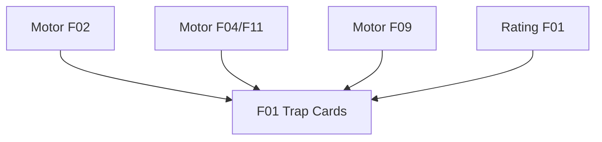

# Sistema de Trap Cards

## 1. Resumo Executivo

Este módulo implementa as dez Trap Cards de Yu-Gi-Oh! Forbidden Memories no duelo offline do
Remastered. Toda armadilha é colocada virada para baixo numa das cinco zonas de magia/armadilha e
é ativada automaticamente assim que a primeira condição válida ocorre, sem decisão manual.

Os efeitos são descritos por dados compartilhados e resolvidos pelo motor determinístico. O módulo
integra combate, magias, equipamentos, pontuação, apresentação e IA, preservando a ocultação da
carta até sua ativação ou destruição.

## 2. Problema e Oportunidade

**Armadilhas atualmente inertes**
- As dez cartas podem ser baixadas, mas nenhuma reage a eventos.
- O contador `triggeredTraps` permanece sempre zero.
- A CPU gera candidatos de posicionamento, mas não escolhe armadilhas.

**Fidelidade incompleta**
- Ataques não podem ser interceptados pelas seis armadilhas clássicas.
- Dano direto, cura e equipamentos ignoram Goblin Fan, Bad Reaction e Reverse Trap.
- Fake Trap não está documentada como isca deliberadamente sem efeito.

**Oportunidade**
- Completar todo o conjunto de armadilhas do FM com uma tabela auditável, resolução automática e
  integração ponta a ponta, reutilizando as janelas e eventos já existentes.

## 3. Público-Alvo

**Jogadores do Forbidden Memories** — esperam os efeitos e a ativação automática do título de PS1.

**Jogadores do Free Duel** — precisam de feedback claro ao enfrentar armadilhas ocultas da CPU.

**Desenvolvedores de regras** — precisam de um vocabulário extensível e determinístico, sem lógica
duplicada por carta.

## 4. Objetivos

- **Implementar** as dez armadilhas com cobertura exata da tabela: 10/10 entradas válidas.
- **Automatizar** a resolução: 100% dos gatilhos elegíveis resolvem sem ação do jogador.
- **Preservar** determinismo e serialização: 1.000 execuções property-based sem divergência.
- **Integrar** Free Duel e IA: ao menos um teste ponta a ponta com armadilha baixada pela CPU.
- **Contabilizar** ativações: cada trap consumida incrementa exatamente uma vez `triggeredTraps`.

## 5. User Stories

### F01. Efeitos e Ativação Automática de Trap Cards
- Como jogador, quero baixar uma armadilha virada para baixo para ocultar sua identidade.
- Como defensor, quero que a primeira armadilha compatível seja ativada automaticamente.
- Como jogador, quero ver qual armadilha foi revelada e qual resultado ela produziu.
- Como sistema, quero resolver os dez efeitos por dados e em ordem determinística.
- Como CPU, quero baixar armadilhas quando minha estratégia não selecionar uma invocação.

## 6. Funcionalidades

### F01. Efeitos e Ativação Automática de Trap Cards

**Consumes:**
- Motor-duelo-1x1/F02: eventos e janela de reação (cross-PRD).
- Motor-duelo-1x1/F04: cálculo de ATK/DEF efetivos (cross-PRD).
- Motor-duelo-1x1/F09: posicionamento de armadilhas (cross-PRD).
- Motor-duelo-1x1/F11: declaração e resolução de ataque (cross-PRD).
- Rating-engine/F01: contador `triggeredTraps` (cross-PRD).

**Provides:**
- Tabela validada das dez armadilhas e consulta por número.
- Resolução automática consumida pelo motor, Free Duel e IA.

**Capabilities:**
- Cartas 681–685 destroem o atacante quando seu ATK efetivo é, respectivamente, menor ou igual a
  500, 1000, 1500, 2000 e 3000; 686 destrói qualquer atacante.
- 687 reflete integralmente dano direto de magia ao conjurador; 688 converte integralmente a cura
  do oponente em dano nele; 689 transforma o bônus do equipamento adversário em penalidade
  equivalente; 690 é uma isca sem gatilho ou efeito.
- Ataques diretos e contra monstros podem disparar armadilhas de ataque.
- Somente a primeira armadilha compatível, varrendo zonas 0 a 4, dispara por evento.
- Armadilhas incompatíveis permanecem baixadas; a ativada é revelada, contabilizada e consumida.
- ATK/DEF efetivos têm piso zero após modificadores negativos.
- A identidade de uma armadilha baixada permanece oculta do oponente.

**Experience:**
- O jogador escolhe apenas baixar a carta e a zona; não existe botão de ativação.
- No gatilho, a interface revela nome e arte, apresenta o resultado e remove a carta da zona.
- A CPU usa a primeira armadilha conhecida e a primeira zona livre quando não seleciona invocação.

## 7. Fora de Escopo

- Chains, prioridade ou escolha manual de ativação do TCG moderno.
- Novas armadilhas além das cartas 681–690.
- Cemitério, recuperação de traps ou proteção de Fake Trap no TCG.
- Preenchimento das matrizes pendentes de Guardiões Estelares e terreno×classe.
- Alterações no servidor de Online Duel; o estado serializável continua compatível com transporte.

## 8. Grafo de Dependências

| # | Feature | Prioridade | Dependências |
|---|---|---|---|
| F01 | Efeitos e Ativação Automática de Trap Cards | 1 | Motor-duelo-1x1/F02, Motor-duelo-1x1/F04, Motor-duelo-1x1/F09, Motor-duelo-1x1/F11, Rating-engine/F01 |

### Foundation Features
- **F01** é a Foundation e a única feature do módulo.

### Execution Waves
- **Wave 1:** F01

### Níveis de prioridade
- **1** = Essencial — o módulo não funciona sem isso
- **2** = Importante — adição significativa de valor
- **3** = Desejável — melhoria incremental

## 9. Critérios de Aceite

### F01. Efeitos e Ativação Automática de Trap Cards
- [ ] As cartas 681–686 destroem atacantes nos limites exatos usando ATK efetivo, incluindo ataques diretos.
- [ ] Apenas a primeira armadilha compatível por índice dispara; as demais permanecem baixadas.
- [ ] Goblin Fan reflete dano direto de magia, Bad Reaction converte cura e Reverse Trap inverte somente o equipamento que provocou o gatilho.
- [ ] Reverse Trap nunca produz ATK/DEF efetivo abaixo de zero.
- [ ] Fake Trap pode ser baixada e permanece sem gatilho próprio.
- [ ] Toda trap ativada é revelada, removida e soma exatamente um `triggeredTraps` ao dono.
- [ ] Armadilhas baixadas permanecem ocultas na projeção pública até revelação ou destruição.
- [ ] A CPU consegue baixar uma armadilha conhecida numa zona livre.
- [ ] O mesmo estado e ação produzem o mesmo resultado; o estado sobrevive ao round-trip JSON.

### Cross-Feature Integration
- [ ] Ataques interceptados não seguem para revelação do defensor, tabela de combate ou dano.
- [ ] A ação adversária mantém seu contador de rating enquanto a ativação soma `triggeredTraps` ao defensor.
- [ ] Free Duel apresenta revelação e resultado sem solicitar ação manual.

### Cross-PRD Integration
- [ ] O motor continua puro, serializável e sem dependências de UI/IO.
- [ ] Equipamentos normais e reversos continuam consumindo a tabela compartilhada de spells.
